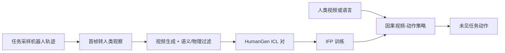

# Zero-WAM

**Zero-WAM: In-Context World-Action Modeling from Human Videos for Open-Ended Task Generalization**（[arXiv:2608.26103](https://arxiv.org/abs/2608.26103)，[项目页](https://robbyant-research.github.io/Zero-WAM/)）——蚂蚁灵波科技（Robbyant）；香港科技大学广州校区（HKUST-GZ）；香港科技大学（HKUST）。

## 一句话定义

**把人类视频当成任务规格：不更新参数，也能按上下文执行训练中从未出现的操作任务。**

## 英文缩写速查

| 缩写 | 英文全称 | 简要说明 |
|------|----------|----------|
| WAM | World-Action Model | 联合预测未来观测与可执行动作 |
| ICL | In-Context Learning | 用提示而非微调指定新任务 |
| IFP | In-context Future chunk Prediction | 抑制已见任务捷径的训练目标 |
| HumanGen | Human-robot ICL Generation | 机器人轨迹 → 对齐人类视频的数据管线 |

## 为什么重要

- 纳入 [具身智能小站 2026-08-28 九篇盘点](../../sources/blogs/wechat_embodied_station_wam_vla_cross_embodiment_9_papers_2026-08-28.md) 的「结构化接口」主线：视频成为任务说明。
- 开源状态（入库日）：**待发布**（代码/模型/数据计划 2026-09-15 前）。

## 核心信息

| 项 | 内容 |
|----|------|
| **机构** | 蚂蚁灵波科技（Robbyant）；香港科技大学广州校区；香港科技大学 |
| **出处** | arXiv:2608.26103（2026-08） |
| **开源** | **待发布** |

### 流程总览

## 工程实践

| 项 | 内容 |
|----|------|
| **数据** | Task-diverse VA 来自 AgiBot / InternData-A1 / OXE / RoboCOIN / RoboMIND；HumanGen 覆盖公开、自研、仿真与真机 |
| **接口** | 单一策略同时支持语言指令与人类视频提示 |
| **复现入口** | 截至入库日无可运行脚本；watch [`robbyant-research/Zero-WAM`](https://github.com/robbyant-research/Zero-WAM) |

## 评测

| 项 | 内容 |
|----|------|
| **RoboTwin 2.0** | 七个任务级 held-out，平均 **46.95%** vs LingBot-VA **17.45%**（+29.5 pp） |
| **最强单任务** | Place empty cup **84.87%**；Stack three blocks 仍仅 **9.00%** |
| **真机** | 多物体、长时程顺序操作与精细插入，无需对应机器人数据或参数更新 |

- 数据出处：[ingest 摘录「评测」](../../sources/papers/zero_wam_arxiv_2608_26103.md)。

## 结论

**跨任务泛化的瓶颈常常是任务规格，而不是再训一遍策略。**

1. 人类视频比语言更能指定实例、交互步骤与长时程顺序。
2. IFP 的作用是切断「只看机器人历史/文本」的捷径。
3. HumanGen 把已有机器人轨迹变成可扩展 ICL 对，而不是手工人机配对。
4. 代码未发布前，只能把 47% 当论文数字，不能当可复现基线。

## 源码运行时序图

**不适用**（截至 **2026-08-28**）：官方训练/推理入口尚未公开发布。

## 局限与风险

- 生成人类视频依赖图像编辑与视频生成模型，语义/物理过滤失败会污染 ICL。
- 堆叠三块等长时程任务成功率仍低，不能把平均 47% 读成「开箱即用」。
- 真机展示不等于全面定量基准。

## 与其他工作对比

- 相对纯语言 VLA：把任务指定从文本扩展到视频上下文。
- 相对 [DreamWAM](./paper-dreamwam.md) 等像素世界动作模型：Zero-WAM 强调 **零样本跨任务 ICL**，而不是在线 rollout 规划。
- 基线对照项目页的 WAN-Action 与 LingBot-VA，不是 LIBERO 全家桶。

## 关联页面

- [World Action Models](../concepts/world-action-models.md)
- [VLA](../methods/vla.md)
- [Manipulation](../tasks/manipulation.md)
- [WAM / VLA / 跨本体 9 篇技术地图](../overview/wam-vla-cross-embodiment-9-papers-technology-map.md)

## 参考来源

- [zero_wam_arxiv_2608_26103](../../sources/papers/zero_wam_arxiv_2608_26103.md)
- [zero-wam 项目页](../../sources/sites/zero-wam.md)
- [zero-wam 仓库](../../sources/repos/zero-wam.md)
- [具身智能小站 9 篇盘点](../../sources/blogs/wechat_embodied_station_wam_vla_cross_embodiment_9_papers_2026-08-28.md)

## 推荐继续阅读

- [arXiv:2608.26103](https://arxiv.org/abs/2608.26103)
- [Zero-WAM 项目页](https://robbyant-research.github.io/Zero-WAM/)
