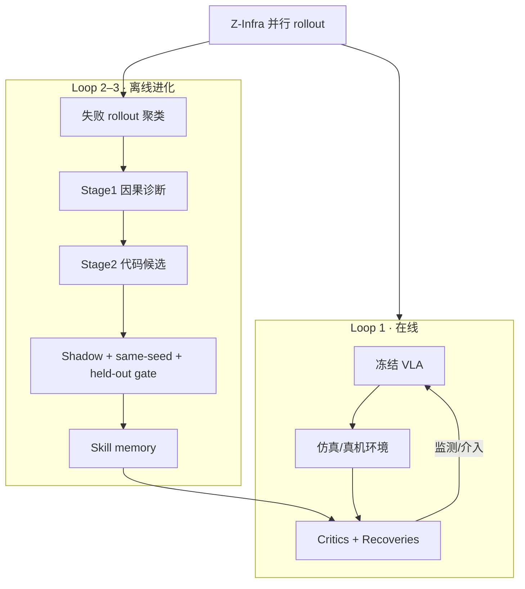
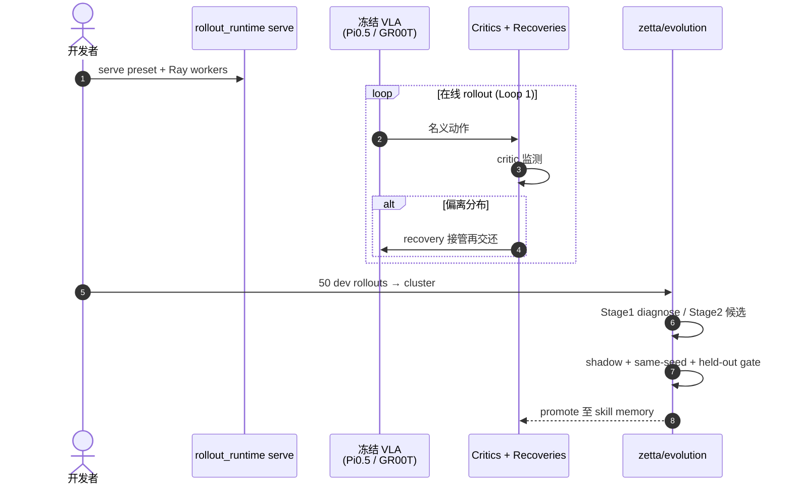

# Zetta ζ：高效闭环具身 Harness 与自进化物理智能

**Zetta ζ**（*Zetta ζ: An Efficient Closed-Loop Embodied Harness for Self-Evolving Physical Intelligence*，[arXiv:2608.16590](https://arxiv.org/abs/2608.16590)，[项目页](https://air-embodied-brain.github.io/zetta/)，[代码](https://github.com/air-embodied-brain/Zetta-Embodiment)，[HF Papers](https://huggingface.co/papers/2608.16590)）由 **清华大学 AIR** 与 **Z-Trans AI** 提出：在 **冻结** 视觉–语言–动作（VLA）策略权重的前提下，在线进化 **代码化 runtime critics** 与 **recovery skills**，构成可版本化的 harness \(H=\{C,R,T\}\)，并通过 **Z-Infra** 将 agent 逻辑与异构仿真/GPU 资源解耦，以 **rollout 吞吐** 作为智能缩放瓶颈。

## 一句话定义

**把「episode 结束后才反思」的开环 agent，改成动作频率上的 critic 治理 + rollout 级代码空间自进化，让冻结 VLA 在部署期持续变可靠。**

## 英文缩写速查

| 缩写 | 英文全称 | 简要说明 |
|------|----------|----------|
| VFA | Vision-Force-Action | 他路线缩写；本文 **不** 采用，仅作行业对照 |
| VLA | Vision-Language-Action | 冻结的基础策略（如 Pi0.5、GR00T） |
| LIBERO-Pro | LIBERO-Pro benchmark | 扰动/泛化向操作基准 |
| SR | Success Rate | 任务成功率 |
| RPent | RLinf RPent | Harness VLA 官方运行时；本文 latency 对照基线之一 |
| Z-Infra | Zetta rollout infrastructure | 本文 rollout 控制面与 worker 池架构 |

## 为什么重要

- **闭环 vs 开环 harness：** 相对 [Harness VLA](./paper-harness-vla.md) / RPent 等 **episode 级** 记忆与规划，Zetta 强调 **执行进行中** 的状态跟踪与 recovery，对准 millisecond 级物理交互与 LLM agent 频率错配。
- **与 [Zeva](./paper-zeva.md) 互补：** 同组织 **冻结策略 + 部署期进化**；Zeva 用 **因果记忆 prompt 注入**，Zetta 用 **可执行代码 critics/recoveries + 验证门控**，更接近 **SkillOpt / EmbodiSkill** 式代码空间 SGD。
- **Scaling 叙事：** 自探索 rollout 即训练数据 → **Z-Infra 20.6× 吞吐** 直接加速进化；成功率随 iteration **继续上升**（未饱和曲线）。
- **已开源完整 harness 协议：** [Zetta-Embodiment](https://github.com/air-embodied-brain/Zetta-Embodiment) 含 evolution manifest、gate、多 sim backend 与 VLA 安装脚本。

## 核心原理

### 三时间尺度循环（论文 + 项目页）

| Loop | 时间尺度 | 作用 |
|------|----------|------|
| **1 · Critic-Governed Action** | 动作频率 | 运行时已准入 critics 监测物理状态，偏离名义分布即触发 recovery |
| **2 · Rollout-Batch Candidate Optimization** | 单轮 batch | 失败轨迹聚类（最早可观测分歧）、因果诊断、生成 critic/recovery **代码候选** |
| **3 · Validation-Gated Skill Update** | 迭代 | 仅当候选通过 **历史回归 + held-out 泛化** 才写入 versioned skill memory |

**不变量：** **无 VLA 微调、无策略梯度**；仅 harness 进化。

### Z-Infra（rollout 基建）

- **控制面** 路由 agent 请求至 **environment workers** 与 **rollout workers**。
- 支持 batched inference、模型分区、异步调度；同一 agent 逻辑可跨 **CPU/GPU/多 sim** 扩展。
- 文内：**1.7 → 35.1** 有效 episodes/min（8×A100 配置）。

### 流程总览

## 方法

- **Orchestrator + 双 agent 治理（论文 §2）：** 在线 **Orchestrator** 裁决 critic 提案；离线 **Evolutionary Agents** 在代码空间做有界更新（借鉴 SkillOpt / EmbodiSkill 思路）。
- **角色边界（仓库 README）：** Cluster 只分组失败轨迹；Stage1 Diagnose **不得** 写 recovery；Stage2 输出 **schema 约束** 的 Critic–Recovery bundle；Recovery actor **仅** 执行被接受的 bounded 程序；环境 actor **唯一** 写 sim action。
- **Evolution Protocol：** 50 次 development rollouts（禁用 seed 1..20）→ 聚类 → 诊断 → 候选 → shadow replay → paired same-seed gate → held-out seeds 1..20 → promote 或回退 Stage2。

## 评测

### 主表（项目页 / 论文，冻结 VLA vs Zetta ζ）

| 基准 | 设置 | Frozen VLA | Zetta ζ |
|------|------|------------|---------|
| LIBERO-Pro | Goal (T) 十任务均 | 31.0 | **92.5** |
| LIBERO-Pro | Goal (S) | 38.0 | **89.0** |
| LIBERO-Pro | LIBERO-10 (T) | 50.0 | 63.0 |
| LIBERO-Pro | LIBERO-10 (S) | 9.0 | 40.0 |
| RoboCasa | 18 Atomic-Seen 宏均 | 73.56 | **93.56** |

页内 headline **90.8% / 93.6%** 与上表 Goal/宏均口径略有差异，读文以 **表格 + 进化曲线** 为准。

### 进化与迁移（讲者/论文陈述）

- LIBERO-Pro Goal 自 **34.5% → 90.8%**（多轮进化）；RoboCasa **73.6% → 93.6%**。
- **零样本技能迁移：** PnP-Stove 上学到的 pregrasp/regrasp/stable-placement → PnP-Sink/Cabinet/Toaster 宏均 **64% → 84%**；接触类 TurnOffStove 技能 → 水龙头/柜/微波 **64% → 80%**。
- **Aha moments：** Wine Bottle in Bowl **15%→95%**；Cream Cheese **5%→90%**。
- **系统：** vs RPent **11.1×** 推理加速；Z-Infra **20.6×** rollout 吞吐。

### 案例（项目页视频）

| 任务 | 进化 | 机制摘要 |
|------|------|----------|
| RoboCasa CoffeeSetupMug | 70% → 86% | 抓取稳定/碰撞 clearance critic + recovery |
| LIBERO-Pro Push plate | 0% → 45% → 95% | 分层 retained-grasp / carry-retention critics |

## 对比

| 维度 | Zetta ζ | [Zeva](./paper-zeva.md) | [Harness VLA](./paper-harness-vla.md) |
|------|---------|-------------------------|--------------------------------------|
| 冻结 VLA | 是 | 是 | 是 |
| 部署期信号 | **失败 rollout + 代码 critics** | **因果交互记忆** | **LLM planner + 记忆重绑定** |
| 闭环频率 | **动作频率** | 每步 prompt 注入 | 原语级重试，偏 episode 规划 |
| LIBERO-Pro 档 | **~90%+**（Goal 均） | 不同基准集 | **82.4%**（文内另一设置） |
| 开源 | **Zetta-Embodiment** | Zeva | RPent |

## 结论

**闭环、代码化、验证门控的 harness 进化，是冻结 VLA 时代把 rollout 经验变成可靠性的可扩展路径。**

- 动作频率 critic 解决「大 agent 跟不上物理」的核心瓶颈表述
- 三 loop 分工清楚：在线治理 / 候选生成 / 严格准入
- Z-Infra 把 **环境即数据** 的 scaling 落到工程吞吐
- 成功率随进化轮次上升且出现 **离散 Aha**，符合 contact 瓶颈叙事
- 技能以 **几何/接触/进度谓词** 定义，支持跨任务零样本迁移
- 相对 RPent 报告 **11.1×** 推理加速，利于密集自探索
- 官方仓库 + 分轨 VLA 安装文档可复现 campaign 骨架

## 源码运行时序图

对齐 [Zetta-Embodiment README](https://github.com/air-embodied-brain/Zetta-Embodiment) 与 Evolution Protocol：

## 工程实践

| 项 | 入口 |
|----|------|
| 克隆 | `git clone https://github.com/air-embodied-brain/Zetta-Embodiment` |
| 最小测试 | `pip install -e ".[test]"`（无需 sim） |
| LIBERO-Pro | `scripts/deployment/install_vla_env.sh --track libero-pro` |
| RoboCasa | 同脚本 `--track robocasa` + kitchen assets ~10GB |
| Rollout | `python -m rollout_runtime.cli serve ...` |
| 权重/资产 | **外置**（HF/OpenPI/GR00T 等按 VLA 轨自备） |

## 局限与风险

- **代码空间进化成本：** gate 与 shadow replay 流程重；错误 promote 的 critic 可能 **误触发** recovery。
- **仿真依赖：** 主结果来自 LIBERO-Pro / RoboCasa；真机与 BEHAVIOR 等集成 **进行中**（README TODO）。
- **冻结 VLA 上界：** 与 Zeva 相同，基础策略不会的动作无法靠 harness **凭空创造**。
- **数字口径：** headline 90.8% vs 表内 92.5% 等需对照 **任务子集与 T/S 设置**。

## 关联页面

- [VLA](../methods/vla.md)
- [Sim2Real](../concepts/sim2real.md)
- [Zeva](./paper-zeva.md) · [Harness VLA](./paper-harness-vla.md) · [CorrectVLA](./paper-correctvla.md)
- [开源系统闭环七篇地图](../overview/open-source-system-loop-7-papers-technology-map.md)

## 推荐继续阅读

- [项目页](https://air-embodied-brain.github.io/zetta/)
- [arXiv:2608.16590](https://arxiv.org/abs/2608.16590)

## 参考来源

- [zetta_arxiv_2608_16590.md](../../sources/papers/zetta_arxiv_2608_16590.md)
- [Zetta 项目页](../../sources/sites/zetta-air-embodied-brain.md)
- [air-embodied-brain/Zetta-Embodiment](../../sources/repos/air-embodied-brain-zetta-embodiment.md)
