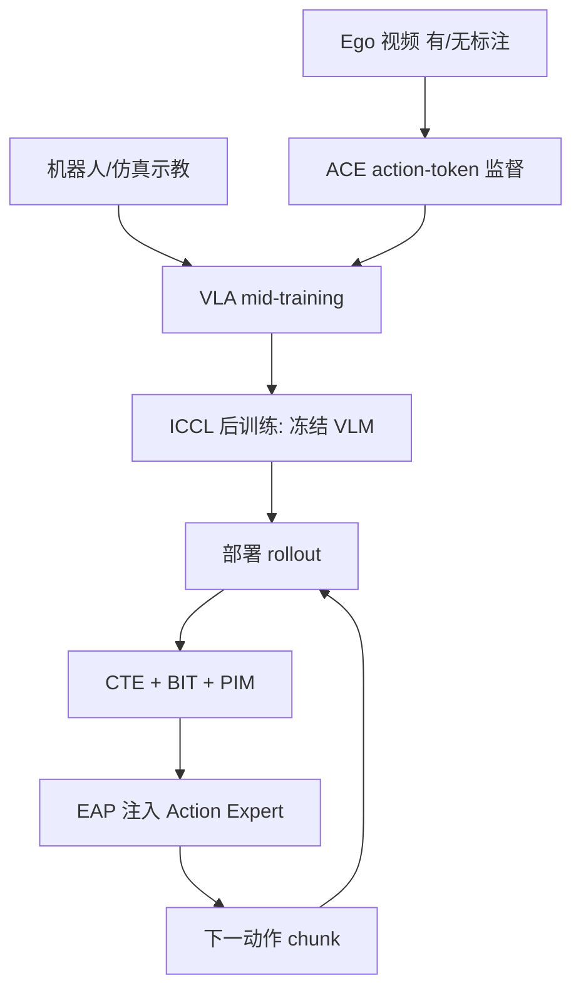
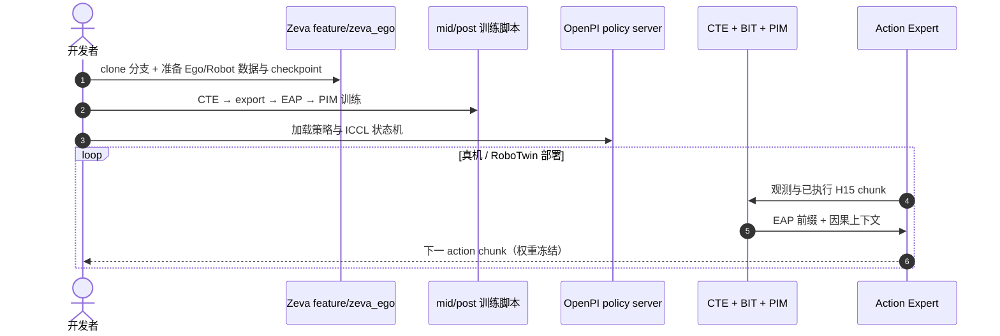

# Zeva-Ego：第一人称 mid-training 与 ICCL 机器人操作

**Zeva-Ego**（*Egocentric Mid-Training with In-Context Causal Learning for Robot Manipulation*，[arXiv:2609.24411](https://arxiv.org/abs/2609.24411)，[项目页](https://air-embodied-brain.github.io/Zeva-Ego/)，[代码 `feature/zeva_ego`](https://github.com/air-embodied-brain/Zeva/tree/feature/zeva_ego)）由 **清华大学 AIR** 与 **Z-Trans AI** 等提出：离线从 **egocentric 人类交互** 学习可迁移的物理先验，在线靠机器人 **动作—效果反馈** 无梯度进化——两阶段统一在 **π0.5** 式 **冻结 VLM + Action Expert** 分层上。

## 一句话定义

**先把可规模化的第一人称视频变成相机系 action 监督喂给 VLA，再在部署期用 ICCL 把机器人自己的因果交互写进 Action Expert 的上下文。**

## 英文缩写速查

| 缩写 | 英文全称 | 简要说明 |
|------|----------|----------|
| ACE | Action-Centric Encoder | 帧对 → 连续 action-token 监督，弱化 embodiment 与外观噪声 |
| ICCL | In-Context Causal Learning | 继承 [Zeva](./paper-zeva.md)：因果证据检索注入低层控制 |
| CTE | Causal Transition Encoder | 编码观测、已执行动作与反馈的因果转移 |
| BIT | Brief / Boundary Interaction Trace | 单次 replan 边界上的短时交互状态（分支 README 亦称 Boundary Interaction Token） |
| PIM | Persistent Interaction Memory | 跨尝试或 episode 内较早边界的 BIT 检索 |
| EAP | Effect Action Prior | 将任务记忆与预测 effect 注入策略 prefix 与 action embedding |
| VLA | Vision-Language-Action | 视觉-语言-动作策略 |

## 为什么重要

- 回答 **机器人示教贵、egocentric 视频便宜** 时如何把后者变成 **可执行控制先验**，而非只做语义预训练。
- 与 [Zeva](./paper-zeva.md) 同族 ICCL，但基座换为 **Ego mid-training 后的 π0.5 VLA**，并 **只动 Action Expert**。
- 给出可操作的 **Ego:Robot 数据等价比（约 4–5 : 1）** 与 **跨尝试 ICCL 增益（+31 pt 量级）** 读法。
- **已开源** 训练/部署栈（独立 git 分支，见工程实践）。

## 核心信息

| 项 | 内容 |
|----|------|
| **机构** | 清华大学 AIR；Z-Trans AI |
| **初始化** | [π0.5](./paper-pi05-open-world-vla.md) |
| **离线** | 10K+ h egocentric + 机器人/仿真 mid-training 混合；ACE + 相机系 chunk |
| **在线** | 全参数冻结；CTE/BIT/PIM/EAP → Action Expert |
| **开源** | **`air-embodied-brain/Zeva@feature/zeva_ego`**；项目页截至入库日 **未列** 独立 HF 权重 |

### 流程总览

## 评测

| 基准 / 设置 | 结果（读法） |
|-------------|-------------|
| RoboTwin 2.0（Hard，同 π0.5 初始化） | 扩 Ego 至 **10K h**：**63.8% → 75.3%**；**2K h** 机器人示教 **74.7%**（约 **4–5 : 1** Ego:Robot） |
| ACE 几何 | EgoDex–AgiBot 转移：token 距离 vs 物理动作距离 **ρ=0.801**；零样本 EgoVerse **ρ=0.724** |
| ICCL 跨尝试 | 首次 **58%** → 第四次 **89%**（**无参数更新**） |
| 真机 | 项目页展示多阶段流程（如 pH 测量、移液）与 **2× 加速** 长程任务 |

## 结论

**Zeva-Ego 把「人类第一人称经验 → VLA 物理先验」与「机器人自身 ICCL 部署进化」接成一条可扩展流水线，数据效率与跨尝试适应均有可复现数字支撑。**

- ACE + 相机系表示是 Ego→Robot 迁移的关键接口，不是单纯堆视频时长
- 10K h Ego 在 RoboTwin 上可对标 2K h 机器人示教，适合 **示教稀缺、Ego 充裕** 的选型
- ICCL 仍只条件化 **Action Expert**，语义子任务通路保持 π0.5 分层
- 与 [Zeva](./paper-zeva.md) 相比：增加 **大规模 Ego mid-training** 与 RoboTwin/真机栈；记忆侧公开实现强调 **EAP** 与两种 PIM 作用域
- 复现依赖 **`feature/zeva_ego`** 分支四阶段脚本与自备 checkpoint，非 main 分支一键 RoboCasa 权重
- 错误因果检索与基础策略上界仍是主要工程风险（同 ICCL 族）

## 源码运行时序图

## 局限与风险

- **分支与权重：** 代码在 **`feature/zeva_ego`**，与 [Zeva](./paper-zeva.md) main 上 RoboCasa HF 权重 **不是同一发布包**；mid-training 算力与数据准备成本高。
- **Ego 质量与伪标签：** 无标注 Ego 依赖 ACE/伪标签，域偏移或遮挡仍可能污染 action-token 几何。
- **ICCL 记忆噪声：** 与 Zeva 相同，错误因果证据会跨尝试误导 PIM 检索。
- **基准不可横比：** RoboTwin Hard 数字与 Zeva 论文 RoboCasa365 / ChemLab-Evo **任务域不同**，勿直接对比百分比。

## 与其他工作对比

| 维度 | Zeva-Ego | [Zeva](./paper-zeva.md) | [Zetta ζ](./paper-zetta.md) |
|------|----------|-------------------------|----------------------------|
| 离线数据 | **10K+ h Ego + 机器人 mid-training** | 预训练策略 + 部署交互 | 代码 critic/recovery harness |
| 在线适应 | **ICCL → Action Expert** | ICCL → 冻结策略 | 可执行代码进化 |
| 基座 | **π0.5 VLA** | 通用 foundation policy | 冻结 VLA + ζ 运行时 |
| 开源入口 | **`feature/zeva_ego`** | main + HF RoboCasa | Zetta-Embodiment |

## 关联页面

- [Zeva](./paper-zeva.md) — ICCL 原论文与 RoboCasa 线
- [π0.5 开放世界 VLA](./paper-pi05-open-world-vla.md) — 初始化与 VLM/Expert 分层
- [Manipulation](../tasks/manipulation.md)
- [VLA](../methods/vla.md)
- [Zetta ζ](./paper-zetta.md) — 同组织部署期进化对照

## 推荐继续阅读

- [Zeva-Ego 项目页](https://air-embodied-brain.github.io/Zeva-Ego/)
- [arXiv:2609.24411](https://arxiv.org/abs/2609.24411)
- [GitHub feature/zeva_ego](https://github.com/air-embodied-brain/Zeva/tree/feature/zeva_ego)

## 参考来源

- [zeva_ego_arxiv_2609_24411.md](../../sources/papers/zeva_ego_arxiv_2609_24411.md)
- [Zeva-Ego 项目页](../../sources/sites/zeva-ego.md)
- [air-embodied-brain/Zeva](../../sources/repos/air-embodied-brain-zeva.md)
