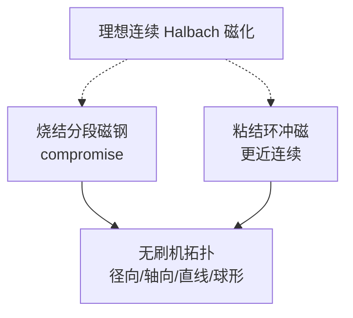

# Halbach permanent magnet machines and applications（Zhu & Howe 2001）

## 一句话定义

**Z. Q. Zhu & D. Howe（University of Sheffield，[IEE Proc. EPA 2001](https://doi.org/10.1049/ip-epa:20010479)）** 综述 **多极 Halbach 磁化无刷电机**：拓扑族、烧结分段与粘结环冲磁两类实现，以及飞轮、伺服、被动磁轴承等应用——电机侧把 Halbach 从磁体学搬进可制造机器的一手总览。

## 英文缩写速查

| 缩写 | 英文全称 | 简要说明 |
|------|----------|----------|
| PM | Permanent Magnet | 永磁 |
| NdFeB | Neodymium-Iron-Boron | 钕铁硼；文中粘结环材料 |
| EPA | Electric Power Applications | 期刊系列名 |
| PMSM | Permanent Magnet Synchronous Motor | 永磁同步/无刷交流机 |
| Halbach | Halbach Array | 旋转磁化阵列 |
| OA | Open Access | 本文非 OA |

## 为什么重要

- 明确写出：**预磁化烧结分段 ≈ 理想 Halbach 的 compromise**——直接校正 DIY「贴满 90° 磁钢 = 理想单侧」的幻觉。
- 覆盖径向/轴向与直线机，便于对照 [PCB Motor](./pcb-motor.md)、[axfluxmdo](./axfluxmdo.md)、Ironless 径向外转子。
- 给出应用清单（飞轮峰值缓冲、伺服、磁轴承），帮助判断 Halbach 何时值得多付磁钢与装配成本。

## 核心信息

| 项 | 内容 |
|----|------|
| **机构** | 谢菲尔德大学（University of Sheffield） |
| **类型** | Review |
| **实现 A** | 烧结稀土 **分段**（逼近分布，性能折中） |
| **实现 B** | 粘结 NdFeB **环** + Halbach 场 **冲磁** |
| **拓扑** | 径向/轴向；有槽/无槽；旋转、管状/平面直线、球形 |
| **开源** | **不适用**（综述；非 OA） |

## 方法

- 文献综合：拓扑分类 + 磁体制造路径 + 应用案例。
- 核心工程二分：**离散磁钢拼装** vs **整体环冲磁**。

## 实验与评测

- 综述引用既有样机与分析（含作者组前期工作）；本文本身是 **总览**，不是单一新台架论文。
- 应用侧重点：高转速飞轮电机/发电机、高性能伺服、被动磁轴承。

## 与其他工作对比

| 工作 | 关系 |
|------|------|
| [Halbach 1980](./paper-halbach-permanent-multipole-magnets.md) | 几何/易轴配方源头；本文谈电机化 |
| [Mallinson 1973](./paper-mallinson-one-sided-fluxes.md) | 平面单侧源头 |
| [Ironless QDD](./ironless-qdd-actuator.md) | 典型「烧结分段」DIY 路径 + FEMM 对照 |

## 结论

**总判：** 电机工程师读 Halbach 应以此综述为桥：先认清分段 compromise，再选拓扑与磁体制造路径。

- DIY 关节默认走 **分段** → 必须 FEM/台架，勿抄理想波形。
- 要接近连续分布，看 **冲磁粘结环** 路线（工艺门槛更高）。
- 轴向薄型关节另账：轴向力、气隙公差（对照 axfluxmdo）。
- 应用价值在场形与弱轭，不在「名字好听」。
- 全文非 OA，用 DOI 定位；概念层可先读 [halbach-array](../concepts/halbach-array.md)。

## 源码运行时序图

**不适用**（综述论文，无可运行官方代码）。

## 工程实践

| 项 | 说明 |
|----|------|
| 与开源样机 | Ironless = 分段路径教材；PCB Motor = 轴向绕组另一路 |
| 设计流程 | [电机设计流程](../overview/motor-design-workflow.md) 拓扑阶段显式勾选「Halbach / 常规径向」 |

## 局限与风险

- **非 OA**；细节公式与图表需期刊访问。
- 2001 年后材料与冲磁工艺有演进，读应用数字时注意年代。

## 关联页面

- [Halbach Array 概念](../concepts/halbach-array.md)
- [Halbach 1980](./paper-halbach-permanent-multipole-magnets.md) · [Mallinson 1973](./paper-mallinson-one-sided-fluxes.md)
- [开源力矩电机电磁设计完整度对比](../comparisons/open-source-torque-motor-em-design.md)

## 参考来源

- [sources/papers/zhu_howe_halbach_pm_machines_review_2001.md](../../sources/papers/zhu_howe_halbach_pm_machines_review_2001.md)

## 推荐继续阅读

- DOI：<https://doi.org/10.1049/ip-epa:20010479>
- Halbach 1980 OA：<https://escholarship.org/content/qt20b829tr/qt20b829tr.pdf>
