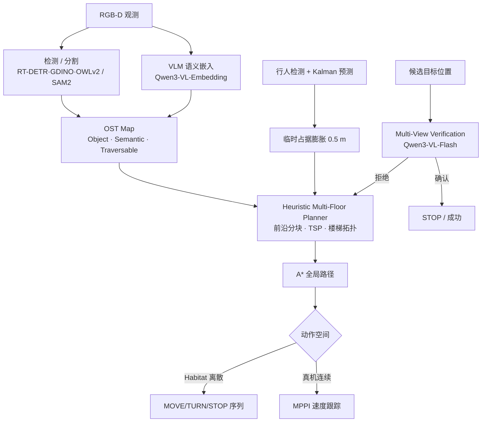

# ZONDA：多楼层动态避障的零样本 ObjectNav

**ZONDA**（*Zero-shot Object Navigation with Dynamic Avoidance*，[arXiv:2607.21025](https://arxiv.org/abs/2607.21025)）由 **南方科技大学 / 直驱科技·华南理工 / 大湾区大学** 提出：在零样本 Object-Goal Navigation 上同时处理 **跨楼层拓扑**、**多视角目标核验** 与 **动态行人避障**，不依赖平台专用 RL 低层导航策略；仿真评测 HM3D / MP3D / 自建 **HM3D-DYNA**，真机部署 Direct Drive Tech **TITA** 轮腿双足。

## 一句话定义

**用高度差可通行地图做启发式跨楼层探索，再用多尺度 VLM 联合确认目标，并显式跟踪–预测行人——一套无需任务微调、也不绑平台 RL PointNav 的零样本 ObjectNav。**

## 英文缩写速查

| 缩写 | 英文全称 | 简要说明 |
|------|----------|----------|
| ZONDA | Zero-shot Object Navigation with Dynamic Avoidance | 本文框架名 |
| ObjectNav | Object-Goal Navigation | 按目标物体类别导航到达 |
| VLM | Vision-Language Model | 语义相似度与多视角核验骨干 |
| HM3D / MP3D | Habitat-Matterport 3D / Matterport3D | 室内多楼层 ObjectNav 基准 |
| HM3D-DYNA | HM3D + Dynamic pedestrians | 本文扩展：每 episode 加入移动行人 |
| OST Map | Object-Semantic-Traversable Map | 物体 / 语义热力 / 可通行三图 |
| MPPI | Model Predictive Path Integral | 真机连续速度局部规划 |
| SPL | Success weighted by Path Length | 路径效率加权成功率 |

## 核心信息

| 字段 | 内容 |
|------|------|
| **机构** | 南方科技大学（SUSTech）；广东直驱科技有限公司（Direct Drive Tech）/ 华南理工大学（SCUT）；大湾区大学（Great Bay University） |
| **arXiv** | [2607.21025](https://arxiv.org/abs/2607.21025)（v1，2026-07-23） |
| **项目页 / 代码** | **未开源**（截至 **2026-07-24**；abs/HTML/PDF 无 GitHub / 项目页） |
| **感知栈** | SegFormer（楼梯）+ SAM2；RT-DETR / Grounding DINO / OWLv2（按基准） |
| **VLM** | Qwen3-VL-Embedding-2B（语义图）；Qwen3-VL-Flash（多视角核验） |
| **仿真** | Habitat；HM3D（2k ep / 6 类）、MP3D（2195 ep / 21 类）、HM3D-DYNA |
| **真机** | Direct Drive Tech TITA；ROS 2；远端 RTX 5060 Ti；MPPI |
| **主要基线** | VLFM、SG-Nav、OpenFMNav、ApexNav、ASCENT；学习式 PIRLNav 等 |

## 为什么重要

- **补齐「零样本 ObjectNav → 真机可用」缺口：** 不只冲静态 SR，还显式处理 **楼梯跨层** 与 **行人**，贴近室内服务部署。
- **解耦平台 RL 低层：** 相对 ASCENT 的 PointNav 策略，ZONDA 用 **几何可通行约束 \(H_{\text{agent}}\)** + 启发式规划，换本体主要调穿越高度与膨胀半径。
- **假阳性是一等公民：** 消融去掉多视角核验后 HM3D SR 从 66.5% 掉到 **41.5%**，说明「看见像目标就 STOP」是当前零样本栈的主要失败模式之一。
- **动态基准信号：** HM3D-DYNA 上相对 ASCENT（30.9%→**48.8%** SR）拉开差距，适合作为后续动态 ObjectNav 对照设定。

## 流程总览

## 核心原理

### 1）Object-Semantic-Traversable Map

三图同网格（0.1 m）：

1. **Object map：** 掩膜反投影到 3D voxel，按置信度 \(\delta\)（检测分 × FOV × 距离衰减）累积，再沿 \(z\) 取 \(\arg\max\) 得 BEV 类别。
2. **Semantic map：** LLM 推断目标常在房间类型；图像–文本余弦相似度投影到 FOV，EMA 平滑（\(\alpha=0.9\)）。
3. **Traversable map：** 去顶后估地面高度 \(\bar{h}\)；邻域高度差 \(\Delta h\)；\(\Delta h < H_{\text{agent}}\) 判可通行（含楼梯/坡道）。

### 2）Heuristic Multi-Floor Planner

- **单层：** 安全前沿按测地距离 DBSCAN 成块；块分 \(V(b)=w_1 s_{\max}-w_2 d_{\text{center}}+\mathcal{R}_{\text{sem}}\)；块内最近邻启发式当 TSP。
- **跨层：** 当前层前沿耗尽后，楼梯候选需同时满足语义「stairs」与 \(\Delta h < H_{\text{agent}}\)；落地后归档旧图、初始化新图，并在无向拓扑 \(\mathcal{G}_{\text{topo}}\) 登记出入点以便双向复用。

### 3）Multi-View Target Verification

候选实例维护多尺度观测缓冲，质量 \(Q=S_{\text{raw}}\cdot f_{\text{area}}\cdot f_{\text{edge}}\)；到达候选点时取高质量近/远场视图送 VLM **联合判定**，抑制单帧误匹配（如收音机 vs 电视）。

### 4）Dynamic Pedestrian Avoidance

与静态建图解耦：实例掩膜→3D 质心；恒速 Kalman + 匈牙利关联；外推 \(T_{\text{pred}}=3.0\) s（0.5 s 步进）；当前与预测轨迹写入占据并 **0.50 m** 膨胀，再交回启发式规划与 A*。

## 源码运行时序图

**不适用**：截至 **2026-07-24**，arXiv 页面与公开检索均未确认官方可运行仓库、权重或项目页；无法对齐 README 训练/部署入口绘制复现时序。若后续开源，应补 `sources/repos/` / `sources/sites/` 与本图。

## 工程实践

| 项 | 建议 / 论文设定 |
|----|----------------|
| 平台迁移 | 优先改 \(H_{\text{agent}}\) 与安全膨胀；其余非平台参数可对齐 HM3D |
| 感知选型 | 闭集 HM3D 用 RT-DETR；开放词 HM3D/MP3D 分别用 Grounding DINO / OWLv2 |
| 算力 | 文中仿真与真机推理均报 **单卡 RTX 5060 / 5060 Ti** 量级 |
| 真机架构 | 重推理离板（ROS 2 联网）；机载执行 MPPI 跟踪路点并避行人 |
| 动态设定 | HM3D-DYNA：行人在距机器人 3–5 m 处生成，沿最短路径 0.5 m/s 走向目标 |
| 复现现状 | **无官方代码/权重**；选型可读方法，可跑栈仍回 [VLFM 等四范式](../overview/vln-open-source-repro-paradigms.md) |

## 实验要点（索引级）

| 设置 | 结果要点 |
|------|----------|
| HM3D（Table I） | ZONDA SR **66.5%** / SPL 33.0%；ASCENT 65.4% / 33.5%；PIRLNav 64.1% / 27.1% |
| MP3D（Table I） | ZONDA SR **48.2%** / SPL **21.5%**；ASCENT 44.5% / 15.5%（+3.7 / +6.0 pp） |
| HM3D-DYNA（Table II） | ZONDA SR **48.8%** / SPL 24.7%；ASCENT 30.9% / 16.6% |
| 消融（Table III） | w/o multi-view：HM3D SR **41.5%**；w/o cross-floor：**57.8%**；w/o heuristic blocks：**62.6%** |
| 真机（Fig. 5） | 动态办公场景：避行人 → 定位 trash can → 正确终止 |

## 结论

**零样本 ObjectNav 要进多楼层、有人环境，关键不只是更强 frontier 语义，而是「平台无关的跨层几何 + 多视角确认 + 显式动态障碍」三件套；其中多视角核验对 SR 的边际贡献最大。**

1. **跨楼层优先改几何阈值，而不是重训 PointNav** — \(H_{\text{agent}}\) + 高度差可通行图可换本体。
2. **假阳性主导失败** — 去掉多视角核验，HM3D SR 掉约 **25 pp**；部署应强制近/远场联合确认再 STOP。
3. **静态榜领先不等于动态可用** — ASCENT 在 HM3D-DYNA 腰斩；行人需独立跟踪–预测管道，勿写进永久占据。
4. **启发式分块主要抬 SPL/大规模探索效率** — MP3D 上去掉分块后 SR/SPL 掉幅更大。
5. **读榜注意系统级对比** — Table I 基线沿用原论文感知栈，非统一 detector/VLM 复现。
6. **真机路径：** Habitat 离散原语 → MPPI 连续跟踪；离板 VLM 推理 + ROS 2。

## 局限与风险

- **未开源：** 无代码/权重，工程复现门槛高；HM3D-DYNA 协议需自行复刻。
- **VLM / 检测栈绑定：** 结果与 Qwen3-VL 及开放词检测器强相关；换骨干需重标定阈值。
- **行人模型简化：** 恒速外推 + 单行人基准；拥挤、突然变向、多类动态物未覆盖。
- **楼梯语义依赖：** 楼梯候选依赖「stairs」检测与 \(\delta_{\text{stair}}\)；漏检会卡在单层。
- **误区：** 把 ZONDA 当成又一个「只刷 HM3D SR」的零样本地图法——其差异化卖点是 **跨层解耦 RL + 动态避障 + 多视角核验**。

## 与其他工作对比

| 路线 | 跨楼层 | 低层控制 | 目标确认 | 动态行人 | 开源 |
|------|--------|----------|----------|----------|------|
| **VLFM / ApexNav** | 弱（单层 2D 假设） | 几何/前沿规划 | 多为单视角 | 通常无 | VLFM 等见 [四范式](../overview/vln-open-source-repro-paradigms.md) |
| **ASCENT** | 有（LLM 楼层感知） | **平台 RL PointNav** | 单视角为主 | 无专用模块 | [ascent](https://github.com/Zeying-Gong/ascent) |
| **Uni-LaViRA** | 任务族含 ObjectNav | 几何控制器（换本体） | MLLM 分层 | 非本文重点 | 已开源 |
| **LOVON** | 足式开放词寻物 | 语言→运动 | 开放词检测 | 行走视觉鲁棒 | 已开源（笔记实体） |
| **ZONDA（本文）** | **高度差可通行 + 拓扑** | **启发式，无平台 RL** | **多视角 VLM** | **Kalman 预测避障** | **暂未开源** |

## 关联页面

- [视觉–语言导航（VLN）](../tasks/vision-language-navigation.md) — 任务总览；本页补 **零样本 ObjectNav / 跨楼层 / 动态** 分支
- [VLN 四范式开源复现](../overview/vln-open-source-repro-paradigms.md) — 以 VLFM 为地图+语义入口；本文作扩展读法（暂不可跑）
- [Habitat-Sim](./habitat-sim.md) — HM3D / MP3D ObjectNav 宿主
- [Uni-LaViRA](./paper-uni-lavira.md) — training-free 统一导航（含 ObjectNav）对照
- [DA-Nav](./paper-da-nav.md) — 户外方向感知 VLN（任务接口不同）
- [LOVON](./paper-notebook-lovon-legged-open-vocabulary-object-navigator.md) — 足式开放词目标导航笔记实体
- [Sim2Real](../concepts/sim2real.md) — 离散仿真动作 → 真机连续 MPPI

## 参考来源

- [ZONDA 论文摘录（arXiv:2607.21025）](../../sources/papers/zonda_arxiv_2607_21025.md)

## 推荐继续阅读

- Liang et al., *ZONDA: Zero-shot Object Navigation with Dynamic Avoidance in Multi-floor Environments* — [arXiv:2607.21025](https://arxiv.org/abs/2607.21025)
- Gong et al., *ASCENT / Stairway to Success* — 多楼层零样本 ObjectNav 主对照（[项目页](https://zeying-gong.github.io/projects/ascent/)）
- Yokoyama et al., *VLFM* — 零样本语义前沿地图基线（ICRA 2024）
- Bai et al., *Qwen3-VL Technical Report* — [arXiv:2511.21631](https://arxiv.org/abs/2511.21631)（本文 VLM 骨干）
