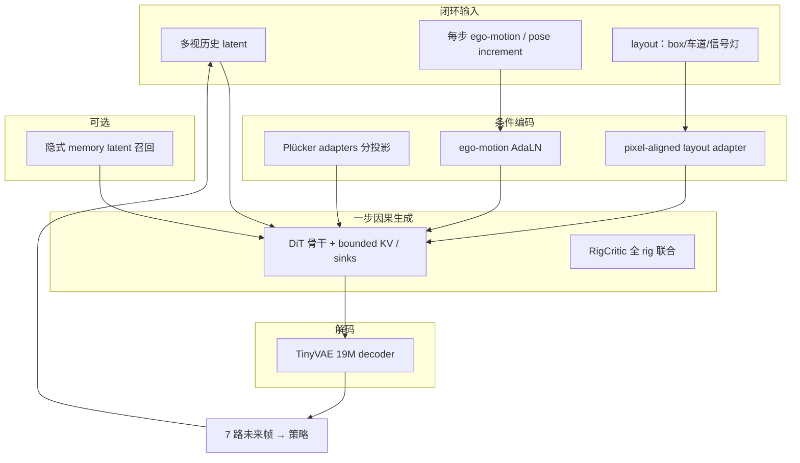

# ZYT-World：闭环智驾实时可控世界模型

**ZYT-World**（*ZYT-World: A Real-Time Controllable World Model for Closed-Loop Autonomous-Driving Simulation*，arXiv:[2609.21712](https://arxiv.org/abs/2609.21712)，[项目页](https://zyt-aim.github.io/ZYT-World/)，[PDF](https://arxiv.org/pdf/2609.21712)）由 **ZYT AI Team** 提出：面向 **端到端 / VLA 驾驶策略** 的 **闭环可复现仿真**，在 **不 homogenize 投影与分辨率** 的前提下原生生成 **4 鱼眼（FoV>180°）+ 3 针孔** 共 **7 路 ~720p** 视频，并以 **每 latent 一步** 的因果流式推理达到 **双 GPU 4 FPS 全 rig** 量级。

## 一句话定义

**用投影感知 Plücker 条件、ego-motion AdaLN 与像素对齐 layout，把 40-step 双向扩散 teacher 蒸馏成一步因果 7 摄生成器，并借 TinyVAE 与隐式 memory 在分钟级闭环里维持可部署延迟与重访一致。**

## 英文缩写速查

| 缩写 | 英文全称 | 简要说明 |
|------|----------|----------|
| WM | World Model | 动作/历史条件下的未来观测生成器 |
| VLA | Vision-Language-Action | 端到端视觉–语言–动作驾驶策略 |
| TF | Teacher Forcing | 蒸馏阶段之一：对齐部署可见性 |
| CD | Causal Consistency Distillation | 相邻噪声级少步学生 |
| DMD | Distribution Matching Distillation | 自 rollout 分布匹配 |
| AdaLN | Adaptive Layer Normalization | ego-motion 调制全层 |
| VAE | Variational Autoencoder | 潜空间编解码；本文 TinyVAE 19M |
| 4DGS | 4D Gaussian Splatting | 跨轨迹重渲染监督来源 |
| FoV | Field of View | 鱼眼 FoV>180° |

## 核心信息

| 字段 | 内容 |
|------|------|
| **机构** | ZYT AI Team |
| **arXiv** | [2609.21712](https://arxiv.org/abs/2609.21712)（2026-09-18 提交） |
| **传感 rig** | **7 摄**：4× 柱面鱼眼 + 3× 针孔；**原生** 宽高比约 **5:1–5:4** |
| **交互粒度** | **Frame-wise**（每 VAE latent 一步；论文 Table 1 对照 chunk-wise 竞品） |
| **实时指标** | **4 FPS / 7 视 ~720p**（**2 GPU**，项目页与摘要）；含 W8A8 + 自研推理引擎 |
| **开源（截至 2026-09-24）** | **未开源** — 项目页仅 **Technical Report** 链接，无代码/权重 |

## 为什么重要

- **闭环评测硬需求：** 开环 replay 不能测策略 **行为**；世界模型须与量产 **相机 rig 可互换**，否则域差直接进入 VLA 输入。
- **异构 7 摄同时成立：** 相对 [X-World](./paper-x-world.md)（7 摄动作条件）、[OmniDreams](./paper-sa-2606-03159-nvidia-omnidreams-real-time-generative-world-mod.md)（4 摄无鱼眼）、Table 1 中 **MagicDrive / GAIA-2** 等 **统一分辨率** 路线，ZYT-World 强调 **混合鱼眼–针孔原生分辨率联合生成**。
- **一步 + 解码栈可部署：** **107.7×**（相对 40-step teacher，生成侧 Figure 2）与 **TinyVAE 59.8×**（相对 Wan decoder）把瓶颈从「多步扩散 + 大 decoder」挪到可进控制周期的组合。
- **跨轨迹 memory：** 用 **4DGS 新轨迹渲染** 构造「同地点不同路径」监督，**plug-in 隐式 memory** 缓解纯生成式 **重访改绘** 问题。

## 流程总览

## 核心原理

### 1. 原生异构 rig 与双路相机控制

- **Plücker rays**：统一鱼眼/针孔像素射线方向，避免强行共享投影或分辨率。
- **Ego-motion AdaLN**：全帧运动调制，实现 **每 timestep 动作响应**（论文：条件为 **pose increment**；原始控制指令需映射到该表示）。
- **Layout adapter**：wireframe **不经过 video VAE**；七视共享轻量 adapter，注入实例 box、heading、颜色、信号灯相位等（项目页：相对 VAE 编码 **3.2× 少参、147× 少算力**）。

### 2. 四阶段因果一步蒸馏

1. **Causal adaptation（TF）** — 训练可见性与部署 KV-cache 一致。  
2. **Consistency distillation（CD）** — 相邻噪声级少步学生。  
3. **Self-rollout DMD** — 学生在自预测上训练，冻结双向 teacher 校正。  
4. **RigCritic + 感知/对抗精炼** — **七视 rig 联合** 评判，保高频细节与模式覆盖。

内部测试集：一步模型保留 teacher **>90% PSNR/SSIM**，FID/FVD/LPIPS 在 **11%** 内。

### 3. TinyVAE、量化与推理引擎

- **19M TinyVAE** 逼近 **555M Wan** decoder 的重建/生成质量，**59.8×** 解码加速、约 **1/27** 显存（项目页）。
- **W8A8 量化** 与 **推理引擎** 进一步压 backbone 与增量执行成本（与生成侧加速分开报告）。

### 4. 跨轨迹隐式 memory

- **4DGS** 从真实场景渲染 **新轨迹** 得到 cross-trajectory pairs。  
- **零初始化 plug-in memory**：历史观测以 **latent** 进入，无显式 3D 管线；前视学习、**跨视 attention** 传播至 7 摄。  
- 重访指标：FVMD / FDD / LPIPS 相对无 memory 降 **12.5% / 6.2% / 10.3%**。

### 5. 长 horizon

- **Bounded KV-cache + attention sinks**：elapsed time 增长不抬升 **每帧算力/内存**；配合 self-rollout 训练与 memory，**分钟级** rollout（项目页 30s+ 演示）。

## 源码运行时序图

**不适用** — 截至 2026-09-24，[项目页](https://zyt-aim.github.io/ZYT-World/) 未提供可运行官方代码或权重入口；闭环时序以论文 Figure 1 系统概览与项目页架构 SVG 为准。

## 评测要点

| 维度 | 公开叙事 / 内部集 |
|------|-------------------|
| **一步 vs 40-step teacher** | PSNR/SSIM **>90%** 保留；FID/FVD/LPIPS **≤11%** 差距 |
| **速度** | 生成 **107.7×**（Figure 2 generator-only）；TinyVAE **59.8×** vs Wan |
| **闭环吞吐** | **4 FPS**，7 视 ~720p，**2 GPU** |
| **长 rollout** | 30s+ 多场景；分钟级叙事 |
| **memory** | 跨轨迹重访；上表 FVMD/FDD/LPIPS 降幅 |
| **对照** | 论文 Table 1：相对 Vista / MagicDrive-V2 / GAIA-2 / Epona / X-World / FAR-Drive / HorizonDrive / OmniDreams 等在 **rig / 分辨率 / 交互粒度 / 长 horizon / 步数** 上的定位 |

> 定量以 **internal multi-view test set** 为主；公开 benchmark 表见 PDF §7。

## 对比定位

| 对照 | ZYT-World 差异 |
|------|----------------|
| [X-World](./paper-x-world.md) | 同为 **7 摄动作条件** 闭环底座；ZYT 强调 **混合鱼眼–针孔原生分辨率 + 1-step frame-wise + 已报告 4 FPS** |
| [M⁴World](./paper-m4world.md) | M⁴ 联合 **LiDAR + 物体外观**；ZYT 聚焦 **量产 rig 像素闭环 + 部署延迟** |
| [OmniDreams](./paper-sa-2606-03159-nvidia-omnidreams-real-time-generative-world-mod.md) | NVIDIA **2-step chunk-wise**、4 摄无鱼眼；ZYT **1-step frame-wise**、4 鱼眼 + 3 针孔 |
| [Epona](./paper-sa-2506-24113-epona-autoregressive-diffusion-world-model-for-a.md) | Epona **前视** frame-wise AR；ZYT **7 视 heterogenous rig + memory** |
| 解析仿真 / 3DGS 引擎 | ZYT 是 **学习式像素 WM**；与 OpenDriveLab WorldEngine 等 **3DGS 闭环** 互补（见 [Generative World Models](../methods/generative-world-models.md)） |

## 工程实践

| 项 | 建议 |
|----|------|
| **用途** | **E2E / VLA 闭环评测与 counterfactual 扩增**；非替代物理保证的解析引擎 |
| **动作接口** | 条件 **pose increment**；需把规划/控制输出映射到该空间 |
| **layout 上游** | 可容忍 **jitter box**（项目页鲁棒性叙事）；仍依赖量产感知 stack 产出 layout |
| **算力预算** | 报告为 **2 GPU** 全 rig 4 FPS；单卡目标需以论文/engine 章节为准 |
| **复现** | **未开源** — 仅 PDF + 演示视频可作设计对照 |

## 结论

**ZYT-World 把驾驶 WM 的验收标准写成量产 rig 上的闭环四项：传感器等价、每步可控、跨视/跨轨迹一致、以及一步生成+TinyVAE 下的可部署 FPS。**

- **异构原生 7 摄是核心差异：** 不做统一 448×960 式 homogenize，Plücker + 联合 attention 才是与量产域对齐的前提。
- **一步蒸馏要 rig 级 RigCritic：** 单视少步会掩盖跨视错位；七视联合评判与 self-rollout DMD 针对闭环误差累积。
- **TinyVAE 与 WM 同等重要：** 一步生成若解码仍是 Wan 555M，闭环仍进不了控制周期。
- **memory 用 4DGS 监督而非在线 3D：** 跨轨迹对来自重渲染，推理侧保持 latent plug-in，避免 sim-to-real 管线分裂。
- **未开源限制工程验证：** 指标主要在 internal set；外部团队应把 Table 1 当选型坐标，而非可复现 SOTA 表。

## 局限与风险

- **代码/权重未发布：** 无法独立复现 4 FPS 与 RigCritic 细节。
- **内部测试集：** 与 nuScenes 等公开口径的横向对比有限，需读 PDF 细表。
- **生成式保真 ≠ 物理正确：** 闭环策略分数改善不等价于安全证明。
- **机构信息稀疏：** 论文作者栏为 **ZYT AI Team**；`schema/institutions.json` 暂无注册条目，tag 未写机构 alias。

## 关联页面

- [Generative World Models](../methods/generative-world-models.md) — 驾驶视频 WM 谱系
- [Video-as-Simulation](../concepts/video-as-simulation.md) — 像素闭环定位
- [World Action Models](../concepts/world-action-models.md) — 与联合 WAM 对照
- [VLA](../methods/vla.md) — 下游策略
- [X-World](./paper-x-world.md) — 7 摄动作条件对照
- [M⁴World](./paper-m4world.md) — 多模态驾驶 WM
- [Robot WM 训练闭环 taxonomy](../overview/robot-world-models-training-loop-taxonomy.md)

## 参考来源

- [ZYT-World 论文摘录](../../sources/papers/zyt_world_arxiv_2609_21712.md)
- [ZYT-World 项目页归档](../../sources/sites/zyt-world-zyt-aim-github-io.md)
- ZYT AI Team, *ZYT-World: A Real-Time Controllable World Model for Closed-Loop Autonomous-Driving Simulation* — <https://arxiv.org/abs/2609.21712>

## 推荐继续阅读

- 项目页：<https://zyt-aim.github.io/ZYT-World/>
- PDF：<https://arxiv.org/pdf/2609.21712>
- 小鹏 X-World：<https://arxiv.org/abs/2603.19979>
- NVIDIA OmniDreams：<https://arxiv.org/abs/2606.03159>
