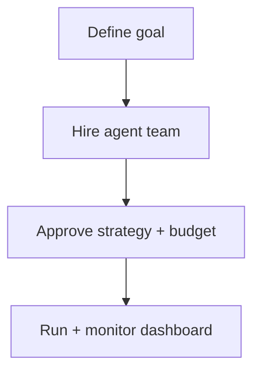

# Paperclip

**Paperclip**（[paperclipai/paperclip](https://github.com/paperclipai/paperclip)，[paperclip.ing](https://paperclip.ing)）是 **「管理工作中各类 Agent」** 的开源自托管应用：表面是 **任务/目标仪表盘**，底层是 **org chart、预算、治理与多 Agent 协调** — README 比喻：**OpenClaw 是员工，Paperclip 是公司**。

## 一句话定义

用 **一个控制台** 对齐 **商业/项目目标** 与 **多 harness Agent 团队** 的任务、技能、权限与 spend。

## 英文缩写速查

| 缩写 | 英文全称 | 简要说明 |
|------|----------|----------|
| UI | User Interface | React 前端仪表盘 |
| API | Application Programming Interface | Node 服务端与 adapter HTTP 端点 |
| MRR | Monthly Recurring Revenue | README 示例目标用语（产品叙事） |

## 核心信息

| 字段 | 内容 |
|------|------|
| 许可 | MIT |
| Stars（2026-10-01） | ~95.4k（Trendshift 约 +14.6k/月） |
| 适配 | OpenClaw、Claude Code、Codex、Cursor、Gemini CLI、OpenCode、Pi、Hermes 等 |

## 为什么重要（对本知识库读者）

- **并行 ingest / 研究组：** 可将 **ingest / lint / 前端 export** 分给不同 Agent，Paperclip 跟踪 **目标与成本**，而非仅 GitHub PR 列表。
- **与单 Agent OS 分工：** [Hermes Agent](hermes-agent.md)、[OpenClaw](openclaw.md) 解决 **单实例能力**；Paperclip 解决 **多实例编制**。
- **与 ECC / Addy Osmani Skills：** harness 侧技能仍各自安装；Paperclip 管 **谁做什么、花多少**。

## 核心流程

## 局限

- 自托管需运维；**Paperclip Cloud** 仍在 waitlist。
- 「公司叙事」示例偏 **软件产品**；科研 wiki 需自行映射 goal 粒度。
- Adapter 能力差异见 [官方 docs](https://docs.paperclip.ing/reference/adapters/overview/)。

## 关联页面

- [OpenClaw](openclaw.md) — 常被 Paperclip 编排的「员工」型 Agent
- [Hermes Agent](hermes-agent.md) — 适配器支持的 harness 之一
- [ECC](ecc.md) — 单 Agent 工程纪律包

## 参考来源

- [Paperclip 仓库归档](../../sources/repos/paperclip.md)
- [paperclip.ing 站点归档](../../sources/sites/paperclip-ing.md)
- [paperclipai/paperclip（GitHub）](https://github.com/paperclipai/paperclip)

## 推荐继续阅读

- [Paperclip 文档 Quickstart](https://docs.paperclip.ing)
- [OpenClaw 实体页](openclaw.md)
