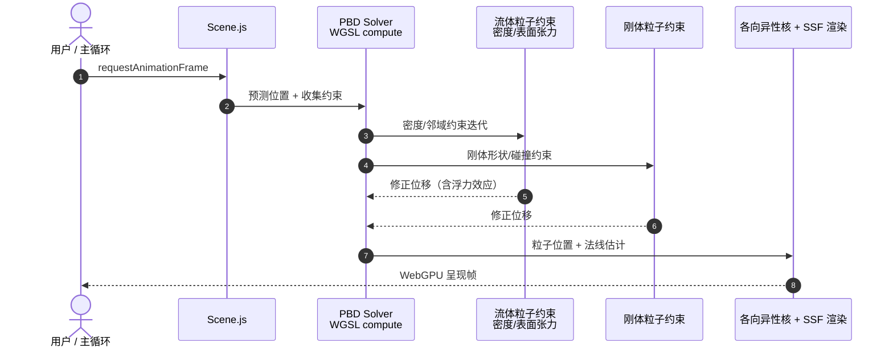

# Particles4All

**Particles4All**（[GitHub](https://github.com/matsuoka-601/Particles4All)，[在线 Demo](https://particles4all.netlify.app/)）是面向浏览器的 **WebGPU** 实时 **统一粒子物理** 求解器：**流体与刚体均表示为粒子**，在 **同一套 PBD（Position Based Dynamics）约束求解器** 中求解，天然含 **浮力**；渲染侧用 **各向异性核** 重建流体表面，并以 **screen-space narrow-range filter** 平滑；支持 **表面张力** 与交互式倒水、推水。

## 一句话定义

**在浏览器里用一套 PBD 环同时解刚体与流体粒子，并用 WebGPU 做实时统一物理 + 屏幕空间流体渲染。**

## 英文缩写速查

| 缩写 | 英文全称 | 简要说明 |
|------|----------|----------|
| PBD | Position Based Dynamics | 位置基约束迭代求解 |
| WebGPU | Web Graphics Processing Unit API | 浏览器 GPU 计算与图形 API |
| WGSL | WebGPU Shading Language | WebGPU 着色器语言 |
| SPH | Smoothed Particle Hydrodynamics | 平滑粒子流体经典族 |
| GPU | Graphics Processing Unit | 浏览器端并行物理与渲染 |
| DAT | Divide and Truncate | Newton 多求解器接触后处理；与本单环 PBD 对照 |

## 为什么重要

- **零安装原型：** `python -m http.server` + Chrome/Edge 113+ 即可跑 —— 适合教学、Demo 与快速验证 **统一粒子** 交互。
- **刚–流同构：** 与 NVIDIA Flex 思路一致，**浮力、耦合接触** 在单约束环内出现，无需刚体引擎 + 流体求解器硬拼接。
- **渲染一体化：** 物理粒子直接接 **各向异性核 + narrow-range screen-space fluid**，避免离线路径烘焙。
- **与 Newton/DAT 对照：** 引擎级多求解器 + 接触后处理（[DAT](./paper-dat-divide-and-truncate.md)）vs **单环 PBD** —— 帮助理解机器人仿真选型外的 **轻量统一粒子** 路径。

## 核心信息

| 项 | 内容 |
|----|------|
| **维护者** | 独立维护者 matsuoka-601（GitHub 个人项目） |
| **许可** | 以 GitHub 仓库为准 |
| **开源** | **已开源** — 零构建 ES modules + WGSL |

## 核心能力

| 维度 | 要点 |
|------|------|
| **统一求解** | 流体 + 刚体粒子 → 单 PBD constraint loop（参考 Flex 统一粒子物理） |
| **浮力** | 统一求解器内自然出现 |
| **表面张力** | 基于 SPH 表面张力/黏附文献 |
| **流体表面** | 各向异性核重建 + narrow-range screen-space 平滑 |
| **栈** | ES modules + WGSL；**无构建步骤、无 npm 依赖** |
| **交互** | 旋转/平移/缩放、悬停推水、倒水、暂停、调试窗 |

## 流程总览

## 源码运行时序图

官方仓库为纯前端 ES modules；典型一帧：

- **最短路径：** clone 仓库 → `python -m http.server 8080` → 打开 `http://localhost:8080`（勿用 `file://`）。

## 工程实践

| 步骤 | 做法 |
|------|------|
| 运行 | `python -m http.server 8080`；Chrome/Edge 113+、Safari 18+ 或启用 WebGPU 的 Firefox |
| 质量 | UI 中 `quality` 控制 per-pixel _pass 分辨率比例 |
| 交互 | 空格暂停；**H** 隐藏控件；**D** 调试 |
| 扩展 | 修改 `Scene` 尺寸、墙运动、`Pour water` 水源参数 |
| 对照 | 机器人训练级仿真见 [Newton](./newton-physics.md)；本仓库偏 **实时可视化原型** |

## 局限与风险

- **非机器人训练后端：** 无 URDF/MJCF、无批量 RL、无可微系统辨识接口。
- **浏览器 GPU 差异：** WebGPU 实现与驱动仍在演进，性能因平台波动大。
- **物理保真：** PBD 统一粒子为 **视觉交互优先**；与 MuJoCo 硬接触 / MPM 本构不可直接类比（见 [仿真物理保真](../queries/simulation-physics-fidelity.md)）。
- **文档 TODO：** README 中部分小节仍为 TODO，细节需读源码。

## 关联页面

- [Newton Physics](./newton-physics.md)
- [DAT](./paper-dat-divide-and-truncate.md)
- [仿真物理保真（Query）](../queries/simulation-physics-fidelity.md)
- [Genesis World 1.0](./genesis-world-10.md)

## 参考来源

- [Particles4All 仓库归档](../../sources/repos/particles4all.md)

## 推荐继续阅读

- [GitHub：matsuoka-601/Particles4All](https://github.com/matsuoka-601/Particles4All)
- [在线 Demo](https://particles4all.netlify.app/)
- [NVIDIA Flex 统一粒子物理（PDF）](https://matthias-research.github.io/pages/publications/flex.pdf)
