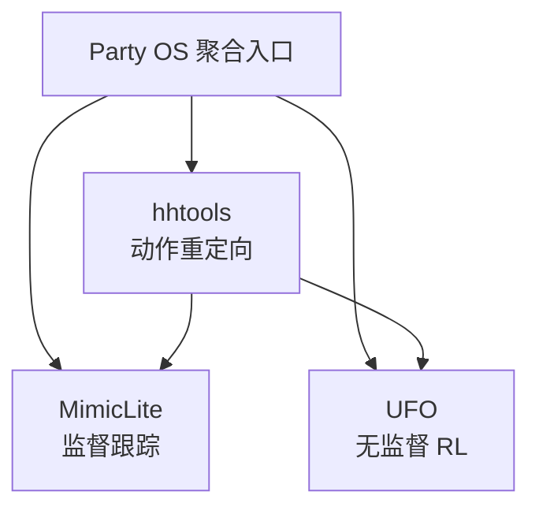

# Party OS（RoboParty 人形研发底座）

**Party OS** 是 [RoboParty](./roboparty.md) 旗下 [RoboParty Lab](https://lab.roboparty.com) 对外沉淀的 **开放研发基础设施**，目标是把人形机器人研发中最耗时、最分散、最难复现的底层能力做成可复用模块，让开发者把时间花在真正前沿的问题上，而非反复从零搭建基建。

## 英文缩写速查

| 缩写 | 英文全称 | 简要说明 |
|------|----------|----------|
| Party OS | Party Operating System | RoboParty Lab 研发底座聚合层（非传统 OS） |
| Sim2Real | Simulation to Real | 仿真策略迁移真机 |
| BFM | Behavior Foundation Model | 可复用、可 prompt 的身体运控基座 |
| RL | Reinforcement Learning | 通过与环境交互最大化长期回报来学习策略的范式 |
| URDF | Unified Robot Description Format | 统一机器人描述格式 |

## 为什么重要

1. **显式解决「idea 输在基建」**：本体、数据、动作处理、训练框架、真机部署、复现与影响力往往消耗年轻研究者大部分时间。
2. **从单机到 infra 的演进**：在 [Roboto Origin](./roboto-origin.md)「开源一台人形」之后，RoboParty 进一步走向 **建设开源人形机器人基础设施**。
3. **首批三段工具链已落地**：动作准备（hhtools）→ 监督跟踪（MimicLite）→ 无监督控制（UFO），并预留跨 codebase 部署层。

## 核心结构

Party OS 首批开源子模块可理解为「三段流水线 + 一个聚合入口」：

| 模块 | 职责 | 详情页 |
|------|------|--------|
| [human-humanoid-tools](./human-humanoid-tools.md) | Human→Humanoid / R2R 动作重定向、数据质检与可视化 | 约 30s 级 retarget；Any Motion / Any URDF |
| [MimicLite](./mimiclite.md) | 监督学习通用运动跟踪训练与部署 infra | any4hdmi + mjhub；跨 SONIC/BFM-Zero/TWIST2 等部署 |
| [UFO](./roboparty-ufo.md) | 无监督 RL 控制全栈框架 | MJLab backend；BFM-Zero / [TeCH](./paper-tech-humanoid-control.md)；真机遥操 |
| **Party_OS 仓库** | 聚合入口与路线图 | [GitHub](https://github.com/Roboparty/Party_OS) |

## Lab 四方向路线图（规划）

| 方向 | 英文 | 重点 |
|------|------|------|
| 通用基础运动 | Humanoid Locomotion | 数据 infra、Sim2Real/Real2Sim、BFM 通用运动模型 |
| 感知交互 | Humanoid Perceptive Interaction | 行走/奔跑/跳跃/攀爬；HSI、HOI |
| 全身操作 | Humanoid Whole-Body Manipulation | BFM 运控基座 + 可 scale 的 VLA / World Model |
| 智能体 | Agentic Humanoid | Agent + Skills 低成本高智能 |

## 工程实践

- **入口：** [lab.roboparty.com](https://lab.roboparty.com) 与 [Party_OS](https://github.com/Roboparty/Party_OS) 仓库。
- **选型建议：**
  - 上游动作/数据准备优先 [hhtools](./human-humanoid-tools.md)；
  - 监督跟踪与 **外部策略统一部署** 优先 [MimicLite](./mimiclite.md)；
  - 无监督 RL / BFM-Zero 类研究优先 [UFO](./roboparty-ufo.md)。
- **与学术栈对照：** 跟踪能力对标 [SONIC](../methods/sonic-motion-tracking.md) 生态；无监督线对标 [BFM-Zero](./paper-bfm-zero.md)；训练 backend 与 [mjlab](./mjlab.md) 同层。

## 局限与风险

- **快速演进：** 2026-07 首批发布，API 与文档可能频繁变更。
- **性能数字：** 文内 GPU-hours、训练时长为自述，须以仓库复现为准。
- **路线图 ≠ 已交付：** 四方向中 VLA infra、world model infra 等多为规划，非本次三项工具范围。

## 关联页面

- [RoboParty Lab / Party OS 技术地图](../overview/roboparty-lab-party-os-technology-map.md)
- [MimicLite](./mimiclite.md)
- [UFO（Roboparty）](./roboparty-ufo.md)
- [human-humanoid-tools](./human-humanoid-tools.md)
- [Roboto Origin](./roboto-origin.md)
- [Motion Retargeting](../concepts/motion-retargeting.md)

## 参考来源

- [party_os.md](../../sources/repos/party_os.md)
- [lab_roboparty_com.md](../../sources/sites/lab_roboparty_com.md)
- [roboparty_com.md](../../sources/sites/roboparty_com.md)
- [wechat_roboparty_lab_party_os_3_tools.md](../../sources/blogs/wechat_roboparty_lab_party_os_3_tools.md)

## 推荐继续阅读

- [Party OS GitHub](https://github.com/Roboparty/Party_OS)
- [RoboParty Lab 官网](https://lab.roboparty.com)
- [BFM 41 篇技术地图](../overview/bfm-41-papers-technology-map.md)
