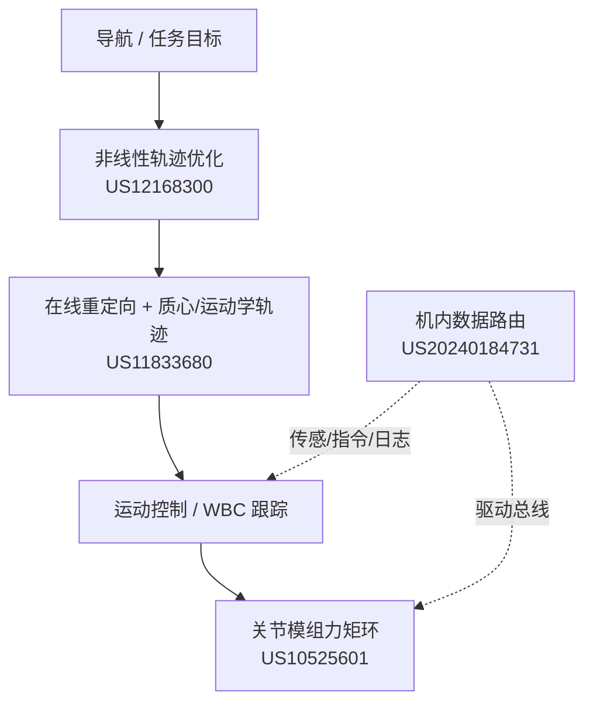

# Boston Dynamics 足式控制与硬件专利栈

本页归纳 **Boston Dynamics** 五件与 **Spot / Atlas 类足式平台** 相关的授权或公开专利（见 [`sources/patents/boston_dynamics_legged_robot_patents.md`](../../sources/patents/boston_dynamics_legged_robot_patents.md)），从 **运动规划、执行器、机内网络** 三条线理解其 **模型驱动 + 高集成硬件** 工程哲学，并与 **RL 低层研究**（[Spot RL](./paper-spot-rl-distributional-sim2real.md)）对照阅读。

## 一句话定义

**用在线质心—运动学轨迹优化与非线性规划做「怎么动」，用关节内电机—驱动—传感一体化与机内交换网络做「怎么力控与怎么连」，液压专利则标记早期高功率密度路线。**

## 英文缩写速查

| 缩写 | 英文全称 | 简要说明 |
|------|----------|----------|
| MPC | Model Predictive Control | 滚动优化控制序列；与专利中轨迹优化同族 |
| WBC | Whole-Body Control | 全身关节协调满足接触与任务约束 |
| PCB | Printed Circuit Board | 关节内集成驱动功率级 |
| FET | Field-Effect Transistor | 电机桥臂功率开关 |
| CMA | Centroidal Dynamics | 质心/角动量级简化动力学 |
| RL | Reinforcement Learning | 数据驱动低层；与专利模型路线形成对照 |
| Spot | Boston Dynamics Spot | 四足商业化平台 |

## 为什么重要

- **知识产权地图：** 理解 BD 在 **实时轨迹重定向、非线性规划、关节模组、机内网络** 上的布局，有助于解读 **产品能力边界** 与 **研究 SDK 开放程度**。
- **技术代际：** **US8126592（液压双缸）** 与 **US10525601（全电关节模组）** 标示 **液压 Atlas/BigDog → 全电 Spot** 的执行器演进。
- **与开源 RL 的关系：** 专利描述 **优化式运控 + 定制硬件**；[Spot RL 论文](./paper-spot-rl-distributional-sim2real.md) 展示 **同一硬件上 RL 低层 API** 的可行性——二者 **可分层共存**（高层导航/安全仍常保留模型方法）。

## 专利—能力对照

| 专利号 | 标题要点 | 工程含义 |
|--------|----------|----------|
| **US11833680B2** | Online trajectory optimization | 导航目标 + 运动学状态 → **重定向轨迹** → **质心轨迹 + 一致运动学轨迹** |
| **US12168300B2** | Nonlinear trajectory optimization | 初始/目标状态间 **非线性优化** 候选轨迹 + **可行性检查** |
| **US10525601B2** | Motor & controller integration | 关节壳体内 **电机 + 面向电机的驱动 PCB + 轴端磁编码器** |
| **US20240184731A1** | Data transfer assemblies | **多主机处理器** 经交换设备路由至 **机载电子设备** |
| **US8126592B2** | Actuator system | **双液压缸** + 负载传感 + **电控阀** 的关节液压闭环 |

> **公开号校正：** 外部索引中的 `US2024184731A1` 对应 Google Patents 公开 **`US20240184731A1`**（Data transfer assemblies）。

### 流程总览（模型驱动运控链）

## 常见误区或局限

- **误区：「读专利即可复现 Spot 步态」。** 专利披露 **机制与结构**，不含完整参数、标定与训练数据；**RL 路线** 另需 SDK 与仿真栈。
- **局限：** 专利 **申请/授权文本** 与 **出货产品** 未必一一对应；宜作 **能力方向** 而非版本说明书。
- **液压专利：** US8126592 主要服务 **历史液压平台**；当前 Spot 为 **全电**，但 **控制分层思想** 仍延续。

## 关联页面

- [Boston Dynamics](./boston-dynamics.md)
- [四足机器人](./quadruped-robot.md)
- [Model Predictive Control](../methods/model-predictive-control.md)
- [Whole-Body Control](../concepts/whole-body-control.md)
- [Spot RL 分布距离 Sim2Real](./paper-spot-rl-distributional-sim2real.md)
- [Autonomous Spot / NeBula](./paper-autonomous-spot-nebula-exploration.md)
- [Tesla 膝关节专利](./patent-tesla-robot-knee-joint-assembly.md)
- [执行器驱动链选型闭环知识链](../queries/actuator-drive-chain-selection-loop.md) — 该腿式控制栈专利覆盖执行器闭环，是驱动链④层实时集成的工业参照

## 参考来源

- [Boston Dynamics 足式机器人专利摘录](../../sources/patents/boston_dynamics_legged_robot_patents.md)

## 推荐继续阅读

- US11833680 PDF：<https://patentimages.storage.googleapis.com/a3/11/0d/6857f78699a46b/US11833680.pdf>
- US12168300 PDF：<https://patentimages.storage.googleapis.com/9c/94/68/18b5059ffcd158/US12168300.pdf>
- US8126592 PDF：<https://patentimages.storage.googleapis.com/04/57/c5/611d0ebefde7e0/US8126592.pdf>
- Kuindersma et al., *Optimization-based locomotion planning for Atlas*（学术对照）
