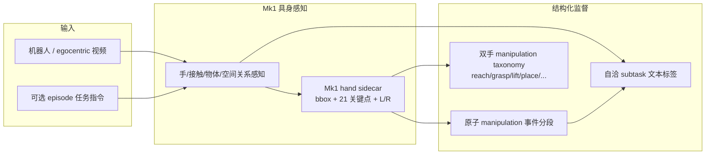

# Perceptron Egocentric

**Perceptron Egocentric**（[官方博客](https://www.perceptron.inc/blog/introducing-perceptron-egocentric-api) | Early Access 2026-07）把 **原始机器人或 egocentric 视频** 转为 **可训练策略的结构化监督**：**原子操作时间分段**、**自洽子任务语义标签** 与 **双手稠密 grounding**（检测 + 21 关键点 + 预定义 manipulation taxonomy）。

## 一句话定义

**Mk1 具身感知底座 + 推理期标注框架**：可选 episode 任务指令，将演示视频切分为 **contact-aware 的原子 manipulation 事件** 并输出 **policy-trainable** 的分段标签与双手轨迹/动作类，在 **WGO-Bench** 上以 **更低成本** 达到 **高于 Gemini Robotics ER-1.6 / Gemini 3.5 Flash 管线** 的端到端子任务标注质量。

## 英文缩写速查

| 缩写 | 英文全称 | 简要说明 |
|------|----------|----------|
| API | Application Programming Interface | 面向实验室与数据供应商的托管标注接口（Early Access） |
| ER | Embodied Reasoning | 具身推理；Google Gemini Robotics 的 ER 变体为 WGO 对照之一 |
| F1 | F1 Score | WGO-Bench 主指标：时间边界 IoU ≥ 0.75 且 LLM judge 标签正确的 harmonic mean |
| IoU | Intersection over Union | 预测与 gold 段时间重叠率；WGO 匹配阈值 **≥ 0.75** |
| VLM | Vision-Language Model | 通用视觉–语言模型；Macrodata WGO 管线以 Gemini 3.5 Flash 等为 teacher |
| WGO | What's Going On | Macrodata 发布的自动 **子任务分段 + 语义标注** 基准与对照管线 |

## 为什么重要

- **策略训练的监督瓶颈：** 视频采集便宜、**语义分段 + 双手 grounding** 标注贵（人工约 **$50/视频小时**）；通用 VLM 管线常产出 **弱时间边界、无手部接地** 的扁平文本。
- **具身原生 vs 通用 VLM：** 作者强调 **Mk1** 在预训练阶段即建模 **手、接触、物体状态与空间关系**，**未**在 WGO harness / taxonomy / episode 上微调；能力来自 **感知–推理** 而非任务专用后训练。
- **Instruction-optional：** 已知任务指令时可显著提 recall；**无指令** 仍可在 WGO 上超过先前 SOTA，适合 **in-the-wild** 或指令缺失的演示库。

## 核心结构/机制

### 运行配置（博客摘要）

| 配置 | 上下文 | 定位 |
|------|--------|------|
| With instruction | 提供 episode 任务指令 | **质量优先**；WGO end-to-end F1 **0.280** |
| No instruction（best accuracy） | 无任务先验 | 仍超先前 SOTA 分割/端到端 |
| No instruction（fast-inferred） | 无任务先验 | **成本/延迟** 选项；F1 **0.182**，仍高于 WGO no-instruction seeded |

### WGO-Bench 结果摘要（with instruction，2026-07）

| 指标 | Perceptron Egocentric | WGO one-pass（Gemini 3.5 Flash 等） |
|------|----------------------|-------------------------------------|
| Semantic end-to-end F1 | **0.280** | 0.158（**+77%** 相对） |
| Segment F1 | **0.370** | 0.302 |
| Semantic precision / recall | **0.330 / 0.244** | 0.190 / 0.136 |
| 完全正确 gold 段 | **181 / 743** | ~101 |

- **成本：** with-instruction 约为人工 **1/10–1/15**；低于 Macrodata 全管线（含 seeded-relabeling 二次 Gemini pass）。
- **WGO seeded-relabeling：** 条件标签准确率 78.1%，但 end-to-end F1 仅 **0.168**——高 **条件** 精度在低 recall 切片上更易，仍低于 Perceptron **无 relabeling** 的 with-instruction 结果。

### 评测设定（WGO-Bench）

- **Episodes：** HomER（egocentric）、DROID（外置相机）、Galaxea（头相机）；**743** gold 段、**62** 指令、**71.5** 分钟。
- **Scoring：** temporal IoU ≥ **0.75** + benchmark 规定 **LLM label judge**（与 Macrodata 公开协议一致）。

## 工程实践

1. **数据入口：** 机器人外置/头相机或人类 egocentric 演示；若任务已知，传入 **episode 级指令** 可换更高 recall 的分段监督。
2. **输出用法：** 原子段边界 + subtask caption → [模仿学习](../methods/imitation-learning.md) / [VLA](../methods/vla.md) 的 **(video segment, language, action)** 或 **keyframe–skill** 数据集；双手 bbox/关键点可接重定向或 contact 校验。
3. **成本建模：** 博客按 2026-07 list price 估算 API 用量；**手部 pose sidecar** 约 **+$1/视频小时**（自有 GPU，非第三方 metered API）；**不含** benchmark LLM judge 评测费。
4. **与通用 VLM 管线对照：** 若已有 Gemini / GPT-4V 抽帧 caption 流程，应用 **同一 WGO 协议**（IoU + judge）做 A/B，而非仅比「文本像不像」。

## 局限与风险

- **Early Access：** 能力边界、定价与 SLA 以 Perceptron 官方为准；WGO 数字来自 **2026-07 博客自报全量跑分**。
- **Benchmark 域：** WGO 覆盖 HomER / DROID / Galaxea 子集，**不等于** 所有机器人本体、夹爪或长程家务任务。
- **Judge 依赖：** 端到端 F1 含 **LLM judge**；换 judge 模型可能改变绝对值（Perceptron 与 WGO 使用同一 judge 协议）。
- **非 motion retargeting：** 输出是 **语义–时间–手部 grounding 监督**，不替代 [Motion Retargeting](../concepts/motion-retargeting.md) 或关节轨迹清洗。

## 关联页面

- [Auto-labeling Pipelines](../methods/auto-labeling-pipelines.md) — 自动化标注管线谱系与 Teacher–Student 架构
- [Gemini Robotics](./gemini-robotics.md) — WGO 对照基座（ER-1.6 + Gemini 3.5 Flash）
- [模仿学习 (Imitation Learning)](../methods/imitation-learning.md) — 分段演示监督的常见消费端
- [VLA](../methods/vla.md) — 语言–视觉–动作数据引擎语境
- [灵巧操作数据管线与 RL 基建指南](../queries/dexterous-manipulation-data-pipeline.md) — 轨迹/接触自动标注选型

## 参考来源

- [perceptron_egocentric_api.md](../../sources/blogs/perceptron_egocentric_api.md)
- Perceptron Blog — *Introducing Perceptron Egocentric API*（2026-07-09）：https://www.perceptron.inc/blog/introducing-perceptron-egocentric-api

## 推荐继续阅读

- Macrodata **WGO-Bench** 公开博客与 end-to-end 评测表（Gemini 3.5 Flash / seeded-relabeling 数字来源）
- [CLAW](../methods/claw.md) — 仿真侧重定向 **语言–全身轨迹** 自动生成（互补「视频→语义分段」路线）
- [MolmoMotion](./molmo-motion.md) — 语言条件 **3D 点轨迹** 自动标注与规划先验（几何运动 vs 子任务语义）
