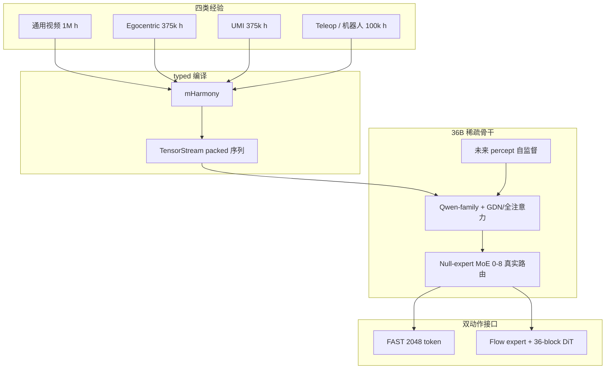
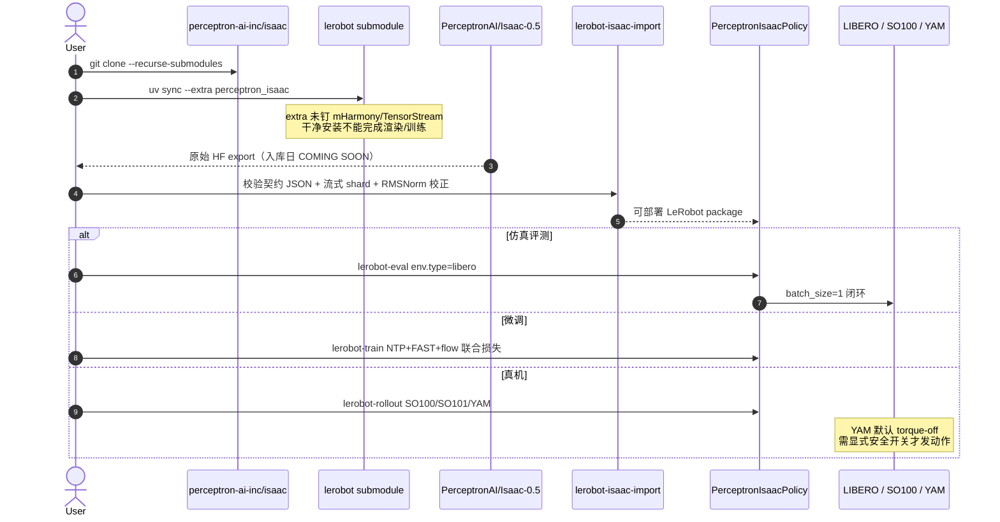

# Perceptron Isaac 0.5

**Isaac 0.5**（[官方博客](https://www.perceptron.inc/blog/introducing-isaac-0-5) | [技术报告 PDF](https://pub-d90b81cad7254a1aa6b148ac18153c0c.r2.dev/isaac-0.5.pdf) | 2026-08-26）是 **感知器（Perceptron）** 发布的 **开源权重具身基础模型**：把多模态视频理解、空间 grounding、任务进度估计与机器人控制收进 **同一 36B 稀疏骨干**，动作用 **FAST 离散 token** 与 **Flow/DiT 连续 chunk** 两条接口读同一表示。

> **消歧：** 本页是 **Perceptron** 的模型，**不是** NVIDIA [Isaac Lab](./isaac-lab.md) / [Isaac Sim](./isaac-sim.md) / [Isaac GR00T](./isaac-gr00t.md)。后者是仿真与人形 VLA **平台**；本页是 **36B 通才策略权重 + LeRobot 策略类型**。

| 字段 | 内容 |
|------|------|
| **机构** | 感知器（Perceptron） |
| **骨干** | Qwen-family VLM；40 稀疏块（30 GDN + 10 全注意力） |
| **规模** | **36B** 总参数 / 期望 **2.5B** 激活（null-expert 参考设定） |
| **数据** | **1M h** 通用视频 + **375k h** ego + **375k h** UMI + **100k h** 机器人（**35+** 本体） |
| **开源** | **部分开源**（代码 Apache 2.0；Hub 权重入库日 **COMING SOON**；percept 损失专有） |

## 一句话定义

**用可缩放的无动作标签视频（未来 percept 自监督）塑造与控制共享的稀疏 VLM 表示，再以 FAST + Flow 双头输出动作，使达到同一 held-out 动作损失所需的遥操作小时数随视频规模下降约两个数量级。**

## 英文缩写速查

| 缩写 | 英文全称 | 简要说明 |
|------|----------|----------|
| VLA | Vision-Language-Action | 视觉–语言–动作通才策略；本模型同时覆盖感知输出与控制 |
| MoE | Mixture of Experts | 稀疏路由；本模型每层 256 真实专家 + null 路径 |
| FAST | Frequency-space Action Sequence Tokenization | 2,048 词表的离散动作 token 接口（π 系同族） |
| DiT | Diffusion Transformer | 36 块、宽 768 的连续动作 Flow 专家骨干 |
| UMI | Universal Manipulation Interface | 手持夹爪示范；与 ego / 通用视频一起构成视频混合物 |
| RTC | Real-Time Chunking | 训练/部署时在当前 chunk 执行中预测下一 chunk |
| MFU | Model FLOPs Utilization | 百万小时视频栈在 hypersparse 设定报告约 24% |

## 为什么重要

- **把「视频能不能换 teleop」写成可规划的等高线：** 固定 80:30:30 通用:ego:UMI，动作损失 **2.50** 时，通用视频从 1k h 升到 1M h，所需 teleop 从 **5,884 h → 28 h**（**210.3×**）。这与 [EgoScale](../methods/egoscale.md)（人视频小时 ↔ 真机后训练）和 [Dyna-2](./dyna-2.md)（1M h ego、**闭源** WAM）构成 **开源、带 teleop 置换数字** 的第三条轴。
- **感知与控制不是两个 checkpoint：** 同一稀疏骨干出文本、坐标、任务状态、FAST token 与 Flow chunk；博客对照表相对 π0.7 / Qwen-VLA 等强调 **RTC、既往动作、mistake modeling、非机器人视频** 同时开源。
- **稀疏激活对准实时控制：** 36B 总参数、期望 2.5B 激活；报告 H100 上约 **70 ms / 14.3 Hz**（三张 1024² + 10 Flow 步的架构估算）。这是对「通才必须是稠密小模型」叙事的直接反例。

## 核心原理

| 模块 | 作用 |
|------|------|
| **共享骨干** | Qwen-family；patch 16；宽 2048；**40** 层（**30 GDN** + **10** 全注意力） |
| **Null-expert MoE** | 256 真实 routed MLP + 学习到的 null 阈值；top-8 中真实专家数 **0–8**；shared expert 常开 |
| **未来 percept** | 从未来观测自动构造语义目标（物体状态、接触、任务阶段等）；**无动作标签**；目标生成与 ℓ **专有** |
| **FAST 头** | 自回归；2,048 离散动作 token；与语言/grounding 共用隐藏态 |
| **Flow / DiT 头** | 骨干 2048→768 交叉注意力；**36** 块 DiT；连续 action chunk |
| **mHarmony → TensorStream** | typed 多模态事件编译再打包；**未**打进 LeRobot extra |

### 数据混合物（技术报告 Table 1）

调度质量上感知约占 **70%**、机器人 **30%**；打包后 token 暴露 **反转** 为感知 **20%** / 机器人 **80%**（机器人样本占更多序列位置）。机器人 **100k h** 拆成高质量 teleop **10k h**、更广交互 **40k h**、游戏与仿真 **50k h**。

### 流程总览

## 源码运行时序图

官方可运行路径在 LeRobot 子模块；**干净 `uv sync --extra perceptron_isaac` 尚不足以训练/推理**（mHarmony 运行时未声明）。下列时序对齐 README 入口，假设权重与数据编译器已按 provenance 指南备齐。

关键复现路径：先 `isaac/lerobot` 装 extra → 等 Hub 权重可下载后走 `lerobot-isaac-import` → `lerobot-eval` / `lerobot-train`；不要把根仓 README 的 `from lerobot.policies.perceptron_isaac import PerceptronIsaacPolicy` 误当成端到端可训。

## 工程实践

1. **克隆必须带子模块：** `git clone --recurse-submodules https://github.com/perceptron-ai-inc/isaac.git`，工作目录是 `isaac/lerobot`。
2. **导入不等于 `from_pretrained`：** 原始 HF export 不可直接部署；必须经 `lerobot-isaac-import` 绑定契约哈希并写出 processor。
3. **LIBERO：** `--eval.batch_size>1` 会被拒绝；在线推理每策略实例一个环境。
4. **CUDA / ABI：** 生产 H100 动作对齐钉 **PyTorch 2.10.0+cu128**；仓默认 2.11 环境只适合 CPU 开发。`perceptron_isaac_cuda` extra 不覆盖全仓 PyTorch 选择。
5. **跨本体：** 报告用同一 checkpoint、只改配置 prompt 里的 embodiment 字符串，在 YAM 与 SO-101 上执行同一叠杯任务。

## 评测读法

| 轴 | 数字（作者报告） | 读法 |
|----|------------------|------|
| Grounding | ScreenSpot-Pro **62.6**、LVIS Count **32.8**、CARPK **19.1** | 与同 harness 的 Qwen3-VL 对照；博客强调相对最强 Qwen3-VL 跑分的领先与更低推理 FLOP |
| LIBERO 适配 | 每套 500 演示后平均 **97.2**（S/O/G/L = 98.0/99.0/98.8/93.0） | 与 MolmoAct2 / GR00T N1.7 / π0.5 **同档**；表中多数行转录自各原文协议，**不是统一重跑** |
| 少样本象棋 | 1 epoch × 1 expert episode：损失降幅 **10.5× / 9.5× / 7.0×** | 博客写明个体差接近 seed 标准误，应读 **排序** 而非绝对值 |
| 延迟 | H100 **70 ms / 14.3 Hz**、FP8 **36 GB** | 架构估算（三图 + 10 Flow 步）；对照 GR00T N1.7 TensorRT **27.9 ms** 时注意协议不同 |

## 结论

**真正拉开差距的是「无动作视频如何更新与控制共享的表示」以及「视频小时数何时开始置换 teleop」；36B 总参数和双动作头是实现该共训的载体，不是独立卖点。**

1. **规划数据预算时用 210× 等高线，而不是「再多采一点 teleop」。** 1M h 通用视频把 τ=2.50 的 teleop 需求从约 5.9k h 降到 28 h；但 1 h teleop 时 10× 视频几乎不降损失——先要有足够动作 grounding。
2. **Percept 目标不是开源可复现项。** 论文只公开 \(L_{\mathrm{sem}}\) 的期望形式；generator 与 ℓ 专有。复现感知分数或缩放斜率时不要假设能重训同一自监督。
3. **LIBERO 97.2 是适配后数字**（每套 500 演示），用来对标 MolmoAct2 / GR00T / π0.5 的「能调上去」，不是零样本通才声明。
4. **部署先看激活参数与导入管线，再看 36B。** 期望 2.5B 激活；未经 `lerobot-isaac-import` 的 HF 目录不能当可部署策略。
5. **开源结论写「部分」。** 代码与 LeRobot 入口已放；权重 Hub 入库日仍 COMING SOON；mHarmony 未进 extra。权重落地后再升格，勿按博客「complete system」字面理解为可一键复现。

## 局限与风险

- **与 NVIDIA Isaac 撞名：** 检索、引用、issue 里必须写 **Perceptron Isaac 0.5**，否则会链到仿真栈。
- **博客对照表把 π0.7 / Qwen-VLA 标成未开源：** 与本库既有页面不完全一致（Qwen-VLA 有公开仓；π0.7 以论文+博客为主）。读表时当 **作者配方清单**，不要当本库开源裁定。
- **专有 percept 损失：** 缩放律依赖该目标把视频接到动作表示；外部无法验证「换一个视频 SSL 是否还能 210×」。
- **运行时缺口：** 无 mHarmony 包则训练/推理文档明确失败；H100 生产 ABI 与开发环境分裂。
- **权重滞后：** 技术报告写「we release the weights」，Hub 页同时写 COMING SOON——以 Hub 实际文件为准。

## 关联页面

- [VLA](../methods/vla.md) — 通才策略方法主线；本模型是 2026-08 开源稀疏大模型样本
- [Foundation Policy](../concepts/foundation-policy.md) — 基础策略谱系
- [Embodied Scaling Laws](../concepts/embodied-scaling-laws.md) — 视频小时置换 teleop 的案例
- [LeRobot](./lerobot.md) — `policy.type=perceptron_isaac`
- [Perceptron Egocentric](./perceptron-egocentric.md) — 同机构 Mk1 子任务标注 API（数据引擎轴，非本策略权重）
- [Isaac GR00T](./isaac-gr00t.md) — NVIDIA 平台；名称消歧
- [π₀.7](../methods/pi07-policy.md) — 博客配方对照表中的闭源通才对照
- [Qwen-VLA](./qwen-vla.md) / [LingBot-VLA](./lingbot-vla.md) — 同属 Qwen-family + flow 开源通才
- [Dyna-2](./dyna-2.md) / [EgoScale](../methods/egoscale.md) — 人视频缩放的闭源 WAM / 开源 VLA 对照
- [Action Chunking](../methods/action-chunking.md) — RTC 与异步 chunk 部署
- [VLA 开源复现景观（2025）](../overview/vla-open-source-repro-landscape-2025.md) — 2026 补充入口

## 参考来源

- [perceptron_isaac_05.md](../../sources/blogs/perceptron_isaac_05.md) — 官方博客摘录
- [perceptron_isaac_05.md](../../sources/papers/perceptron_isaac_05.md) — 技术报告 PDF 摘录
- [perceptron-isaac.md](../../sources/repos/perceptron-isaac.md) — GitHub / LeRobot 子模块
- [perceptron-inc.md](../../sources/sites/perceptron-inc.md) — 公司站开源核查
- Perceptron, *Isaac 0.5: Percepts Scale Control*（技术报告，2026-08-26）：https://pub-d90b81cad7254a1aa6b148ac18153c0c.r2.dev/isaac-0.5.pdf
- 博客：https://www.perceptron.inc/blog/introducing-isaac-0-5
- 代码：https://github.com/perceptron-ai-inc/isaac
- 权重页：https://huggingface.co/PerceptronAI/Isaac-0.5

## 推荐继续阅读

- Physical Intelligence FAST tokenizer（博客外链 [arXiv:2601.15370](https://arxiv.org/abs/2601.15370)）— 离散动作接口的上游工作
- [π₀ Policy](../methods/π0-policy.md) — FAST + flow 双接口的 π 系开源栈
- TensorStream 工程博客：https://www.perceptron.inc/blog/tensorstream
- [Xiaomi-Robotics-1](./xiaomi-robotics-1.md) — 另一条 **100k h** 级 UMI 预训练、权重 Coming soon 的对照
