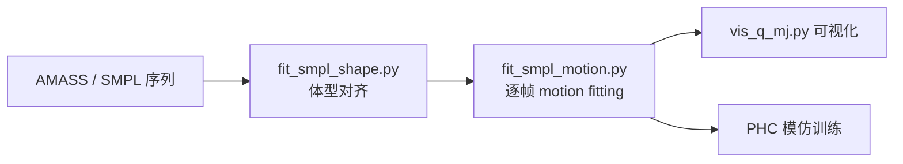

# PHC（Perpetual Humanoid Control）

**PHC**（<https://github.com/ZhengyiLuo/PHC>，ICCV 2023）是 [Zhengyi Luo](./zhengyi-luo.md) 团队的 **物理仿真人形控制** 开源实现：大规模动作模仿、噪声输入容错与 fail-state 恢复（PMCP）。在重定向语境下，它提供 **SMPL/AMASS → 自定义人形** 的 shape/motion fitting 工具链（`docs/retargeting.md`）。

## 英文缩写速查

| 缩写 | 英文全称 | 简要说明 |
|------|----------|----------|
| PHC | Perpetual Humanoid Control | 长期稳定跟踪参考的人形控制器 |
| SMPL | Skinned Multi-Person Linear Model | 重定向源人体表示 |
| AMASS | Archive of Motion Capture as Surface Shapes | 大规模 SMPL 人体运动库 |
| PMCP | Progressive Multiplicative Control Policy | 渐进扩容网络容量的训练策略 |
| IK | Inverse Kinematics | motion fitting 中的姿态对齐 |

## 为什么重要

- **重定向 + 控制一体**：不仅输出关节轨迹，还在同一仿真栈里训练跟踪策略，适合构建「物理可行参考库」。
- **自定义机型入口**：通过 YAML 配置 `joint_matches`、`smpl_pose_modifier`、`extend_config` 把 SMPL 拟合到新 URDF 人形（文档以 Unitree G1 为例）。
- **社区基线**：[OmniRetarget](./paper-hrl-stack-03-omniretarget.md) 与 GMR 论文常将 PHC 作为重定向/跟踪基线对比。

## 重定向子流程



典型命令（以 `unitree_g1_fitting` 为例）：

```bash
python scripts/data_process/fit_smpl_shape.py robot=unitree_g1_fitting
python scripts/data_process/fit_smpl_motion.py robot=unitree_g1_fitting +amass_root=/path/to/amass
```

## 与 GMR / ProtoMotions 的分工

| 工具 | 侧重 |
|------|------|
| [GMR](../methods/motion-retargeting-gmr.md) | 实时几何 IK，多输入格式，CPU 友好 |
| **PHC** | SMPL 拟合 + 物理模仿闭环，适合离线大规模库 |
| [ProtoMotions](./protomotions.md) | 多后端并行训练；PHC 提供 AMASS 预处理参考 |

## 关联页面

- [Motion Retargeting](../concepts/motion-retargeting.md)
- [GMR](../methods/motion-retargeting-gmr.md)
- [ProtoMotions](./protomotions.md)
- [Zhengyi Luo](./zhengyi-luo.md)
- [paper-bfm-22-phc](./paper-bfm-22-phc.md)

## 参考来源

- [PHC 仓库归档](../../sources/repos/phc.md)
- [BFM awesome PHC 论文摘录](../../sources/papers/bfm_awesome_phc_arxiv_2305_06456.md)

## 推荐继续阅读

- 重定向文档：<https://github.com/ZhengyiLuo/PHC/blob/master/docs/retargeting.md>
- 项目页：<https://www.zhengyiluo.com/PHC-Site/>
