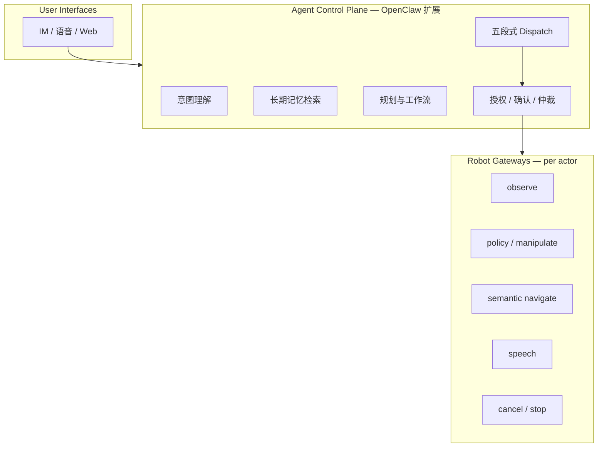

# Philia（Physical AI Symbiotic Agent）

**PHILIA**（*A Glimpse into Long-term Physical Coexistence with Intelligent Robots*，[arXiv:2607.11377](https://arxiv.org/abs/2607.11377)，[项目页](https://www.astribot.com/research/Philia)）是 Astribot 提出的 **长期人机物理共存** 运行时：不是单点策略论文，而是把 **持久助手身份**（多通道交互、长期记忆、开放意图规划）与 **机器人本地执行栈**（感知、导航、操纵策略、安全控制）通过 **Robot Gateway 能力契约** 拆开，使 **UI / 推理模型 / 记忆 / 导航 / 策略 / 新本体** 可 **组合式演进** 而无需端到端重设计。

## 一句话定义

**一个 OpenClaw 助手控制平面 + 多台 Robot Gateway**——语义层统一调度，物理层 actor 隔离执行，策略以 capability 即插即用（含 [Lumo-2](./lumo-2.md) 系基础模型）。

## 英文缩写速查

| 缩写 | 英文全称 | 简要说明 |
|------|----------|----------|
| PHILIA | Physical AI Symbiotic Agent | 本文多机器人物理 AI 助手系统 |
| RTC | Real-Time Chunking | 训练时随机推理延迟 + 已执行前缀条件化 |
| SFT | Supervised Fine-Tuning | 专家示范微调通才策略 |
| RL | Reinforcement Learning | 本文采用 advantage-conditioned **离线**后训练，非在线 PG |
| SLAM | Simultaneous Localization and Mapping | 机器人侧建图定位，不暴露给 LLM |
| MDP | Markov Decision Process | 单帧策略的历史局限；Philia 注入动作/轨迹记忆缓解 |

## 为什么重要

- **策略 alone 不够：** 开放家务需要 **跨会话偏好、多机编排、人在回路确认** 与 **可审计的物理闸门**——这是 agent 运行时问题，不是换更大的 VLA 能单独解决的。
- **Composable 演进：** 新 manipulation policy、导航栈或 IM 渠道只需 **注册 gateway manifest**；控制平面 **不改 prompt 即可路由新 skill**（论文 Tab. 1「零开销扩展」）。
- **与 Lumo 栈闭环：** Philia 论文将 **Lumo 系基础模型** 作为零样本 executor，并描述 **SFT → rollout 干预 → advantage-conditioned 后训练** 的部署闭环；与 [Lumo-2](./lumo-2.md) 模型论文形成 **模型 + 系统** 双子报告。
- **对照开源 Agent OS：** 与 [Hermes Agent](./hermes-agent.md) 同属「助手运行时」族，但 Philia 强调 **物理 gateway 契约、多 actor 安全信封与真机导航/manifest**。

## 核心结构/机制

### 三层架构

| 层 | 职责 |
|----|------|
| **Control Plane** | 会话、记忆、工具、**capability-grounded** 结构化下发；**不生成电机级命令** |
| **Gateway** | 发布 **runtime manifest**（能力 ID + I/O schema）；封装 ROS/SDK/策略服务 |
| **状态分区** | 平面持 **偏好/语义地点/任务史**；机器人持 **地图、传感器流、策略 buffer** |

### 五段式 Dispatch（精度–延迟权衡）

1. Regex / 确定性快路径（~1 ms）
2. 本地轻量分类器（Qwen3.5-4B，**~414 ms**，robot/non-robot F1 **0.965**）
3. 确定性语义路由
4. Capability-grounded 全路由（claude-opus-4.6，**~3.6 s p50**；skill top-1 **~90%+**）
5. Agent 端到端回合（复杂多步）

### Policies as Capabilities

| 阶段 | 机制 |
|------|------|
| **零样本** | [Lumo](./lumo-2.md) 等基础模型经统一接口调用 |
| **SFT** | 灵巧/长程任务收集专家示范 |
| **部署后改进** | SFT 策略 rollout + 人工纠正 → progress-based advantage → **chunk-aware** 二值标签 → 条件策略离线提取 |
| **平滑执行** | 训练 **RTC** + 部署 **轨迹滤波**；128 步历史动作 token 或 **主视角 EEF 轨迹染色投影** 作策略记忆 |

## 工程实践

| 项目 | 要点 |
|------|------|
| **当前平台** | **Astribot S1** 真机验证；网关契约面向未来异构机 |
| **记忆** | 继承 OpenClaw **Markdown**（`MEMORY.md`、按日日志）；**检索工具 on-demand**，文本 **不经网关直驱电机** |
| **导航** | 操作员建图 + 语义地点标注；每会话 anchor **重定位**；多机共享地图语义、独立定位运行时 |
| **安全** | 下发前：授权、确认、就绪（连接/定位/姿态）；执行中：**每 actor 至多一个运动改变型 capability**；stop/cancel **actor 作用域** |
| **评测** | **N=483** 话语 dispatch 基准；Playbook：推理接地、记忆接地、多机协同、策略热升级 |

## Playbook 与演示视频

| 项目页分类 | 片段 | 系统能力 |
|------------|------|----------|
| [multi-robot-control/01](https://astribot-website-shenzhen.oss-cn-shenzhen.aliyuncs.com/media/philia/multi-robot-control/01.mp4) | 1 | Alice 清桌 + Bob **提垃圾袋** |
| [reasoning-grounding/01–04](https://astribot-website-shenzhen.oss-cn-shenzhen.aliyuncs.com/media/philia/reasoning-grounding/01.mp4) | 4 | 观测/偏好/热量/食物类别 → 策略 prompt |
| [memory-grounding/01](https://astribot-website-shenzhen.oss-cn-shenzhen.aliyuncs.com/media/philia/memory-grounding/01.mp4) | 1 | 早餐偏好记忆驱动后续任务 |
| [policy-execution/01](https://astribot-website-shenzhen.oss-cn-shenzhen.aliyuncs.com/media/philia/policy-execution/01.mp4) | 1 | 策略 capability 即插即用 |
| [hero.mp4](https://astribot-website-shenzhen.oss-cn-shenzhen.aliyuncs.com/media/philia/hero.mp4) | 1 | 总览 |

完整 URL 见 [sources 归档](../../sources/sites/astribot-philia-project-page.md)。技术报告摘要场景含 **pack the backpack**、**lift the garbage bag** 等开放家务。

## 局限与风险

- **开放实现程度：** 报告描述架构与 Astribot S1 部署经验；**OpenClaw 扩展与 gateway 参考实现** 需关注官方后续发布。
- **Dispatch 成本：** 全 capability router 在复杂话语上 **秒级延迟**；生产需级联预滤（论文已采用本地 4B + 云端前沿模型）。
- **记忆安全：** Markdown 记忆可读可改是特性也是风险；错误偏好检索可能导向 **错误规划**（虽仍过物理闸门）。
- **单厂商栈绑定：** 当前 Playbook 与 Lumo 策略深度耦合 Astribot 生态；跨厂商 gateway 互操作仍待验证。

## 关联页面

- [Lumo-2](./lumo-2.md) — 上游 latent WAM 通才策略
- [Hermes Agent](./hermes-agent.md) — 开源多通道 Agent 运行时对照
- [Manipulation](../tasks/manipulation.md) — 长程灵巧服务任务
- [Vision-Language Navigation](../tasks/vision-language-navigation.md) — 语义地点 vs 低层导航分界
- [Action Chunking](../methods/action-chunking.md) — chunk 级 RTC 与后训练标签对齐

## 参考来源

- [Philia 技术报告摘录](../../sources/papers/philia_arxiv_2607_11377.md)
- [Astribot Philia 项目页归档](../../sources/sites/astribot-philia-project-page.md)

## 推荐继续阅读

- [arXiv:2607.11377](https://arxiv.org/abs/2607.11377) — Dispatch 定量表、记忆/导航细节与 Playbook 图
- [Astribot Philia 项目页](https://www.astribot.com/research/Philia) — 架构原则与场景视频
- [Lumo-2 项目页](https://www.astribot.com/research/Lumo2) — 模型能力与 22 项真机 benchmark
