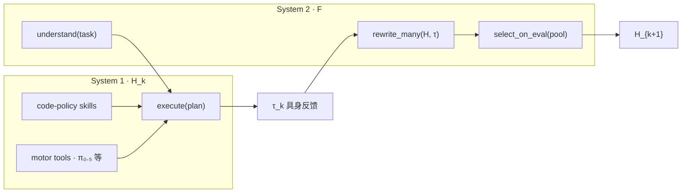
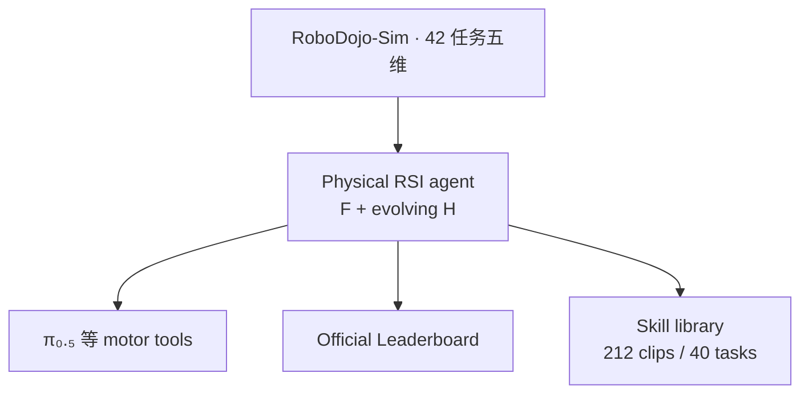

# Physical RSI 1.0（Recursive Self-Harness）

**Physical RSI 1.0**（*Recursive Self-Harness for Scaling Embodied Skills*，[项目页](https://mmlab.hk/research/PhysicalRSI)）是 **香港大学 MMLab** 与 **Kinetix AI** 在 [RoboDojo](./robodojo.md) 生态上推出的 **具身自我.harness** 基线：把 **System 2** 多模态 agent 的推理预算用于 **跨 rollout 改写可执行 harness**，**System 1** 在 rollout 内以 **code-policy skills + motor tools（含 π₀.₅）** 开环执行，并用 **具身评测** 在候选 harness 间做 **达尔文式选择**。

| 机构 | 香港大学 MMLab；凯涅克斯人工智能（Kinetix AI） |
|------|-----------------------------------------------|
| 项目页 | <https://mmlab.hk/research/PhysicalRSI> |
| 主榜单 | [RoboDojo Leaderboard](https://robodojo-benchmark.com/leaderboard)（页内 **2026-09-28** Overall **#1**） |
| 开源（2026-09-28 核查） | **待发布** — 项目页未列 arXiv / GitHub / 权重 |

## 一句话定义

**用具身反馈让 agent 改写自己的 harness（路由、技能代码与工具组合），在候选 agent 间按任务表现选择存活者，把 scaling 压力从「再训一个 VLA」转到「可验证的 harness 进化」。**

## 英文缩写速查

| 缩写 | 英文全称 | 简要说明 |
|------|----------|----------|
| RSI | Recursive Self-Improvement | 系统用自身能力改进产生下一轮能力的闭环 |
| S1 / S2 | System 1 / System 2 | 快执行（harness 控制） vs 慢 deliberation（理解/改写） |
| SR | Success Rate | RoboDojo 任务成功率 |
| VLA | Vision-Language-Action | π₀.₅ 等作为 Physical RSI 的 **motor tool** |
| WAM | World-Action Model | 页内对比路线：复合误差与 OOD 敏感 |
| τ | Embodied feedback | 观测、动作、成败轨迹，驱动 harness 修订 |

## 为什么重要

- **RoboDojo 高难度综合榜的公开 #1（页内叙事，2026-09-28）：** Overall **Score 36 / SR 31%**，把讨论从「单任务 demo」拉回 **五维 42 任务** 上的 **generalist manipulation** 压力测试。
- **Harness 作为一等公民：** 与 [HarnessPAI](./paper-harnesspai.md)、[Harness VLA](./paper-harness-vla.md)、[Zetta ζ](./paper-zetta.md) 同族，但强调 **Native S1–S2 协同进化** 与 **code-policy skill 库**（页内 **212** clips / **40** tasks）而非仅 episode 级记忆。
- **相对纯 VLA / WAM 的定位：** 页内将 **VLA/WAM** 标为 compounding error 与 OOD 风险，将 **GPT-as-policy** 标为慢与贵；Physical RSI 把 **π₀.₅** 降格为 **可编排 motor tool**，主力在 **可读写、可评测的 harness**。
- **与公益榜规则对齐：** 长期复现仍须走 RoboDojo **verified 开源训推 + checkpoint**（见 [RoboDojo](./robodojo.md)）；当前项目页 **尚未** 给出仓库，读榜时需区分 **宣传页分数** 与 **可复现 artifact**。

## 核心原理

### Darwinian Self-Harness

页内主循环：

\[
A_k=\mathrm{Agent}(F,H_k),\quad H_{k+1}=\mathrm{Improve}(A_k,H_k,\tau_k)
\]

| 符号 | 含义 |
|------|------|
| **F** | System 2 多模态 agent：理解任务、诊断失败、**批量改写** harness |
| **H_k** | 第 k 代 harness：路由、skills、tools、System 1 控制代码 |
| **τ_k** | 具身反馈：执行轨迹上的观测/动作/成败 |
| **Improve** | vary → evaluate → select → inherit |

### 最小实现（页内两式）

- **修订：** \(H_{k+1}=F(H_k,E^+,E^-)\) — 用成功/失败证据改写 harness。
- **执行：** \((a_t,m_{t+1})=H_k(o_t,g,m_t;S,T)\) — 观测 **o**、目标 **g**、episode 状态 **m**；**S/T** 为 skills 与 tools 集。

### 页内示例：harness 修订 ΔH

| 任务类型 | π₀.₅ 典型失败 | Physical RSI 修订方向 |
|----------|---------------|------------------------|
| 数字排序放置 | 够不到/未完成排序 | 识别数字 → argsort → 槽位映射 |
| 遮挡取物 | 抓杯失败、物仍被盖 | 物体–杯 **对应关系 memory** |
| Swap-T | 朝向错误 | 引入 **buffer pose** 三阶段搬运 |
| 插钥匙 | 接触几何不稳 | 分 **approach / align / insert** 阶段 |

## 流程总览：RoboDojo 评测与技能库

## 实验与评测（项目页口径，2026-09-28）

### Overall（页内 Official Overall）

| 指标 | Physical RSI |
|------|----------------|
| 排名 | **#1** |
| Score | **36** |
| SR | **31%** |

### 分任务亮点（页内表；带 **≈** 为估计均值）

| 维度 | 示例任务 | SR / Score（Physical RSI） |
|------|----------|----------------------------|
| Memory | cover blocks | ≈ **100%** / ≈ **100** |
| Memory | swap T | ≈ **93%** / ≈ **93** |
| Long horizon | play tic tac toe | **94%** / **98.33** |
| Open | align blocks | **86%** / **86** |
| Open | solve equation | **60%** / **60** |
| Precision | insert tubes | **66%** / **78.93** |

页内同时展示 **π₀.₅**、**DM0.5**、**Liber-0 Lite**、**GPT-6 Astra**、**Simate-beta** 等对照曲线；**SR/Score 以 RoboDojo 官方结果表为准**，部分条目标注 incomplete rollout。

## 工程实践

1. **读榜先读协议：** 对照 [RoboDojo Leaderboard Protocol](https://robodojo-benchmark.com/leaderboard/protocol) 与 [XPolicyLab](./xpolicylab.md) 观测–动作契约，避免与社区摘录榜混读。
2. **区分「页内 #1」与「verified artifact」：** 2026-09-28 项目页 **未发布** 代码/权重；复现前等待 GitHub/HF 或 RoboDojo verified 条目。
3. **Harness 进化对照：** 与 [HarnessPAI](./paper-harnesspai.md)（跨 rollout 程序进化）、[Zetta](./paper-zetta.md)（冻结 VLA + critics/recovery 代码）并读，明确 **改写对象**（整 harness vs 模块 vs runtime critics）。
4. **Motor tool 视角看 π₀.₅：** 页内 π₀.₅ 为 **工具层** 而非唯一策略；长程/记忆/开放词汇任务依赖 **H** 中的符号规划与 memory，而非单次 VLA forward。
5. **RSI 层级定位：** 见 [RSI 四 tier 五 pushes](../queries/rsi-four-tier-five-pushes.md) — Physical RSI 属于 **Physical / harness 层 RSI**，验证器来自 **RoboDojo 任务成功**，而非 SWE-bench 式单元测试。

## 局限与风险

- **开源待发布：** 无 arXiv/GitHub → 外部无法独立复现页内 #1；分数可能随榜单刷新变化。
- **估计分与 incomplete rollout：** 页内部分任务 SR/Score 标 **≈** 或 incomplete，跨模型对比需核对官方 sheet。
- **Sim 优先：** 当前公开叙事集中在 **RoboDojo-Sim**；真机 RealEval 与 verified 视频链尚未在项目页给出。
- **与 WAM 路线张力：** 页内指出高接触任务需要 **动作→世界变化** 建模（指向 [World-Action Models](../concepts/world-action-models.md)）；Cosmos 式 **视觉增广** 不替代交互动力学。

## 关联页面

- [RoboDojo](./robodojo.md) · [XPolicyLab](./xpolicylab.md)
- [HarnessPAI](./paper-harnesspai.md) · [Harness VLA](./paper-harness-vla.md) · [Zetta ζ](./paper-zetta.md)
- [GPT 6 Astra 具身策略评测](./paper-gpt-6-astra-embodied-policy.md) · [Simate](./simate.md)
- [RSI 四 tier 选型](../queries/rsi-four-tier-five-pushes.md)
- [VLA](../methods/vla.md) · [Manipulation](../tasks/manipulation.md)

## 参考来源

- [MMLab Physical RSI 项目页归档](../../sources/sites/mmlab-physical-rsi.md)
- [页面正文摘录](../../sources/raw/mmlab_physical_rsi_page_extract_2026-09-28.md)
- 官方项目页：<https://mmlab.hk/research/PhysicalRSI>

## 推荐继续阅读

- [RoboDojo 文档](https://robodojo-benchmark.com/doc/) — 五维任务定义与 eval 接入
- [Kinetix AI](https://www.kinetixai.tech/) — 页内合作方与硬件/模型叙事
- [RoboDojo Leaderboard](https://robodojo-benchmark.com/leaderboard) — 最新 Overall 与 verified 条目
