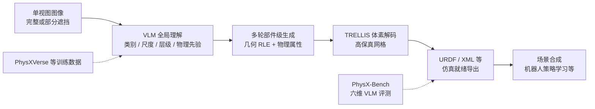

# PhysX-Omni（统一仿真就绪物理 3D 生成）

**PhysX-Omni**（S-Lab NTU / ACE Robotics，arXiv:2605.21572）是面向 **具身 AI、游戏与物理仿真** 的 **统一 sim-ready 3D 生成** 框架：在 **单张完整或部分遮挡图像** 条件下，经 **Vision-Language Model（Qwen2.5-VL-7B-Instruct）** 粗到细推理，输出带 **绝对尺度、材料、affordance、运动学、功能描述** 的 **刚性、可变形与关节化** 资产，并可经官方管线导出 **URDF/XML** 等仿真格式。公开入口包括 [项目页](https://physx-omni.github.io/)、[GitHub](https://github.com/physx-omni/PhysX-Omni)、[PhysXVerse 数据集](https://huggingface.co/datasets/PhysX-Omni/PhysXVerse) 与 [预训练权重](https://huggingface.co/PhysX-Omni/PhysX-Omni)。

## 一句话定义

**用 VLM 统一「全局物理理解 + 部件级高分辨率几何」，摆脱分割瓶颈，一次框架覆盖三类物理对象并直接落地仿真。**

## 为什么重要

- **数据引擎视角：** 机器人操作、交互仿真与开放世界需要的不只是「好看网格」，而是 **可碰撞、可关节、可变形、带尺度与材料语义** 的资产；PhysX-Omni 把 **生成与理解** 绑在同一 VLM 栈上，并发布 **PhysXVerse** 缓解类别与物理字段稀缺。
- **相对前序 PhysX 线：** [PhysXGen](https://arxiv.org/abs/2605.05163) / **PhysX-Anything** 等已探索 sim-ready 生成，但多受 **数据多样性** 与 **显式分割阶段** 限制；本文用 **模板化 2D RLE** 直接编码高分辨率体素切片，报告在 **运动学** 等指标上相对 PhysX-Anything 的大幅提升（论文表 1，PhysXVerse 测试集 kinematic ≈ **0.92** vs **0.42**）。
- **可复现评测：** **PhysX-Bench** 用渲染图/视频 + 开源 VLM 在野外评估 **六维物理属性**，弥补「无 GT 时难以评物理」的缺口。

## 核心结构

| 组件 | 作用 |
|------|------|
| **全局–局部 VLM 推理** | 先推断类别、语义、绝对尺度、部件层级与物理先验，再多轮生成各部件几何与物理字段（与 PhysX-Anything 类似的 coarse-to-fine，但几何表征不同）。 |
| **模板化 RLE 几何** | 部件体素沿 **z 轴切片** → 每层 2D 二值 mask → **经典 RLE** 转文本；引入 **template layer** 存共享结构、其余层存残差，压缩序列且 **不增 VLM 词表 special token**。 |
| **TRELLIS 解码** | 生成体素 latents 后由 **TRELLIS** 出高保真网格，**无需额外 mesh 分割/拓扑精修**（论文 §4.1）。 |
| **PhysXVerse** | **8.7K+** 资产、**2.9K+** 类；基于 **PartVerse** 分割 + VLM 初标 + 人工校验；与 PhysXNet 结构对齐。 |
| **PhysX-Bench** | **Geometry**（CLIP / 3D consistency / visual quality）、**absolute scale**、**material**（落体/落水仿真视频）、**affordance**、**kinematics**（运动视频一致性）、**description**（部件 mask 语义对齐）。 |
| **训练语料** | **PhysXNet + PhysX-Mobility + PhysXVerse** 合计 **42K+**；每物体 **25** 条件视角；**64×A100** 约 **14 天**（论文实现细节）。 |

### 流程总览

## 常见误区或局限

- **误区：** 把 **PhysXVerse** 等同于「所有类别关节数值都已精确到毫米级真值」；论文与 HF 卡片均强调 **VLM 初标 + 人工校验**，复杂运动学仍依赖仿真视频与 Bench 的 **相对/常识性** 评分。
- **误区：** 与 [PhysForge](./paper-physforge-physics-grounded-3d-assets.md) 混为同一系统——PhysForge 走 **分层物理蓝图 + KineVoxel 扩散**；PhysX-Omni 走 **纯 VLM 自回归 + RLE 体素 + TRELLIS**，同属 sim-ready 3D 但 **表征与训练栈不同**。
- **局限：** 训练与推理依赖 **大显存 VLM 微调、TRELLIS 与子模块生态**（PartNet-mobility、Depth-Anything 等）；真机策略实验以论文与仓库 **演示脚本** 为准，工程化产品管线仍需自行验收物理参数。

## 关联页面

- [PhysForge（论文实体）](./paper-physforge-physics-grounded-3d-assets.md) — **VLM 蓝图 + 扩散 KVI** 的物理 3D 生成对照。
- [Articraft](./articraft.md) — **Agent + SDK** 程序化可关节资产路线。
- [RoboTwin 2.0](./robotwin.md) — 操作仿真对 **可交互场景资产** 的需求语境。
- [SAPIEN](./sapien.md) — 关节体交互仿真栈。
- [Manipulation（任务总览）](../tasks/manipulation.md) — 操作学习数据与资产缺口背景。
- [Sim2Real](../concepts/sim2real.md) — 仿真器质量与资产动力学一致性提醒。

## 英文缩写速查

| 缩写 | 英文全称 | 简要说明 |
|------|----------|----------|
| Sim2Real | Simulation to Real | 把仿真中学到的策略迁移落地真机的工程主线 |
| AI | Artificial Intelligence | 人工智能 |
| URDF | Unified Robot Description Format | 统一机器人描述格式 |
| VLM | Vision-Language Model | 视觉-语言多模态理解模型，VLA 的上游 |
| SDK | Software Development Kit | 软件开发工具包 |
| Manipulation | Robot Manipulation | 抓取、移动、操作物体的任务总称 |

## 参考来源

- [PhysX-Omni 论文摘录（arXiv:2605.21572）](../../sources/papers/physx_omni_arxiv_2605_21572.md)
- [PhysX-Omni 项目页归档](../../sources/sites/physx-omni-github-io.md)
- [PhysX-Omni 代码仓库](../../sources/repos/physx-omni.md)
- [PhysXVerse 数据集（Hugging Face）](../../sources/repos/physx-omni-physxverse.md)

## 推荐继续阅读

- 论文 PDF：<https://arxiv.org/pdf/2605.21572>
- 项目主页：<https://physx-omni.github.io/>
- PhysXVerse：<https://huggingface.co/datasets/PhysX-Omni/PhysXVerse>
- 前序数据集 PhysXNet：<https://huggingface.co/datasets/Caoza/PhysX-3D>
