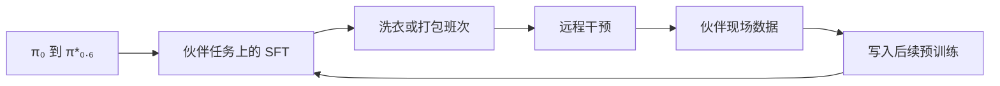

# The Physical Intelligence Layer：伙伴现场里的模型层

2026-02-24 的博客 [The Physical Intelligence Layer](https://www.pi.website/blog/partner) 不发布新模型。Physical Intelligence 主张：机器人应用不该每次从控制器和数据管线建起，而应调用已经训好的通才，文中点名 **π₀、π₀.₅、π₀.₆、π\*₀.₆**。后半篇由伙伴 **Weave** 与 **Ultra** 写他们自己的现场。

## 一句话定义

> **公司把通才 VLA 定位成给别人硬件用的一层能力；证据是伙伴部署叙事，不是新的算法或公共权重。**

## 英文缩写速查

| 缩写 | 英文全称 | 简要说明 |
|------|----------|----------|
| VLA | Vision-Language-Action | 文中被伙伴微调的通才 |
| SFT | Supervised Fine-Tuning | 伙伴对比 π₀.₅ 与 π₀.₆ 的监督微调 |
| WPT / UPT | Weave / Ultra pre-training | 伙伴数据是否进入预训练的对照标记 |

## 为什么重要

实验室论文很少写清「别人的机器人、别人的班次」上一代模型和一代模型差多少。这篇把 π₀.₆ 相对 π₀.₅ 放到洗衣店和仓库里，并单独标出伙伴数据进预训练的增量。读的时候要把它当成部署侧证，而不是 π\*₀.₆ 论文表的重复。

## 核心原理

干预数据被说成下一次预训练的来源。这是飞轮叙事，博客没有给出干预接口或数据格式。

## 工程实践

Weave 写旧金山洗衣店的真实折叠（T 恤、长袖、短裤、长裤）。正文结论是：π₀.₆ SFT 比 π₀.₅ SFT 提高自主时间占比；Weave 数据进入预训练后，连续漏抓（连续两次及以上）减少 **42%**，每筐干预减少 **50%**。柱状图的其余读数没有写进句子。

Ultra 写美国客户仓库的订单打包。一段连续镜头标注自主率 **96.4%**。正文称 π₀.₆ 比 π₀.₅ 成功率更高，伙伴数据进预训练后再提高件/小时吞吐，并配有 95% 置信区间，但没有把柱顶数字写出来。定性部分提到提示拆成子任务后能覆盖更多流程，长尾情况下恢复策略更多。失败时由人工介入保证订单正确。

## 局限与风险

- 确认未开源。没有伙伴栈的代码、π₀.₆ 权重或「数据进预训练」的配方。
- 42%、50%、96.4% 是伙伴自述。任务、夹爪、干预定义与 [π\*₀.₆](./paper-pistar06-recap.md)、[π₀.₇](../methods/pi07-policy.md) 的实验不同，不能横比吞吐。
- 图表里没写进正文的柱高不要从截图估成精确百分比。

## 关联页面

- [π₀](../methods/π0-policy.md)
- [π₀.₅](./paper-pi05-open-world-vla.md)
- [π\*₀.₆ / RECAP](./paper-pistar06-recap.md)
- [π₀.₇](../methods/pi07-policy.md)

## 参考来源

- [pi_physical_intelligence_layer_2026-02-24](../../sources/blogs/pi_physical_intelligence_layer_2026-02-24.md)
- [PI 官网技术文章索引](../../sources/sites/pi-website-technical-articles.md)

## 推荐继续阅读

- [博客原文](https://www.pi.website/blog/partner)
