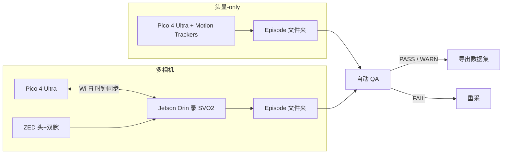

# Pico 4 Ultra（Egocentric 采集）

**Pico 4 Ultra** 在 2026 年成为可规模化部署的 **第一人称视频 + 全身/手部姿态** 采集硬件：PICO SDK 允许自研录制服务直接读取 passthrough RGB 与 OpenXR 手/身追踪，相对 Quest 3 更高应用侧帧率与 **12 GB** RAM，并可通过 **Motion Trackers** 扩展到 **24 点全身骨架**。

## 一句话定义

面向机器人/具身 AI 的 **头戴 egocentric 采集终端**：立体 RGB、~90 Hz 头/手/身 pose 日志，可选腕部 ZED 多相机 rig；选型关键在 **SDK 数据可达性**、**全身追踪** 与 **采集几何是否匹配机器人腕相机**。

## 英文缩写速查

| 缩写 | 英文全称 | 简要说明 |
|------|----------|----------|
| Ego | Egocentric | 第一人称视角采集与感知 |
| SDK | Software Development Kit | PICO / ZED 等厂商开发接口 |
| iToF | indirect Time-of-Flight | 头显 MR 用短距深度，量产采集管线通常不用 |
| QA | Quality Assurance | Episode 级自动质检（帧率、同步、追踪有效率） |
| GMR | General Motion Retargeting | 人全身运动映射到机器人关节（如 TWIST2） |
| VLA | Vision-Language-Action | 可用 egocentric 视频预训练的多模态策略族 |

## 为什么重要

- **视角匹配决定迁移上限：** 头顶/腕部相机几何若与机器人部署位不一致，egocentric 优势会快速蒸发（[Ego 数据采集](../overview/ego-category-01-data-collection.md) 核心问题）。
- **人视频缩放已有实证：** [EgoScale](../methods/egoscale.md) 等在 **万小时级** 人视频上给出 log-linear 缩放；采集 brief 应优先 **环境/物体多样性**，而非单场景堆演示。
- **量产门槛在管线而非头显：** Unidata 博客（2026-08）给出 **4,050 h** 商业语料与完整 episode QA——说明瓶颈在 **时钟同步、掉帧检测、追踪有效率**，不是「能否录一段 MP4」。

## 流程总览

**双 rig 分工：**

| 设定 | 适用 | 同步 |
|------|------|------|
| **头显-only** | 全身 loco-manipulation、桌面粗操作、户外（理想天气） | 单设备时钟，视频与 pose **亚帧**对齐 |
| **ZED + Orin** | 精细抓取/闭合瞬间需 **腕视角** 与机器人腕相机几何对齐 | 头显–Orin **软件时钟**；典型 offset **2–3 ms**，p95 **>11 ms** 拒收 |

## 核心原理

### 传感器与可读流

| 通道 | 规格要点 |
|------|----------|
| 立体 RGB | 双 **32 MP** 前向相机；SDK 流 **1280×960 @89 fps**（EgoKit）；量产录制常见 **2160×810 SBS ~30 fps** H.264 |
| 深度 | 机载 iToF 供 MR；**数据集通常不带独立深度通道**，由立体 RGB 下游估计 |
| 全身 | Motion Trackers：**24** 骨架点，宣称 **20 ms** 延迟、步态 **≥98%**；日志 **~90 Hz** |
| 双手 | 每手 **26** OpenXR 关节；**掌心遮挡时退化**（抓握闭合瞬间） |
| 算力 | Snapdragon XR2 Gen 2 + **12 GB** RAM（同芯片 Quest 3 为 **8 GB**） |

### Episode 数据形态（Unidata 量产格式）

- **头显：** MP4 立体视频 + **~90 Hz** pose（位置、四元数、tracking status）+ 逐帧 timing sidecar。
- **ZED（多相机 rig）：** 每路 **SVO2** 960×600@30fps + 曝光/到达时间 sidecar（依赖 ZED SDK）。
- **Episode 元数据：** 时钟同步模型与原始样本、事件日志、质量报告、全局起止 manifest。

### 与 Quest 3 / Vision Pro / Aria 的分工

| 平台 | 采集向结论 |
|------|------------|
| **Pico 4 Ultra** | 全身追踪、**89 fps** 级应用可读流、自研服务规模化、ZED 多相机 rig |
| **Meta Quest 3** | 手/桌面、生态成熟；应用流 **60 Hz** 上限；无原生全身 tracker |
| **Apple Vision Pro** | 相机 Enterprise API 门控；EgoKit 实测 **不适合** 开放采集 |
| **Project Aria** | 科研传感器平台；仅当机器人部署 Aria 时几何匹配有意义 |

遥操作场景下 Pico 与 Quest 常并列出现（[XRoboToolkit](./paper-xrobotoolkit.md)、[TWIST2](./paper-twist2.md)、[xr_teleoperate](./xr-teleoperate.md)）；本页聚焦 **离线 egocentric 数据集采集**，而非实时机器人映射。

## 工程实践

1. **先定几何：** 腕相机 FOV/位姿是否需与目标机器人一致；精细操作优先 **多相机 rig**，否则抓握闭合期可能不可标注。
2. **开机流程：** Motion Tracker 标定（~5 s/个）**每次激活必做**；多相机 rig 在录制前用 Orin **局域网预览** 查 skeleton 漂移。
3. **拒绝半开录：** 任一相机打不开则 **不开始**；头显失联 **15 s** 后安全收尾，避免悬挂 episode。
4. **同步验收：** 跨设备看 **p95 offset** 与全程漂移 **<5 ms**；失败 episode **重采**，不修补。
5. **日产规划：** 按 **5–5.5 h/人/8 h 班** 排期；跨 **20 站点 × 500 h** 约 **95 操作员·日** 量级（仅采集人力，不含标注/存储）。
6. **合规：** GDPR/州生物识别法对手部关键点敏感；设备 ID 应 token 化；非授权路人需环境管控。

### 商业语料锚点（Unidata，2026-08）

| 数据集 | 规模 | Rig 构成 |
|--------|------|----------|
| Egocentric Video Dataset | **4,050 h** / **13** 场景 | 头显-only **2,321 h** + ZED 多相机 **1,729 h** |
| Robotic Household Activities | **1,000 h** | 清洁、叠衣、洗碗 |

## 局限与风险

- **头显手追踪非精密计量：** 掌心遮挡即失效；精细操作 **必须** 腕相机或外部位姿（mocap/手套）。
- **iToF 不进数据集：** 户外强光下 MR 深度不可靠；勿假设有 LiDAR 级深度真值。
- **Unidata 采集栈未开源：** 可复现的是 **硬件规格 + episode 模式**；自研 QA 阈值需自行校准。
- **QA 不覆盖示范语义：** 帧率/同步 PASS 仍可能是差示范；需人工终审。
- **与遥操作混谈：** Pico 亦用于 [Teleoperation](../tasks/teleoperation.md)，但采集 brief 的 **时钟、多相机、episode 边界** 与实时 IK 链路不同。

## 关联页面

- [Ego 分类 01：数据采集](../overview/ego-category-01-data-collection.md)
- [Meta Quest 遥操作](./oculust-quest-teleop.md)
- [EgoScale](../methods/egoscale.md)
- [Macrodata Egocentric Hand-Action](../methods/macrodata-egocentric-hand-action.md) — 采集后的 RGB→度量手轨迹层
- [XRoboToolkit](./paper-xrobotoolkit.md) / [TWIST2](./paper-twist2.md) — Pico 遥操作与重定向实例

## 参考来源

- [unidata_pico_4_ultra_egocentric_data_collection.md](../../sources/blogs/unidata_pico_4_ultra_egocentric_data_collection.md)
- [unidata-pro.md](../../sources/sites/unidata-pro.md)

## 推荐继续阅读

- Unidata 原文：<https://unidata.pro/blog/pico-4-ultra-for-egocentric-data-collection/>
- [EgoKit 多设备相机流 benchmark](https://github.com/egokit/egokit)（博客引用之 89 fps 测量来源）
