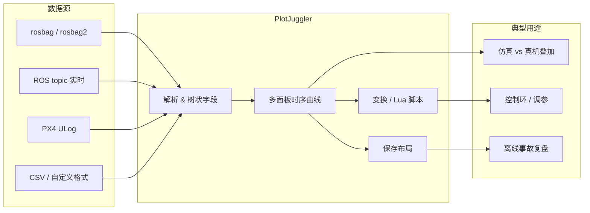

---

type: entity
tags: [software, visualization, debugging, ros2, ros1, time-series, px4, middleware, linux-foundation]
status: complete
updated: 2026-06-17
related:
  - ../concepts/ros2-basics.md
  - ../queries/robot-policy-debug-playbook.md
  - ./px4-autopilot.md
  - ./unitree-ros.md
  - ./navigation2.md
  - ../comparisons/ros2-vs-lcm.md
sources:
  - ../../sources/repos/plotjuggler.md
summary: "PlotJuggler 是跨平台时序可视化桌面工具：拖拽多曲线、离线 rosbag/ULog/CSV 与实时 MQTT/UDP/ROS topic 流；内置导数/积分/Lua 变换与插件架构，是 ROS 与飞控日志调试的常用标配。"
---

# PlotJuggler

**PlotJuggler**（[PlotJuggler/PlotJuggler](https://github.com/PlotJuggler/PlotJuggler)）是面向工程师的 **时序数据可视化** 工具：把传感器、控制环、策略 obs/action 等标量或向量字段拖进多面板曲线，支持 **离线回放** 与 **实时订阅**，在机器人 ROS 栈与 PX4 社区中几乎是 **rosbag / ULog 分析的默认 GUI** 之一。

## 一句话定义

用拖拽式界面快速对齐、缩放、叠加多条时序曲线，并可在曲线上做导数/积分或 Lua 脚本变换——**不替代 RViz 的空间可视化，而是补全「数值随时间怎么变」这一调试维度**。

## 英文缩写速查

| 缩写 | 英文全称 | 简要说明 |
|------|----------|----------|
| ROS 2 | Robot Operating System 2 | PlotJuggler 可订阅 topic 并打开 rosbag2 |
| ROS 1 | Robot Operating System 1 | 历史 bag 与 live topic 仍广泛支持 |
| ULog | PX4 micro Log | PX4 机载飞行日志二进制格式 |
| LSL | Lab Streaming Layer | 生理/实验设备常用流式总线，有 PJ 插件 |
| MQTT | Message Queuing Telemetry Transport | IoT/遥测常用发布订阅协议 |
| GUI | Graphical User Interface | 桌面端 OpenGL 多面板绘图 |
| Sim2Real | Simulation to Real | 真机与仿真 log 叠加对比是常见用法 |
| SDK | Software Development Kit | 自定义 DataLoader/Streamer 插件接口 |

## 为什么重要

- **ROS 调试闭环**：策略上机后，把 `ros2 bag record` 与仿真 rollout 的同名 topic 字段拖进同一布局，比纯 `ros2 topic echo` 更易发现 **尺度、相位、限幅** 问题（见 [RL 策略真机调试 Playbook](../queries/robot-policy-debug-playbook.md)）。
- **飞控日志**：原生支持 [PX4 ULog](./px4-autopilot.md)，调参、对比 SITL/真机 EKF 与执行器输出时省去自写解析脚本。
- **性能与规模**：OpenGL 渲染 + 布局保存，适合 **长时程、多通道**（关节力矩、IMU、电池、指令轨迹）而非只看最后一帧。
- **可扩展**：MPL 2.0 主仓 + 独立 ROS/MQTT/LSL 插件仓，团队可封装私有消息格式而不 fork 核心。

## 核心结构 / 机制

### 数据入口

| 模式 | 典型来源 |
|------|----------|
| 文件 | CSV、PX4 **ULog**、rosbag（经 ROS 插件） |
| 实时流 | ROS1/2 **topic**、MQTT、WebSocket、ZeroMQ、UDP |
| 实验设备 | **LSL**（Lab Streaming Layer）插件 |
| 自定义 | DataLoader / DataStreamer 插件（示例见 `plotjuggler-sample-plugins`） |

### 分析与布局

- **Transform Editor**：导数、滑动平均、积分等单曲线运算。
- **Custom Function Editor**：**Lua** 多输入 → 单输出（如合成误差、饱和检测）。
- **布局持久化**：面板、曲线组合、缩放窗口可保存，便于 **回归对比** 同一测试用例。

### ROS 安装路径（常见）

```bash
sudo apt install ros-$ROS_DISTRO-plotjuggler-ros
ros2 run plotjuggler plotjuggler
```

Ubuntu 亦可用 Snap：`sudo snap install plotjuggler`（README 注明对 ROS2 有部分限制）。ROS 插件源码在 [`plotjuggler-ros-plugins`](https://github.com/PlotJuggler/plotjuggler-ros-plugins)。

### 流程总览（调试数据流）



## 常见误区或局限

- **不是 3D 可视化**：关节空间轨迹、点云、TF 仍用 **RViz / Foxglove** 等；PlotJuggler 只管 **标量/向量分量随时间**。
- **勿信仿冒官网**：上游 README 明确警告 **plotjuggler.com** 为钓鱼站；只从 [GitHub Releases](https://github.com/PlotJuggler/PlotJuggler/releases) 或发行版包管理器安装。
- **与 rerun.io 分工**：rerun 偏 **多模态时空记录与 SDK 嵌入**；PlotJuggler 偏 **工程师桌面、ROS/ULog 生态、轻量 Lua 后处理**，二者可并存而非互斥。
- **超大数据集**：虽宣称百万级点，极端高频全机 log 仍建议 **先裁剪 topic/时间窗** 再导入。

## 与其他页面的关系

- [ROS 2 基础](../concepts/ros2-basics.md) — topic/bag 语义与 QoS；PJ 是 ROS 调试工具链一环。
- [RL 策略真机调试 Playbook](../queries/robot-policy-debug-playbook.md) — obs/action 时序对比推荐工具之一。
- [PX4 Autopilot](./px4-autopilot.md) — ULog 分析入口。
- [unitree_ros](./unitree-ros.md)、[Navigation2](./navigation2.md) — 典型 ROS1/2 真机与导航栈 log 场景。
- [ROS 2 vs LCM](../comparisons/ros2-vs-lcm.md) — 中间件选型；PJ 主要服务 ROS 侧，LCM log 需插件或转存。

## 推荐继续阅读

- [PlotJuggler 官方教程（Slides）](https://slides.com/davidefaconti/introduction-to-plotjuggler)
- [PX4 ULog 格式说明](https://docs.px4.io/main/en/dev_log/ulog_file_format)
- [plotjuggler-ros-plugins](https://github.com/PlotJuggler/plotjuggler-ros-plugins) — ROS 订阅与 bag 加载实现

## 参考来源

- [sources/repos/plotjuggler.md](../../sources/repos/plotjuggler.md)
- [PlotJuggler/PlotJuggler](https://github.com/PlotJuggler/PlotJuggler)
