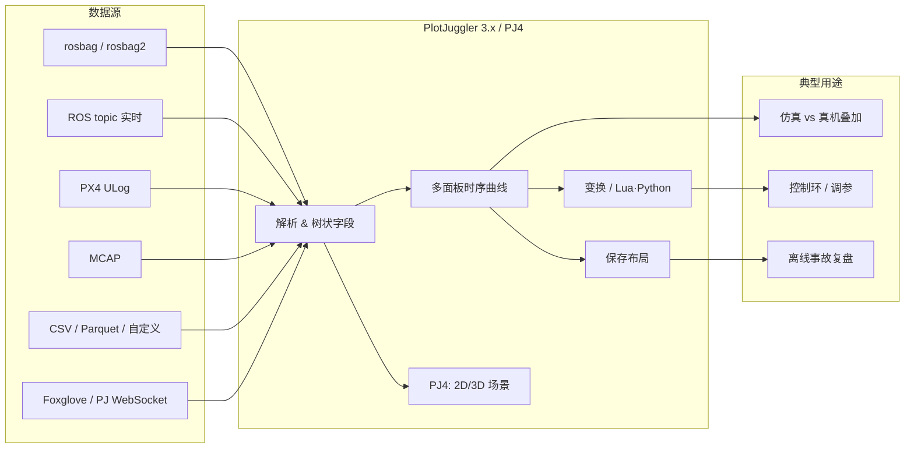

# PlotJuggler

**PlotJuggler**（[PlotJuggler/PlotJuggler](https://github.com/PlotJuggler/PlotJuggler)，站 [plotjuggler.io](https://plotjuggler.io/)）是面向工程师的 **时序（及 PJ4 起多模态）数据可视化** 工具：把传感器、控制环、策略 obs/action 等字段拖进多面板曲线，支持 **离线回放** 与 **实时订阅**。在机器人 ROS 栈与 PX4 社区中，**3.x** 几乎是 **rosbag / ULog 分析的默认 GUI** 之一；**PlotJuggler 4**（2026 起 beta）则按作者公告为 **全新应用**，对标 Foxglove / Rerun 的多模态可视化方向。

## 一句话定义

用拖拽式界面快速对齐、缩放、叠加多条时序曲线，并可在曲线上做导数/积分或 Lua/Python 脚本变换——**3.x 主攻「数值随时间怎么变」；PJ4 beta 额外覆盖图像/点云等 2D·3D 场景，但仍以高效时序与布局工作流为内核。**

## 英文缩写速查

| 缩写 | 英文全称 | 简要说明 |
|------|----------|----------|
| ROS 2 | Robot Operating System 2 | 可订阅 topic 并打开 rosbag2 |
| ROS 1 | Robot Operating System 1 | 历史 bag 与 live topic 仍广泛支持 |
| ULog | PX4 micro Log | PX4 机载飞行日志二进制格式 |
| MCAP | MCAP log container | 多通道机器人日志容器；3.x 已增强读取韧性 |
| LSL | Lab Streaming Layer | 生理/实验设备常用流式总线，有 PJ 插件 |
| MQTT | Message Queuing Telemetry Transport | IoT/遥测常用发布订阅协议 |
| GUI | Graphical User Interface | 桌面端 OpenGL 多面板绘图 |
| PJ4 | PlotJuggler 4 | 2026 起 beta 的从零重写线（Release tag `3.999.x`） |
| Sim2Real | Simulation to Real | 真机与仿真 log 叠加对比是常见用法 |
| SDK | Software Development Kit | 自定义 DataLoader/Streamer 插件接口 |

## 为什么重要

- **ROS 调试闭环**：策略上机后，把 `ros2 bag record` 与仿真 rollout 的同名 topic 字段拖进同一布局，比纯 `ros2 topic echo` 更易发现 **尺度、相位、限幅** 问题（见 [RL 策略真机调试 Playbook](../queries/robot-policy-debug-playbook.md)）。
- **飞控日志**：原生支持 [PX4 ULog](./px4-autopilot.md)（含大文件），调参、对比 SITL/真机 EKF 与执行器输出时省去自写解析脚本。
- **与多模态生态对齐**：3.16+ 起内置 **Foxglove / PlotJuggler WebSocket bridge** 与更稳的 [MCAP](./mcap-log-format.md) 读取；选型时可与 [Foxglove](./foxglove-studio.md)、[rerun](./rerun-io.md) 分工而非互斥。
- **PJ4 路线清晰**：官方站与 [Announcing PlotJuggler 4](https://plotjuggler.io/blog/announcing-plotjuggler-4/) 明确「不是升级而是新应用」——列式引擎、懒加载大对象、Extensions Marketplace、2D/3D；评估新工具链时应单独跟踪 beta Releases。
- **可扩展**：MPL 2.0 主仓 + 独立 ROS/MQTT/LSL 插件仓，团队可封装私有消息格式而不 fork 核心。

## 核心原理

### 版本线怎么选

| 线 | 何时用 |
|----|--------|
| **3.17.x 稳定** | 日常 ROS/ULog/CSV 时序调试、apt/Snap 装包、布局回归对比 |
| **PJ4 beta（`3.999.x`）** | 试用多模态 2D/3D、Marketplace 扩展、新 UI/undo 工作流；生产前核对插件与 ROS 集成成熟度 |

### 数据入口（3.x）

| 模式 | 典型来源 |
|------|----------|
| 文件 | CSV、PX4 **ULog**、**MCAP**、rosbag（经 ROS 插件）、Parquet（Toolbox） |
| 实时流 | ROS1/2 **topic**、MQTT、WebSocket（含 Foxglove bridge）、ZeroMQ、UDP、串口 |
| 实验设备 | **LSL**（Lab Streaming Layer）插件 |
| 自定义 | DataLoader / DataStreamer 插件（示例见 `plotjuggler-sample-plugins`） |

### 分析与布局

- **Transform Editor**：导数、滑动平均、积分、RMS / MAV / stddev / peak-to-peak 等。
- **Custom Function Editor**：**Lua** 与 **Python**（源码构建需 `python3-dev`）多输入 → 单输出。
- **布局持久化**：面板、曲线组合、缩放窗口可保存；PJ4 beta 引入 layout schema v4（时间轴视口、每数据集 time offset）。
- **导出**：ToolboxCSV / Parquet（单文件或多文件、topic 过滤、时间缝分割）。

### ROS 安装路径（常见，3.x）

```bash
sudo apt install ros-$ROS_DISTRO-plotjuggler-ros
ros2 run plotjuggler plotjuggler
```

Ubuntu 亦可用 Snap：`sudo snap install plotjuggler`（README 注明对 ROS2 有部分限制）。ROS 插件源码在 [`plotjuggler-ros-plugins`](https://github.com/PlotJuggler/plotjuggler-ros-plugins)。PJ4 / 跨平台二进制以 [GitHub Releases](https://github.com/PlotJuggler/PlotJuggler/releases) 为准。

### 流程总览（调试数据流）


```mermaid
flowchart LR
  subgraph sources["数据源"]
    BAG["rosbag / rosbag2"]
    LIVE["ROS topic 实时"]
    ULOG["PX4 ULog"]
    MCAP["MCAP"]
    CSV["CSV / Parquet / 自定义"]
    WS["Foxglove / PJ WebSocket"]
  end
  subgraph pj["PlotJuggler 3.x / PJ4"]
    LOAD["解析 & 树状字段"]
    PLOT["多面板时序曲线"]
    SCENE["PJ4: 2D/3D 场景"]
    XFORM["变换 / Lua·Python"]
    LAYOUT["保存布局"]
  end
  subgraph use["典型用途"]
    CMP["仿真 vs 真机叠加"]
    TUNE["控制环 / 调参"]
    POST["离线事故复盘"]
  end
  BAG --> LOAD
  LIVE --> LOAD
  ULOG --> LOAD
  MCAP --> LOAD
  CSV --> LOAD
  WS --> LOAD
  LOAD --> PLOT --> XFORM
  LOAD --> SCENE
  PLOT --> LAYOUT
  PLOT --> CMP
  XFORM --> TUNE
  LAYOUT --> POST
```

## 工程实践

1. **先定版本线**：产线/日常真机 bag 优先 **3.17 + `plotjuggler-ros`**；需要点云/图像同屏或 Marketplace 时再开 **PJ4 beta** 并行评估。
2. **布局当测试夹具**：同一套面板/缩放保存为 layout，对「仿真 vs 真机」「改参前后」做回归，比每次重拖字段更稳。
3. **先裁剪再导入**：高频全机 log 先按 topic / 时间窗裁剪；ULog >2 GB 虽已支持，仍避免一次塞满无关通道。
4. **变换放进 Function Editor**：尺度误差、饱和检测、合成跟踪误差用 Lua/Python 固化，少在外部脚本重复算。
5. **与 Foxglove/rerun 互通**：已有 Foxglove WebSocket 或 MCAP 管线时，用 bridge / 文件入口对齐时间轴，不必强制二选一。

| 检查项 | 建议 |
|--------|------|
| 安装来源 | 仅 [plotjuggler.io](https://plotjuggler.io/) / GitHub Releases / 发行版包；**不要**访问 `plotjuggler.com` |
| ROS 发行版 | Humble / Jazzy / Rolling 有上游 CI；apt 包名 `ros-$ROS_DISTRO-plotjuggler-ros` |
| 源码构建 | 见 `COMPILE.md`；Python 变换需 `python3-dev`；Parquet/Mosaico 需 Arrow |
| 开源边界 | 主仓 MPL-2.0；ROS/MQTT/LSL 等在独立仓 |

## 局限与风险

- **3.x 仍非「完整 3D 工作站」**：点云/TF/视频复盘在稳定线仍常配合 **RViz / Foxglove / rerun**；PJ4 的 3D Scene 处于 **beta**，勿默认已替代上述工具。
- **勿信仿冒官网**：上游明确警告 **plotjuggler.com** 为钓鱼站；正牌为 **plotjuggler.io**。
- **与 Foxglove / rerun 分工**：二者偏 **多模态时空记录与面板生态**；PlotJuggler 3.x 偏 **工程师桌面、ROS/ULog、轻量脚本后处理**；PJ4 在缩小差距，但插件与 ROS 打包成熟度需按 Release 再验。
- **Snap 的 ROS2 限制**：Ubuntu Snap 路径对 ROS2 支持有限；深度 ROS 用户优先 apt 的 `plotjuggler-ros` 或自编译插件。
- **超大数据集**：虽宣称百万级点，极端高频全机 log 仍建议 **先裁剪 topic/时间窗**。

## 关联页面

- [ROS 2 基础](../concepts/ros2-basics.md) — topic/bag 语义与 QoS；PJ 是 ROS 调试工具链一环。
- [RL 策略真机调试 Playbook](../queries/robot-policy-debug-playbook.md) — obs/action 时序对比推荐工具之一。
- [PX4 Autopilot](./px4-autopilot.md) — ULog 分析入口。
- [Foxglove](./foxglove-studio.md)、[rerun](./rerun-io.md)、[MCAP](./mcap-log-format.md) — 多模态可视化与日志容器对照。
- [unitree_ros](./unitree-ros.md)、[Navigation2](./navigation2.md) — 典型 ROS1/2 真机与导航栈 log 场景。
- [ROS 2 vs LCM](../comparisons/ros2-vs-lcm.md) — 中间件选型；PJ 主要服务 ROS 侧，LCM log 需插件或转存。

## 参考来源

- [sources/repos/plotjuggler.md](../../sources/repos/plotjuggler.md)
- [sources/sites/plotjuggler-io.md](../../sources/sites/plotjuggler-io.md)
- [PlotJuggler/PlotJuggler](https://github.com/PlotJuggler/PlotJuggler)
- [Announcing PlotJuggler 4](https://plotjuggler.io/blog/announcing-plotjuggler-4/)

## 推荐继续阅读

- [PlotJuggler 官方教程（Slides）](https://slides.com/davidefaconti/introduction-to-plotjuggler)
- [PX4 ULog 格式说明](https://docs.px4.io/main/en/dev_log/ulog_file_format)
- [plotjuggler-ros-plugins](https://github.com/PlotJuggler/plotjuggler-ros-plugins) — ROS 订阅与 bag 加载实现
- [GitHub Releases（含 PJ4 beta）](https://github.com/PlotJuggler/PlotJuggler/releases)
