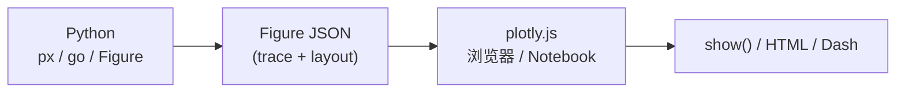

# plotly.py（Plotly Python）

**plotly.py**（[plotly/plotly.py](https://github.com/plotly/plotly.py)，[文档](https://plotly.com/python/)）是面向 Python 的 **交互式、浏览器端图表库**：在 Python 侧用声明式 API 描述图形，由 [plotly.js](https://github.com/plotly/plotly.js) 在 Jupyter、marimo、独立 HTML 或 [Dash](https://dash.plotly.com/) 应用中渲染。MIT 许可，PyPI 包名 `plotly`。

## 一句话定义

**用 `px`/`go` 写交互图（缩放、悬停、图例），一键 `show()` 或 `write_html` 分享——补 matplotlib 静态图的探索体验，但不替代 TensorBoard 训练日志或 PlotJuggler 机器人时序调试。**

## 英文缩写速查

| 缩写 | 英文全称 | 简要说明 |
|------|----------|----------|
| px | plotly.express | 高层一行 API，绑定 DataFrame 列名 |
| go | graph_objects | 低层 trace/布局对象，细粒度控制 |
| HTML | HyperText Markup Language | `write_html` 自包含交互页 |
| WebGL | Web Graphics Library | plotly.js 3D/大规模散点常用 GPU 路径 |
| SVG | Scalable Vector Graphics | 部分 2D 图表矢量渲染 |
| API | Application Programming Interface | Python 侧 `Figure` 构建接口 |
| Dash | Plotly Dash | 基于 plotly 的 Python Web 仪表盘框架（独立仓库） |

## 为什么重要

- **机器人实验的「展示层」**：把多 seed 成功率、episode 长度分布、关节轨迹 3D 摘要做成 **可交互 HTML**，比静态 PNG 更适合组会/PR 附录；[Residual Policy Learning](./paper-residual-policy-learning.md) 等论文复现脚本用 matplotlib/pandas/seaborn，Plotly 是同类场景里 **交互优先** 的替代。
- **与训练监控分工清晰**：实时 `mean_reward` / PPO loss 仍写 event 到 [TensorBoard](./tensorboard.md) 或 [W&B](./weights-and-biases.md)；Plotly 读 **导出 CSV/parquet 或聚合表** 做二次可视化。
- **真机 log 之后处理**：[PlotJuggler](./plotjuggler.md) 对齐 rosbag/ULog 原始时序；Plotly 适合 **按 episode 聚合** 后的对比（例如 success rate vs 物体高度分箱）。
- **生态成熟**：18k+ GitHub stars；Jupyter widget（`anywidget`）、Kaleido 静态导出、与 Dash 仪表盘链路均有官方文档。

## 核心结构



### API 选型

| 场景 | 推荐 API | 示例 |
|------|----------|------|
| 快速 EDA | `plotly.express` | `px.scatter(df, x="step", y="reward", color="seed")` |
| 多子图 / 动画 | `plotly.graph_objects` + `make_subplots` | 多关节角同屏、帧动画 |
| 3D 轨迹 | `go.Scatter3d` / `px.line_3d` | 末端执行器路径、点云下采样 |
| 论文/static | `fig.write_image` + **Kaleido** | `pip install -U kaleido`；缺 Chrome 时 `plotly_get_chrome` |

### 安装与输出模式

```bash
pip install plotly
pip install jupyter anywidget   # Notebook widget
pip install -U kaleido          # PNG/SVG/PDF 导出
```

```python
import plotly.express as px
fig = px.line(df, x="step", y="success_rate", color="method")
fig.show()                      # 浏览器 / Jupyter
fig.write_html("report.html")   # 离线分享
```

## 工程实践

| 目标 | 做法 |
|------|------|
| Notebook 交互 | `fig.show()`；Jupyter 需 `jupyter` + `anywidget` |
| 无服务器分享 | `write_html` 单文件（内嵌 plotly.js CDN 或全离线 bundle） |
| 训练曲线 | 从 TB 导出 scalar CSV 或 W&B API 拉表 → `px.line`；**不要**用 Plotly 替代 TB 实时写 log |
| 机器人时序 | rosbag → pandas 重采样/按 episode 切分 → Plotly；**原始对齐**仍用 PlotJuggler |
| 仪表盘 | 需要多页布局与回调时上 [Dash](https://dash.plotly.com/)，而非只用 plotly.py |

**开源状态（2026-09-05）：** 仓库 **已开源 MIT**；文档 CC BY 4.0。Kaleido 与 Dash 为 **独立开源依赖/项目**。

## 局限与风险

- **不是训练 logger**：无内置 RL runner 集成；高频 step 写 Plotly 图会极慢且文件巨大。
- **不是机器人 log 播放器**：毫秒级多 topic 对齐、ULog/rosbag 原生解析见 PlotJuggler / Foxglove / Rerun。
- **大点云 / 超长序列**：WebGL 仍可能卡顿；需下采样或改用专用 3D 查看器。
- **静态导出依赖 Chromium**：Kaleido 在无头环境要额外装 Chrome；CI 里导出图需单独配置。
- **Dash 混淆**：`plotly.py` 只负责 **图**；完整 Web 应用是 Dash 另一套概念。

## 关联页面

- [TensorBoard](./tensorboard.md) — 训练期标量/loss 离线仪表盘
- [Weights & Biases](./weights-and-biases.md) — 云端实验追踪与媒体日志
- [W&B vs TensorBoard](../comparisons/wandb-vs-tensorboard.md) — 训练监控选型
- [PlotJuggler](./plotjuggler.md) — 真机/仿真高频时序与 rosbag
- [RL 策略真机调试 Playbook](../queries/robot-policy-debug-playbook.md) — 工具链分工
- [强化学习](../methods/reinforcement-learning.md) — 实验可观测性语境

## 参考来源

- [plotly.py 仓库归档](../../sources/repos/plotly.py.md)

## 推荐继续阅读

- [Plotly Python 文档](https://plotly.com/python/)
- [plotly/plotly.py（GitHub）](https://github.com/plotly/plotly.py)
- [静态图导出（Kaleido）](https://plotly.com/python/static-image-export/)
- [Plotly Dash 文档](https://dash.plotly.com/) — 仪表盘层
