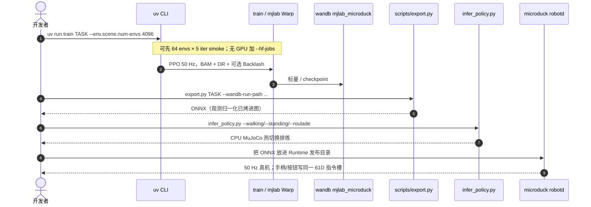

# Microduck RL

**Microduck RL**（[`pollen-robotics/microduck_rl`](https://github.com/pollen-robotics/microduck_rl)）是 Microduck 的 **mjlab（MuJoCo Warp）+ PPO** 训练仓：50 Hz 出策略，导出 ONNX 给 [机载 Runtime](./pollen-microduck.md)。

## 一句话定义

把 ~800 g / 25 cm 双足鸭的 sim2real 写成一套可跑的 mjlab 任务族：BAM 电压舵机、域随机化、±1° 背隙孪生，以及全家族共享的 61 维观测合同。

## 英文缩写速查

| 缩写 | 英文全称 | 简要说明 |
|------|----------|----------|
| PPO | Proximal Policy Optimization | 本仓 on-policy 训练算法（rsl_rl） |
| BAM | Better Actuator Models | Rhoban 扩展摩擦舵机模型；此处用 M6 电压律 |
| MJCF | MuJoCo XML Format | MuJoCo 的模型与场景描述格式 |
| ONNX | Open Neural Network Exchange | 导出给 Runtime 的策略格式 |
| DR | Domain Randomization | 域随机化，缩小仿真与真机分布差 |
| IMU | Inertial Measurement Unit | 惯性测量单元；本仓对安装偏置做零均值 DR |
| HF Jobs | Hugging Face Jobs | 无本地 GPU 时的云端训练入口 |
| MDP | Markov Decision Process | 奖励、事件、观测、课程都集中在 `mdp.py` |

## 为什么重要

- **廉价小舵机上的执行器保真：** 官方判断此尺度下 sim2real 缺口主要在执行器，所以不用理想 PD，而用 [BAM](./bam-better-actuator-models.md) XL330 电压控制律。
- **可热切换的观测合同：** 61 维布局全任务共用，Runtime 才能在走 / 起身 / 把戏之间换脑而不改总线。
- **把失败写成规范：** `AGENTS.md` 里的奖励符号、jackpot、零指令死权重、滤波不匹配，都是真机周级调试换来的，可直接对照 [Reward Design](../concepts/reward-design.md) 与 [Sim2Real Gap 缩减](../queries/sim2real-gap-reduction.md)。

## 核心原理

### 源码运行时序



训练默认走 CUDA 上的 MuJoCo Warp；导出后必须用 `export.py`，不要手转 checkpoint——viewer `play` 仍会应用归一化，会把错误藏到上机。

### 观测与关节合同

- **Actor 观测 61 维：** 48 本体感觉 + 指令块 `[twist(3), head_pose(4), body_pose(6)]`。某任务不用某槽就 **零填充并保留微小采样**，禁止删维（否则热切换与后续课程的输入神经元坏死）。
- **14 路伺服（walk 模型下标）：** 0–4 左腿（hip_yaw/roll/pitch、knee、ankle），5–8 颈/头，9–13 右腿。轮滑/背隙模型会插入 `passive_*`，奖励函数必须用 `_servo_joint_*` 助手。
- **无驱关节一律 `passive_*`：** 轮子与背隙铰；执行器/观测/奖励选择器用 `^(?!passive_).*`。

### 执行器、背隙、模型变体

全部任务挂 BAM M6 **Dynamixel XL330**（`FrictionDRBamActuator`）：电压、反电动势、Coulomb/Stribeck/负载摩擦；DR 打在电池电压、负载压降、指令延迟、`friction_scale`。BAM 下 `dof_frictionloss` 被置零，随机化它是静默空操作。

背隙孪生：在任务 id 里插入 `-Backlash-`（例 `Mjlab-Velocity-Flat-Backlash-MicroDuck`）。每路伺服串联 ±1°（合计 2°）无驱铰；编码器在间隙**输出**侧，`joint_pos/vel` 读 `qpos[servo]+qpos[backlash]`，维数不变故 ONNX/Runtime 不用改。

MJCF（Onshape → onshape-to-robot）：

| XML | 用途 |
|-----|------|
| `robot_walk.xml` | Velocity；躯干/头接触精简（摔倒便宜） |
| `robot_allcollisions.xml` | 起身、坐站、触地、踢球、前滚（身体可躺地） |
| `robot_allcollisions_rollers.xml` | 轮滑族 |
| `robot_*_backlash.xml` | `add_backlash.py` 生成 |

### 任务族

活列表以 `uv run list-envs` 为准。主线包括：平地/崎岖速度跟踪（可带头姿）、走+跌倒恢复、多姿态起身、指令坐站、喙触地拾取、盲踢 70 mm/15 g 球、前滚、以及轮滑速度 / swizzle / 滑行下蹲 / 下坡 / 轮上起身 / 原地转。

产品页盒内动作是上述集合的子集；训练注册表 strictly 更大。

## 工程实践

依赖 CUDA + `uv`。默认分支 **`develop`**。

```bash
uv run train Mjlab-Velocity-Flat-MicroDuck --env.scene.num-envs 4096
uv run play Mjlab-Velocity-Flat-MicroDuck --wandb-run-path <entity/project/run_id>
uv run scripts/export.py Mjlab-Velocity-Flat-MicroDuck --wandb-run-path <...>
uv run scripts/infer_policy.py --walking walk.onnx --standing stand.onnx --new-cmd-obs
```

预算量级（官方）：简单 episodic 把戏约 1000 iter @ 4096 envs；步态与恢复课程约 4000–6000。wandb 项目名 `mjlab_microduck`。CPU pytest 锁关节下标、奖励符号与 NaN 守卫。

部署排练：`infer_policy.py` 模拟 Runtime 热切换。姿势类按钮占用 twist 的 vx 槽；**全零指令表示站立**，看起来会像「策略不听按键」。

## 局限与风险

从 `AGENTS.md` 蒸馏的可操作约束（每条都对应过「viewer 能走、真机不能」）：

- **奖励符号：** mjlab 自带 cost ≥ 0 → 负权重；自取负的 `*_penalty` / `*_l1` → **正权重**。双重取负会奖励违规。判据：每个 `Episode_Reward/<penalty>` 必须 ≤ 0。
- **禁止 jackpot：** 「到达 X」按步给钱会买暴力；指令切换应对内部目标做恒速 blend，提前到达收益为零。
- **不要把正奖励门在坏状态上**（摔倒、过低）：策略会停在最便宜的合格姿势。改用势函数（如 Δcos(tilt)）。
- **训练默认无动作低通；** 训练/部署滤波不一致会直接断迁移。
- **IMU DR 零均值：** 只训幅值容忍，补不了系统性安装偏置（那是 Runtime 标定）。
- **25 cm 机体自然角速度 3.5–5.5 rad/s：** 不要用人体尺度限速；反暴力应打在冲击与抽搐（|a_z|、action_rate、支撑门）。
- **aarch64 上 PyPI torch 可能是 CPU-only：** 仓内用 uv sources 把 aarch64 指到 cu129；torch 必须保持直接依赖且 `==` 钉版本。

## 关联页面

- [Pollen Microduck](./pollen-microduck.md) — 整机与 Runtime
- [mjlab](./mjlab.md) — 训练框架
- [BAM](./bam-better-actuator-models.md) — 执行器模型
- [Open Duck Playground](./open-duck-playground.md) — 另一条迷你鸭 RL 栈（MJX / 模仿奖励）
- [Sim2Real](../concepts/sim2real.md)
- [Reward Design](../concepts/reward-design.md)
- [Domain Randomization](../concepts/domain-randomization.md)
- [Sim2Real Gap 缩减](../queries/sim2real-gap-reduction.md)
- [Reward Design 实战指南](../queries/reward-design-guide.md)

## 参考来源

- [microduck_rl 仓归档](../../sources/repos/microduck_rl.md)
- [microduck Runtime 归档](../../sources/repos/microduck.md)
- [产品页归档](../../sources/sites/pollen-robotics-microduck.md)

## 推荐继续阅读

- 仓内 playbook：[`AGENTS.md`](https://github.com/pollen-robotics/microduck_rl/blob/develop/AGENTS.md)（`develop` 上 `CLAUDE.md` 仅为短指针）
- [mjlab](https://github.com/mujocolab/mjlab)
- [Rhoban/bam](https://github.com/Rhoban/bam)
