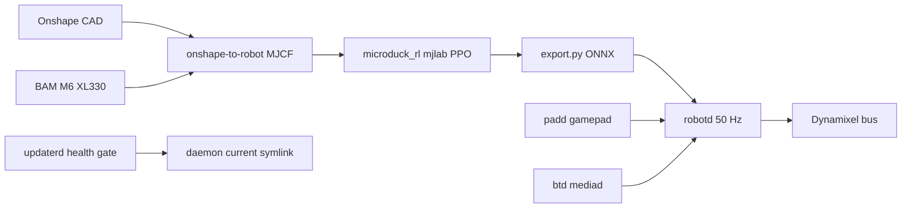

# Pollen Microduck

**Microduck** 是 **Pollen Robotics** 的桌面双足机器人：产品叙事是「开箱可玩、策略可自训」。机载软件在 [`pollen-robotics/microduck`](https://github.com/pollen-robotics/microduck)，策略训练在 [`microduck_rl`](./pollen-microduck-rl.md)。

## 一句话定义

约 **25 cm / 800 g** 的开源软件栈双足鸭：Rockchip RK3566 上若干 Rust daemon 以 **50 Hz** 驱动舵机神经网络策略；仿真在 mjlab 里训、ONNX 上机，整机按商品预售。

## 英文缩写速查

| 缩写 | 英文全称 | 简要说明 |
|------|----------|----------|
| RL | Reinforcement Learning | 通过与环境交互最大化长期回报来学习策略的范式 |
| ONNX | Open Neural Network Exchange | 跨框架神经网络模型交换格式，本机策略上机格式 |
| Sim2Real | Simulation to Real | 把仿真中学到的策略迁移落地真机的工程主线 |
| IMU | Inertial Measurement Unit | 惯性测量单元，姿态与角速度观测 |
| ToF | Time of Flight | 飞行时间测距；头上 8×8 深度由 `tofd` 发布 |
| BLE | Bluetooth Low Energy | 低功耗蓝牙；`btd` / `duckctl` 无网通道 |
| RPC | Remote Procedure Call | 本机各 daemon 用 JSON-RPC 2.0 经 Unix socket 通信 |
| PPO | Proximal Policy Optimization | 训练仓使用的 on-policy 策略梯度算法 |

## 为什么重要

- **商品机 + 全开源软件：** 与 [Open Duck Mini](./open-duck-mini.md) 的 DIY/BOM 路线对照——这里买的是整机，fork 的是 Runtime 与训练栈，不是「先打一套零件」。
- **机载工程完整：** 控制环、配网、验签 OTA、健康门回滚拆成独立 daemon，适合读「策略上板之后还有什么会让机器人变砖」。
- **策略热切换合同：** 与 [Microduck RL](./pollen-microduck-rl.md) 共享 61 维观测，walk / 起身 / 把戏可在 Runtime 里替换，不必为每个动作改总线协议。

## 核心原理

### 两仓分工

| 仓 | 职责 |
|----|------|
| [microduck](https://github.com/pollen-robotics/microduck) | 机载大脑：`robotd` 控制环、更新、无线电、相机 |
| [microduck_rl](./pollen-microduck-rl.md) | mjlab + PPO、BAM 执行器、ONNX 导出 |

### 流程总览

### 机载服务边界

`docs/design/architecture.md`（2026-07-22 draft）把板上拆成：**只有 `robotd` 写电机**；`configd`、`updaterd`、`btd` 在控制环死亡时仍须工作（配 Wi-Fi、回滚、BLE）。客户端只发 *intent*（速度、朝向、站起），安全层决定能否执行。进程间是 **每服务一个 Unix socket + JSON-RPC 2.0 NDJSON**；视频不走这条控制面。

发布是 **整目录替换**：CI 签名 → `robotctl update apply` → `updaterd` 改 `current` symlink → `robot.health` 不过则自动退回。板上配置（`/etc/robot/`、`/var/lib/robot/config/`）故意不进 release，以免更新覆盖身份与 Wi-Fi。

## 工程实践

### 规格（产品页 + Runtime README，入库日）

| 项 | 值 |
|----|-----|
| 身高 / 质量 | 25 cm / 800 g |
| 电机 | 产品页 **15**；RL 关节表 **14** 路 XL330（见局限） |
| 传感 | 相机 + LiDAR + 两路 IMU；头 ToF 8×8（`tofd`） |
| 控制频率 | 机载策略环 50 Hz（与训练对齐） |
| SoC | Rockchip RK3566 |
| 盒内宣称 | 7 个已训动作；手柄开箱可开 |
| 价格 | 整机介绍价 **$399**（税运另计）；充电器 / Dev / 配件包另售 |
| 发货 | 预售；产品页写 2026 圣诞前 |
| 软件许可 | Apache-2.0 |

### 真机操作入口

- SSH：`ssh microduck` 后 `robotctl monitor / configure / update`。
- 无网：`duckctl` 走蓝牙。
- 手柄：cheat sheet 的 gamepad 映射；每只手柄配对一次。
- 开发板：`docs/robot/install-dev.md` → 本机构建经 ssh 推约一分钟（`dev-push.md`）。

### 开源状态

**已开源。** 项目页 *Open source* 区链到 GitHub；Runtime 与 RL 训练、导出脚本均可运行。整机不是开源套件：没有把本仓当 BOM 入口。RL README 声明硬件设计文件 **CC BY-SA-NC**；CAD 以 RL 仓 Onshape 导出配置为准，不要默认能按 Open Duck Mini 那样从零打印一台官方鸭。

社区在 [Pollen Discord](https://discord.com/invite/pollen-community-519098054377340948)。

## 局限与风险

- **商品交付窗口：** 入库时仍是预售；软件可先在仿真里跑，真机日历以产品页为准。
- **15 vs 14 电机：** 规格表写 15 路，训练 MJCF 执行 14 路腿+头伺服。对照日志或改模型时不要混用两个数字。
- **architecture.md 仍标 draft：** 文中写第一版出货硬件单一配置，早期 `microduck_runtime` 原型将被重写；以仓内 `docs/design/` 与当前 crate 为准。
- **不是研究级人形：** 廉价舵机 + 大头质量比（训练笔记写头部约占体重 38%）决定动态上限；把戏（前滚、踢球）对奖励门控极敏感，见 RL 页。
- **与 Open Duck Mini 不是同一生态：** Mini 是社区 Feetech + Playground + Pi Zero；Microduck 是 Pollen 商品 + Dynamixel XL330 + mjlab + RK3566。对照读 sim2real，不要混装零件表。

## 关联页面

- [Microduck RL](./pollen-microduck-rl.md) — 训练、BAM、背隙、奖励课
- [Pollen Reachy2](./pollen-reachy2.md) — 同一机构的开源移动人形
- [Open Duck Mini](./open-duck-mini.md) — DIY 迷你双足鸭对照
- [Open Duck Mini Runtime](./open-duck-mini-runtime.md) — 社区线的上机对照
- [mjlab](./mjlab.md)
- [Sim2Real](../concepts/sim2real.md)
- [Locomotion](../tasks/locomotion.md)

## 参考来源

- [产品页归档](../../sources/sites/pollen-robotics-microduck.md)
- [Runtime 仓归档](../../sources/repos/microduck.md)
- [RL 仓归档](../../sources/repos/microduck_rl.md)

## 推荐继续阅读

- [pollen-robotics/microduck README](https://github.com/pollen-robotics/microduck) 与 [`docs/design/architecture.md`](https://github.com/pollen-robotics/microduck/blob/main/docs/design/architecture.md)
- [产品页](https://pollen-robotics.com/microduck)
- [Pollen Discord](https://discord.com/invite/pollen-community-519098054377340948)
