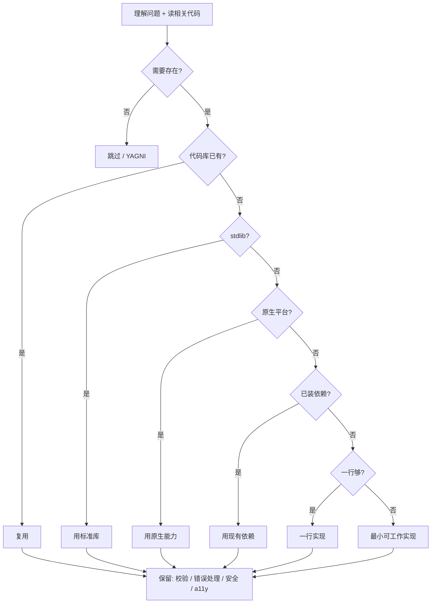

# Ponytail

**Ponytail** 是 [DietrichGebert/ponytail](https://github.com/DietrichGebert/ponytail) 仓库分发的 **编码代理「必要性优先」技能/插件**：在代理理解问题并读完相关代码之后，按固定 **阶梯** 选择 **能工作的最小实现**，避免装库、写 wrapper、提前抽象等过度工程；同时声明 **验证、错误处理、安全与无障碍永不削减**。

## 一句话定义

用 **可版本化的必要性阶梯 + 多 harness 规则/hook 注入**，让代理 **懒在解法、勤在读码**，把 diff 里的 **多余代码** 删掉而不是把 **思考与安全护栏** 删掉。

## 英文缩写速查

| 缩写 | 英文全称 | 简要说明 |
|------|----------|----------|
| LLM | Large Language Model | 大语言模型，常作编码代理的推理核心 |
| YAGNI | You Aren't Gonna Need It | 只实现当前任务真正需要的功能，拒绝 speculative 抽象 |
| LOC | Lines of Code | 代码行数，ponytail 基准的主要体量指标之一 |
| API | Application Programming Interface | 应用程序编程接口；代理调用模型与工具时的计费与延迟载体 |

## 为什么重要（对本知识库读者）

- **与本仓库维护场景直接相关：** Robotics_Notebooks 的 ingest 常改 **Python 脚本、Makefile 派生链与长 markdown**；代理容易「为一个小功能加一层抽象或新依赖」。ponytail 针对 **实现选择**（stdlib / 原生 HTML / 复用现有模块），与 [Karpathy LLM Wiki](../references/llm-wiki-karpathy.md) 的「知识编译进文件」互补。
- **生态位清晰 — 代码量 vs 措辞 vs 流程：**
  - [Caveman](caveman.md) — **怎么说更短**（输出与部分上下文 token）
  - [Superpowers（obra）](superpowers-obra.md) — **怎么做对流程**（TDD、worktree、子代理评审）
  - **Ponytail** — **写什么更少**（必要性阶梯、anti over-engineering）
- **有可复现 agentic 基准：** 上游在真实 Claude Code 会话中编辑 FastAPI+React 模板，对照无 skill、[Caveman](caveman.md) 与裸 YAGNI 提示词；对本站读者评估「装技能是否真省 token/LOC」有参考值（仍以自家仓库与 CI 为准）。

## 核心结构

| 层次 | 内容 |
|------|------|
| **规则载体** | 根 `AGENTS.md`、`.cursor/rules/`、`.github/copilot-instructions.md` 等；Claude Code / Codex 等用 **Node hook** 每轮注入 |
| **必要性阶梯** | 存在性 → 复用 → stdlib → 原生平台 → 已装依赖 → 一行 → 最小实现 |
| **强度档位** | `lite` / `full`（默认）/ `ultra` / `off`；环境变量 `PONYTAIL_DEFAULT_MODE` 或 `~/.config/ponytail/config.json` |
| **命令族** | `/ponytail-review`（diff）、`/ponytail-audit`（全仓）、`/ponytail-debt`（延后 shortcut 台账）、`/ponytail-gain`（基准板）、`/ponytail-help` |
| **分发** | Claude Code / Codex / Copilot CLI / Pi / OpenCode / Gemini / Hermes / OpenClaw / Swival 等插件市场；Cursor 等 **复制规则文件**（见上游 `docs/agent-portability.md`） |
| **基准** | `benchmarks/results/2026-06-18-agentic.md` — 12 任务 × n=4，Haiku 4.5 |

### 必要性阶梯（决策流）

### 与对照臂的差异（上游 agentic 基准归纳）

| 对照 | 主要杠杆 | 相对无 skill 基线（上游表） |
|------|----------|----------------------------|
| **ponytail** | 阶梯 + 安全红线 | LOC **-54%**，token **-22%**，cost **-20%**，time **-27%**，safe **100%** |
| caveman | 极简措辞 | LOC -20%，token +7%，safe 100% |
| 裸「YAGNI + one-liners」 | 仅提示词 | LOC -33%，safe **95%**（易砍护栏） |

## 常见误区或局限

- **误区：ponytail = 代码高尔夫。** 规则是 **必要性** 而非最短字符；安全、校验、无障碍不在优化目标内。
- **误区：可替代 [Superpowers](superpowers-obra.md) 或本仓库 `schema/ingest-workflow.md`。** ponytail 不强制 TDD/worktree，也不生成 wiki cross-reference 或跑 `make ci-preflight`；可与流程技能 **叠加**，不能省略 ingest 健康检查。
- **误区：与 [Caveman](caveman.md) 重复。** Caveman 主要压 **输出 token**；ponytail 主要减 **写入的代码行**；上游基准中二者可并用，收益维度不同。
- **局限：** 降幅在「代理本会 over-build」的任务上最大（如 date picker 装 flatpickr）；对已极简代码接近 0%。部分推理模型在「逐步走阶梯」时可能 **thinking token 反增**（README FAQ）。多 harness 行为以仓库 `docs/agent-portability.md` 为准。

## 关联页面

- [Caveman](caveman.md) — **输出/上下文压缩**（ponytail 基准对照臂之一）
- [Superpowers（obra）](superpowers-obra.md) — **交付流程** 技能库（TDD、worktree、子代理评审）
- [Skills For Real Engineers（mattpocock）](mattpocock-skills.md) — **轻量日常** 工程技能（grill、CONTEXT.md、TDD）
- [Hermes Agent](hermes-agent.md) — 常驻代理运行时（可安装 ponytail 插件）
- [Agent Reach](agent-reach.md) — 外网读搜脚手架
- [LLM Wiki（Karpathy 模式）](../references/llm-wiki-karpathy.md) — 本仓库知识编译范式
- [Ingest Workflow](../../schema/ingest-workflow.md) — ingest / query / lint 操作规范

## 参考来源

- [Ponytail 仓库源归档（本站）](../../sources/repos/ponytail.md)
- [DietrichGebert/ponytail（GitHub）](https://github.com/DietrichGebert/ponytail)
- [Agentic benchmark 报告（上游）](https://github.com/DietrichGebert/ponytail/blob/main/benchmarks/results/2026-06-18-agentic.md)

## 推荐继续阅读

- [docs/agent-portability.md（上游）](https://github.com/DietrichGebert/ponytail/blob/main/docs/agent-portability.md) — 各 harness 规则文件映射
- [examples/（上游）](https://github.com/DietrichGebert/ponytail/tree/main/examples) — before/after 极简实现样例
- [JuliusBrussee/caveman](https://github.com/JuliusBrussee/caveman) — 对照「压缩措辞」路线
