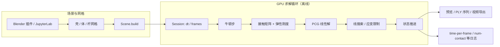

# ppf-contact-solver（ZOZO Contact Solver）

**ppf-contact-solver**（README 亦称 *ZOZO's Contact Solver*）是 [ZOZO, Inc.](https://corp.zozo.com/en/) 技术团队（[st-tech](https://github.com/st-tech)）开源的 **GPU 接触–弹性联合求解器**：在 NVIDIA GPU 上以 **单精度** 处理 **shell（三角壳）**、**solid（四面体体）** 与 **rod（杆/索）** 的 FEM 可变形体与大规模接触（公开案例含 **>1.8 亿** 接触对）。默认定位为 **离线** 物理仿真（布料垂坠、编织、多米诺、摩擦滑坡等），而非足式机器人毫秒级控制环。

## 英文缩写速查

| 缩写 | 英文全称 | 简要说明 |
|------|----------|----------|
| Sim2Real | Simulation to Real | 把仿真中学到的策略迁移落地真机的工程主线 |
| GPU | Graphics Processing Unit | 图形处理器，大规模并行仿真训练的算力基础 |
| RL | Reinforcement Learning | 通过与环境交互最大化长期回报来学习策略的范式 |
| MuJoCo | Multi-Joint dynamics with Contact | 接触丰富的刚体物理仿真引擎 |
| Isaac Lab | NVIDIA Isaac Lab | 基于 Omniverse 的机器人学习训练框架 |
| CUDA | Compute Unified Device Architecture | NVIDIA GPU 通用并行计算平台 |
| API | Application Programming Interface | 应用程序编程接口 |
| Locomotion | Robot Locomotion | 足式/人形等无轮移动能力的总称 |

## 为什么重要？

- **可变形体 + 接触的工程缺口：** 主流 RL 仿真栈（[MuJoCo](./mujoco.md)、[Isaac Lab](./isaac-gym-isaac-lab.md)、[Newton](./newton-physics.md)）以 **刚体 / 关节** 为主；服装电商、数字孪生布料、软包装与索网结构需要 **无穿透、应变受限** 的壳/体仿真，本项目把该能力做到可 Docker 化、可 Blender 远程调用的产品级形态。
- **方法与实现一体开源：** 对应 TOG 论文 [*A Cubic Barrier with Elasticity-Inclusive Dynamic Stiffness*](./paper-ppf-cubic-barrier-contact-solver.md)（Apache-2.0），便于对照「障碍接触势 + 弹性刚度并入牛顿步」与工程 stress test（GitHub Actions 连续 10 轮全示例）。
- **降低 GPU 门槛：** JupyterLab 浏览器前端、~1GB 容器、Windows 免安装可执行包，以及 Blender 插件在 **macOS 笔记本** 上连 **远程** CUDA 实例——与「本地必须 NVIDIA + 本地 CUDA」的传统图形学插件路径不同。

## 核心能力

| 维度 | 要点 |
|------|------|
| **几何类型** | Shell（布）、Solid（软体 tet）、Rod（索/杆）；管线内 `.triangulate()` / `.tetrahedralize()` |
| **数值** | FEM + 符号力 Jacobian；接触 **无穿透**；应变 **硬上限**（如 5%/三角） |
| **并行** | 接触与弹性求解均在 GPU；缓存友好、全 float32 |
| **前端** | `frontend.App` 链式 API；Blender 5+ 插件 + MCP 自然语言驱动 |
| **部署** | Docker `ghcr.io/st-tech/ppf-contact-solver-compiled:latest`；Windows `start.bat`；云模板（vast.ai 等） |
| **许可** | Apache-2.0，可商用 |

## 流程总览

典型 Jupyter 路径：`App.create` → `asset` + `scene.build` → `session.build` → `start().preview()` → `export.animation()`。

## 与相近工具的分工

| 工具 | 关系 |
|------|------|
| **[MuJoCo](./mujoco.md)** | 刚体接触与 RL 基准的黄金标准；原生 **软体/壳** 能力弱，本项目补足 **高保真可变形 + 亿级接触** 离线路径 |
| **[Newton](./newton-physics.md)** | GPU 可微、多求解器、机器人 **刚体** 学习栈；与 ppf 的 **服装/软体 FEM** 场景互补 |
| **[mjlab](./mjlab.md) / Isaac** | 大规模 **并行 RL rollout**；ppf 明确 **非实时控制**，不做策略训练环境替代品 |
| **论文实现** | 见 [TOG 论文实体](./paper-ppf-cubic-barrier-contact-solver.md)；复现用分支 `sigasia-2024`，日常用 `main` |

## 优势与局限

**优势：**

- 穿透与穿插控制、应变上限、摩擦等 **图形学/服装仿真** 诉求对齐度高。
- 部署与文档成熟（GitHub Pages API、示例目录、Blender 工作流视频）。
- 远程 GPU + 本地 Blender 降低硬件门槛。

**局限：**

- **离线为主**，不适合作为机器人 **1 kHz 闭环** 仿真后端。
- **仅 x86 + NVIDIA CUDA 12.8+**，无 arm64；无 Apple Silicon 本地 CUDA。
- `main` 分支 API **频繁 breaking**；与论文一致需锁定 `sigasia-2024`（性能较差）。
- 与机器人 **Sim2Real** 主线耦合弱：更多服务数字内容、服装工程与可变形体研究，而非腿足策略迁移。

## 关联页面

- [TOG 论文：Cubic Barrier 接触求解](./paper-ppf-cubic-barrier-contact-solver.md)
- [MuJoCo（物理引擎）](./mujoco.md)
- [Newton Physics](./newton-physics.md)
- [mjlab](./mjlab.md)
- [Locomotion RL 仿真器选型](../queries/simulator-selection-guide.md)
- [Sim2Real](../concepts/sim2real.md)

## 参考来源

- [ppf-contact-solver 仓库归档](../../sources/repos/ppf-contact-solver.md)
- [TOG 论文来源归档](../../sources/papers/ppf_contact_solver_tog_cubic_barrier.md)

## 推荐继续阅读

- [GitHub：st-tech/ppf-contact-solver](https://github.com/st-tech/ppf-contact-solver)
- [官方文档与 Blender 插件](https://st-tech.github.io/ppf-contact-solver)
- [ACM TOG 论文页](https://dl.acm.org/doi/abs/10.1145/3687908)
- [JupyterLab API 参考](https://st-tech.github.io/ppf-contact-solver/jupyterlab_api/module_reference.html)
