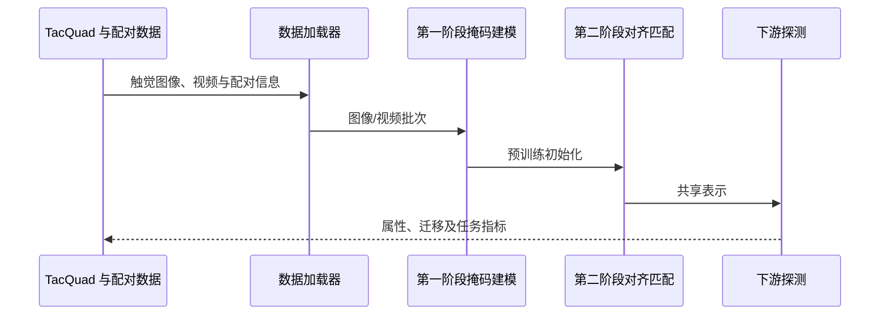

# AnyTouch 项目：代码、数据与复现入口

本页记录 AnyTouch 的**软件与数据项目**，与[论文方法页](./paper-anytouch.md)分开维护。

| 资源 | 入口 | 说明 |
|---|---|---|
| 官方项目站 | [gewu-lab.github.io/AnyTouch](https://gewu-lab.github.io/AnyTouch/) | 项目概览与论文材料 |
| 代码 | [GeWu-Lab/AnyTouch](https://github.com/GeWu-Lab/AnyTouch) | 训练、评估及数据处理代码 |
| 论文 | [arXiv:2502.12191](https://arxiv.org/abs/2502.12191) | 论文详情：[独立论文页](./paper-anytouch.md) |
| TacQuad 数据集 | [项目页](https://gewu-lab.github.io/AnyTouch/) | 项目论文/页面介绍的数据集 |
| 相关开放数据 | [TacQuad on Hugging Face](https://huggingface.co/datasets/xxuan01/TacQuad) | 数据卡与下载入口 |
| 预训练权重 | [Google Drive](https://drive.google.com/file/d/1L4jGUjIHNBMzOiD33Rv0jxWYKHBORD1R/view?usp=sharing) | 仓库 README 提供的权重入口 |

## 项目组成

- **传感器覆盖**：GelSight Mini、DIGIT、DuraGel、Tac3D。
- **数据组织**：TacQuad 提供精细时空配对和更大规模的空间配对；详见[论文页](./paper-anytouch.md)中的规模与定义。
- **训练代码**：官方仓库 README 描述两阶段流程：先做图像/视频掩码建模，再做语义对齐与跨传感器匹配。
- **下游评估**：仓库包含静态/动态属性探测和跨传感器评估入口；真实机器人倒珠是论文实验，需结合论文设置理解。
- **环境信息**：README 所列验证环境为 Ubuntu 20.04、PyTorch 2.1、CUDA 11.8。运行前应以当前仓库 README 和依赖文件为准。

## 代码执行概览

## 使用边界

仓库公开程度、数据条款和权重链接可能变化；实际复现请查看上游 README 与各数据卡。TacQuad Hugging Face 页面标注 MIT 许可。论文中的机器人任务需要相应硬件与传感器，不能仅凭训练脚本复现。

## 相关条目

- [AnyTouch 论文详情](./paper-anytouch.md)
- [AnyTouch 2 项目](./project-anytouch2.md) 与 [AnyTouch 2 论文](./paper-anytouch2.md)
- [触觉感知主题](../concepts/tactile-sensing.md)
