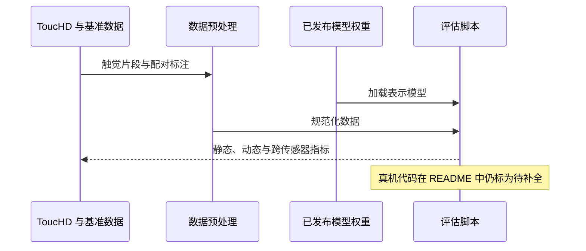

# AnyTouch 2 项目：ToucHD、代码与模型入口

本页聚焦 AnyTouch 2 的项目资产和当前可用入口；方法与实验论述见[独立论文详情](./paper-anytouch2.md)。

| 资源 | 入口 | 说明 |
|---|---|---|
| 官方项目站 | [gewu-lab.github.io/AnyTouch2](https://gewu-lab.github.io/AnyTouch2/) | 方法、数据与实验概览 |
| 代码 | [GeWu-Lab/AnyTouch2](https://github.com/GeWu-Lab/AnyTouch2) | 数据预处理与评估代码 |
| 论文 | [arXiv:2602.09617](https://arxiv.org/abs/2602.09617) | [论文详情页](./paper-anytouch2.md) |
| ToucHD 数据集 | [BAAI Hugging Face collection](https://huggingface.co/collections/BAAI/touchd) | 包含 Mani、Force、Sim 数据集入口 |
| 预训练模型 | [AnyTouch2-Model](https://huggingface.co/xxuan01/AnyTouch2-Model) | 模型访问需按模型卡说明申请/提交联系信息 |
| ToucHD-Force | [BAAI/ToucHD-Force](https://huggingface.co/datasets/BAAI/ToucHD-Force) | 页面设有访问表单 |

## 英文缩写速查

| 缩写 | 全称 | 含义 |
|---|---|---|
| HF | Hugging Face | 模型与数据托管平台 |
| MAE | Masked Autoencoder | 掩码自编码器 |
| ToucHD | Tactile Understanding through Contact Hierarchy Dataset | 动态触觉数据集 |

## 数据资产

- **Sim**：1,118,896 帧；项目论文统计包含 5 类传感器、6 种原子动作及 1,043 个物体。
- **Mani**：584,842 帧、46 项操作任务。
- **Force**：722,436 个触觉-力样本；该子集下载需查看 Hugging Face 页面当前访问条件。
- 三部分总计 2,426,174 个样本。来源、协议及样本定义见[论文归档](../../sources/papers/anytouch2_arxiv_2602_09617.md)。

## 仓库可用性

截至本页整理时，README 标记数据预处理和 Sparsh 评估代码已提供，并将 real-world code 标为待补全；仓库 quick-start 文案还出现 “Coming Soon”，运行前请以代码仓库当前说明为准。公开评估结果可在 README 查看，但具体分数应与任务、传感器及帧采样设定一起引用。不要把论文中的真机实验误当成当前仓库已公开的部署代码。

## 代码执行概览

下图只概括仓库公开的**数据处理/预训练权重评估路径**，不表示仓库已提供完整真机训练与部署管线：

## 关联页面

- [AnyTouch 2 论文详情](./paper-anytouch2.md)
- [AnyTouch 前作项目](./project-anytouch.md)与[论文](./paper-anytouch.md)
- [触觉感知主题](../concepts/tactile-sensing.md)

## 参考来源

- [来源归档](../../sources/papers/anytouch2_arxiv_2602_09617.md)
- [官方项目页](https://gewu-lab.github.io/AnyTouch2/) · [代码仓库](https://github.com/GeWu-Lab/AnyTouch2) · [ToucHD 数据入口](https://huggingface.co/collections/BAAI/touchd)

## 模态与重定向就绪度

- **模态**：多传感器触觉视频、语义/物体配对和力信号。
- **重定向就绪度**：表征权重和评估需遵循 Hugging Face 访问流程；真机部署代码在上游 README 中尚未完成。
