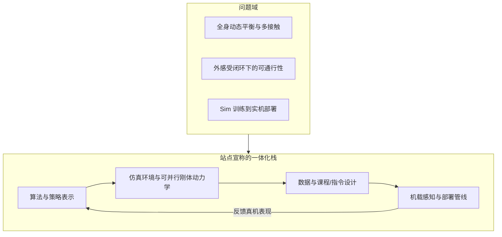
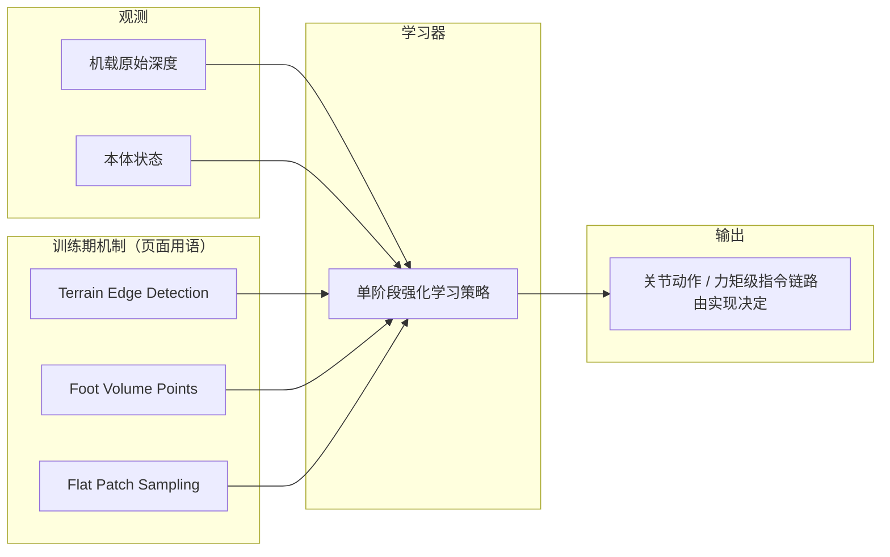
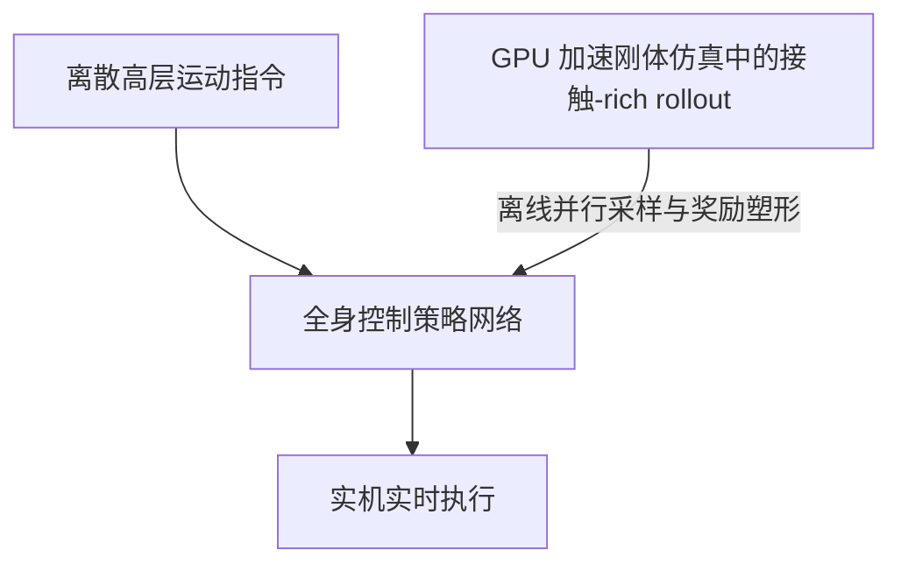

# Project Instinct

本页汇总 Project Instinct 公开站点与子课题主张；定量结论与实现细节以各论文 PDF 与代码仓库为准。

## 一句话定义

**Project Instinct**（[project-instinct.github.io](https://project-instinct.github.io/)）是面向 **人形全身动态控制** 的公开研究门户，把 **算法、仿真环境、数据与实机部署** 放在同一叙事下，并拆分多条子课题展示 **全身多接触 Shadowing**、**深度感知跑酷** 与 **可扩展野外徒步** 等能力。

## 为什么重要

- **问题覆盖面全**：同时触及 **接触丰富全身**（非仅限手脚）、**Sim2Real 人形 RL**、**外感受闭环里的全身跟踪** 与 **端到端深度策略**，是理解当前「高动态人形 + 感知 + 单策略多技能」论文群的方便入口。
- **工程闭环叙事清楚**：站点反复出现 **GPU 刚体仿真**、**机载深度**、**蒸馏 / 下游用例** 等关键词，便于和本库 [Sim2Real](../concepts/sim2real.md)、[Terrain Adaptation](../concepts/terrain-adaptation.md)、[Reinforcement Learning](../methods/reinforcement-learning.md) 对照阅读。
- **可追溯性强**：各子页给出 **会议或 arXiv 标识**，适合作为 curator 进一步精读论文时的 **一级索引**（正文仍以 PDF 为准）。

## 核心结构（据站点归纳）

| 子课题 | 公开主张（压缩） | 公开标识 |
|--------|------------------|----------|
| **Embrace Collisions** | 离散高层指令 + 实时低层全身控制；GPU 仿真里承受 **随机全身接触** 与 **大基座转动**，走向可部署接触无关动作 | CoRL 2025；arXiv:2502.01465 |
| **Deep Whole-Body Parkour** | 把 **外感受** 并入 **全身动作跟踪**，在起伏地形上做 **腾跃、翻滚** 等多接触动态技能；单策略跨动作与地形特征 | arXiv:2601.07701（页面写 In Submission） |
| **Hiking in the Wild** | **单阶段 RL**：原始深度 + 本体 → 关节动作；引入 **边沿检测 + 足端体积点** 与 **平坦块采样** 以兼顾安全与训练稳定性；强调 **无外部状态估计** 的野外徒步 | arXiv:2601.07718；宣称开源训推代码 |

## 流程总览

### 研究站群在工程上的分层（站点一级叙事）

### 「Hiking in the Wild」式端到端感知徒步（页面摘要级）

### 「Embrace Collisions」式全身 Shadowing（页面摘要级）

## 常见误区或局限

- **项目页 ≠ 论文全文**：动画与标题突出 **能力展示**；奖励设计、观测归一化、域随机化细节必须以 **arXiv / proceedings PDF** 为准。
- **「开源代码」需单独核验**：Hiking 子页宣称开放训推代码，**许可证、硬件改动量与复现门槛** 以 GitHub 仓库 README 为准，本页不替官方承诺可复现性。
- **In Submission 状态会变化**：Deep Whole-Body Parkour 在抓取时标注为投稿中，后续录用信息需人工更新。

## 关联页面

- [人形机器人](./humanoid-robot.md)
- [Sim2Real](../concepts/sim2real.md)
- [Whole-Body Control](../concepts/whole-body-control.md)
- [Terrain Adaptation](../concepts/terrain-adaptation.md)
- [Reinforcement Learning](../methods/reinforcement-learning.md)
- [Locomotion](../tasks/locomotion.md)

## 参考来源

- [Project Instinct 原始资料（站群摘录）](../../sources/sites/project_instinct.md)

## 推荐继续阅读

- [Project Instinct 主页](https://project-instinct.github.io/) — 总览与视频入口
- [Embrace Collisions（arXiv:2502.01465）](https://arxiv.org/abs/2502.01465) — 接触丰富全身 Shadowing 全文入口
- [Deep Whole-Body Parkour（arXiv:2601.07701）](https://arxiv.org/abs/2601.07701) — 感知 + 全身跟踪跑酷全文入口
- [Hiking in the Wild（arXiv:2601.07718）](https://arxiv.org/abs/2601.07718) — 可扩展深度徒步 RL 全文入口
