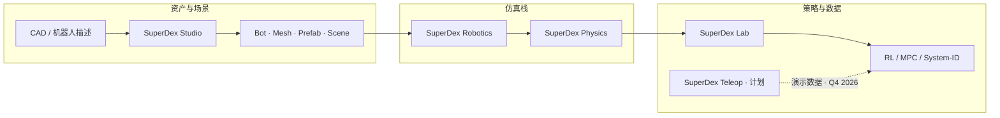
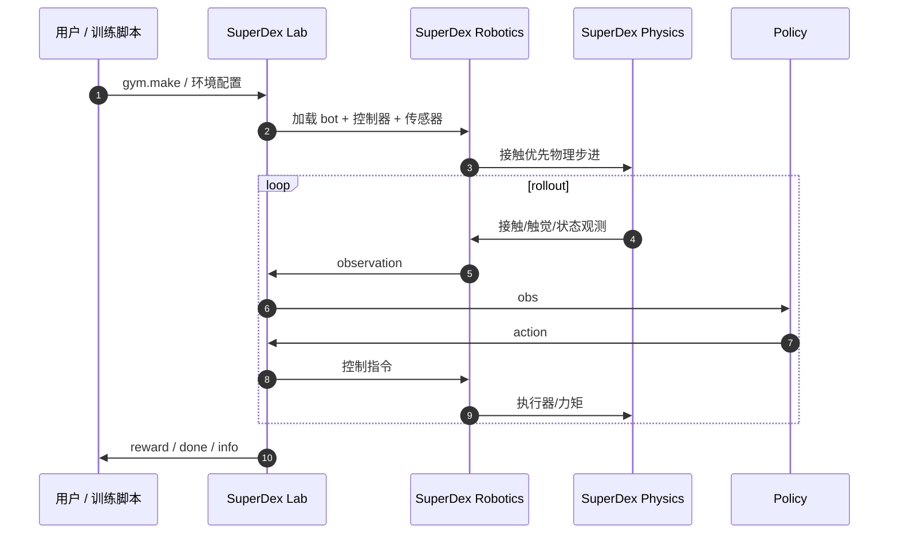

# Project SuperDex

**Project SuperDex** 是 Meta（[facebookresearch](https://github.com/facebookresearch/project_superdex)）发布的 **灵巧操作（dexterous manipulation）研究平台**，面向 **接触密集型（contact-rich）** 机器人任务。它将自研物理引擎、机器人 authoring、桌面资产工具与强化学习接口收进同一仿真栈，并计划以 **SuperDex Teleop**（Quest 3 端侧 VR）补齐数据采集闭环。

## 一句话定义

用 **接触优先物理引擎** 做仿真底座，用 **Studio** 把 CAD/机器人描述变成可验证资产，用 **Lab** 以 Gymnasium 风格 API 接 RL——Meta 在灵巧操作上的 **端到端开源平台**，不是 MuJoCo/Isaac 的薄封装，也尚未提供 DexBench 式工业真机 SR 榜。

## 英文缩写速查

| 缩写 | 英文全称 | 简要说明 |
|------|----------|----------|
| RL | Reinforcement Learning | SuperDex Lab 主接口场景；亦支持 MPC / system-ID |
| MDP | Markov Decision Process | Lab 抽象的核心决策过程层 |
| OSC | Operational Space Control | Robotics 示例含 `example_osc_jsc_control.py` |
| GUI | Graphical User Interface | SuperDex Studio 桌面 authoring 工具 |
| VR | Virtual Reality | SuperDex Teleop 计划 Quest 3 端侧遥操作 |
| API | Application Programming Interface | Lab 提供 Gymnasium 风格环境接口 |

## 先说结论

- **选型：** 若研究 **多指灵巧、螺纹拧紧、软体接触、触觉传感** 等接触主导任务，且需要 **一体化 authoring → 仿真 → RL** 栈，SuperDex 是当前 Meta 官方主推的 **开源全链路平台**（Apache 2.0）。
- **与通用仿真器分工：** [MuJoCo Playground](./mujoco-playground.md) / [Isaac Lab](./isaac-lab.md) 强项在 **大规模并行 loco-manip**；SuperDex 强项在 **自研 contact-first 物理** 与灵巧操作资产管线，勿按「谁 FPS 更高」单维选型。
- **与 DexBench 分工：** [DexBench](./dexbench.md) 是工业真机 **OSC 规格 + Regime 诊断语言**；SuperDex 是 **仿真+训练平台**，无公开工业 SR 排行榜。
- **成熟度：** Physics / Robotics / Studio **已可安装运行**（`uv pip install superdex`）；**Lab 为 early preview**；**Teleop 未发布**（README 标 Q4 2026）。
- **开源：** GitHub **已开源**；Python 3.12 有 PyPI 预编译 wheel；论文 citation 块 README 仍写待发表。

## 为什么重要

- **垂直整合：** 四模块覆盖「物理 → 机器人配置 → 场景资产 → 策略训练」，减少灵巧操作研究中常见的 **MJCF/URDF 手搓 + 仿真器补丁 + 环境胶水** 碎片化。
- **接触优先物理：** 自研 **SuperDex Physics** 针对稳定接触与精确传感建模，服务螺纹、编织、软指尖等 demo 所展示的任务类。
- **Authoring 闭环：** **SuperDex Studio** 把 CAD 与机器人描述转为原生资产（bot、mesh、task prefab、scene），降低复杂灵巧场景搭建门槛。
- **RL 入口统一：** **SuperDex Lab** 用 Gymnasium 风格 API 连接仿真与策略开发，与社区 IL/RL 工具链习惯对齐。
- **遥操作路线图：** **SuperDex Teleop** 计划 Quest 3 **端侧纯 C++**（无 PC 串流），对手追踪与控制器混合模式——若落地将补齐 sim-to-real 数据环。

## 核心架构

### 四模块职责

| 模块 | 角色 | 状态（2026-09） |
|------|------|-----------------|
| **SuperDex Physics** | 接触优先物理引擎；仿真底座 | 已发布；含 Physics Debugger |
| **SuperDex Robotics** | 机器人定义/组合、控制器、传感器、执行器 | 已发布；含 OSC 等控制示例 |
| **SuperDex Studio** | 桌面 GUI：资产创建、编辑、验证 | 已发布；Linux 需 X11 + OpenGL 4.1 |
| **SuperDex Lab** | Gymnasium 风格 RL / MPC / system-ID 接口 | **Early preview** |
| **SuperDex Teleop** | Quest 3 VR 遥操作 | **计划 Q4 2026** |

### 流程总览

### 源码运行时序图

> 快速冒烟：Physics `example_tendon_comparison.py`；Robotics `example_osc_jsc_control.py`；Studio `uv run superdex-studio`。安装见 [`sources/repos/project-superdex.md`](../../sources/repos/project-superdex.md)。

## 工程实践

| 步骤 | 做法 |
|------|------|
| 克隆 | `git clone --branch stable https://github.com/facebookresearch/project_superdex.git` |
| 快速开始 | `uv venv` → `uv pip install superdex`（**Python 3.12**） |
| 源码+GUI | `uv sync --extra gui`；仓内命令加 `--no-project` |
| 精度 | 默认 fp32；`SUPERDEX_PRECISION=double` 或 `--extra double` |
| 平台 | Linux / Windows x86_64、macOS ARM；Linux GUI 需 X11 与 OpenGL 4.1 |
| Lab | 视为 early preview；API 与性能可能大幅变动 |
| 许可 | 源码 Apache 2.0；资产 CC BY 4.0；mesh-cli 组件 GPLv3 |

## 与相关栈的对照

| | **Project SuperDex** | **MuJoCo / Isaac Lab** | **[DexBench](./dexbench.md)** |
|--|----------------------|------------------------|-------------------------------|
| 物理 | 自研 contact-first 引擎 | 成熟通用物理（MuJoCo / PhysX） | 无官方仿真仓 |
| 主场景 | 多指灵巧、接触密集 | 通才 loco-manip、大规模并行 | 工业真机 OSC 规格 |
| Authoring | Studio 原生资产管线 | 外部 URDF/MJCF 工具链 | 任务规格 PDF/站点 |
| RL 接口 | Lab（Gymnasium 风格） | 各生态自有 wrapper | 无官方 SR 榜 |
| 开源 | **已开源** | 已开源 | 规范公开；评测仓 coming soon |

## 局限与风险

- **Lab 未成熟：** README 明确 early preview，不宜假设 API 稳定或 benchmark 齐全。
- **Teleop 未发布：** Q4 2026 为路线图；截至入库日无法复现 README 画廊中的遥操作 demo 栈。
- **无正式论文：** citation 块占位，学术对标需自行核对后续发表版本。
- **Python 版本钉扎：** 预编译 wheel 仅 **3.12**；其他版本需源码构建。
- **非 GPU 大规模 benchmark：** 与 [RoboCasa](./robocasa.md) / [ManiSkill2](./maniskill2.md) 的「通才操作榜」不同赛道；工业规格见 [DexBench](./dexbench.md)。
- **第三方许可：** 部分依赖与资产限非商业/学术用途，部署前须核对各组件 LICENSE。

## 关联页面

- [Contact-Rich Manipulation](../concepts/contact-rich-manipulation.md) — 接触密集型操作概念层
- [DexBench](./dexbench.md) — 工业灵巧 OSC 规格（真机对标）
- [RoboCasa](./robocasa.md) — 厨房仿真 SR 榜（不同任务域）
- [ManiSkill2](./maniskill2.md) — 机械臂泛化操作 benchmark
- [XR Teleoperate](./xr-teleoperate.md) — 跨平台 XR 遥操作生态对照
- [Manipulation](../tasks/manipulation.md)
- [Reinforcement Learning](../methods/reinforcement-learning.md)
- [具身评测基准选型闭环](../queries/embodied-eval-benchmark-selection-loop.md)

## 参考来源

- [Project SuperDex 仓库归档](../../sources/repos/project-superdex.md)
- [Project SuperDex 项目站归档](../../sources/sites/projectsuperdex-com.md)

## 推荐继续阅读

- 项目主页：<https://projectsuperdex.com/>
- GitHub：<https://github.com/facebookresearch/project_superdex>
- Physics 文档：<https://projectsuperdex.com/physics/docs/overview/>
- Lab 文档：<https://projectsuperdex.com/lab/docs/overview/>

## 一句话记忆

> SuperDex = Meta 的「灵巧操作全栈」：自研接触物理 + Studio 资产 + Lab RL；工业规格看 DexBench，厨房 SR 榜看 RoboCasa，大规模 GPU 并行仍看 Isaac/MJX。
