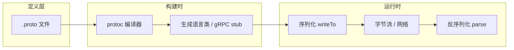

# Protocol Buffers（Protobuf）

## 一句话定义

**Protocol Buffers** 是 Google 开源的 **语言中立、平台中立** 结构化数据 **序列化机制**：用 **`.proto` IDL** 定义 `message`/`enum`/`service`，经 **`protoc`** 生成多语言类型与编解码代码，线上/磁盘交换 **紧凑二进制 wire format**；[gRPC](./grpc.md) 的默认 IDL 与载荷格式。

## 英文缩写速查

| 缩写 | 英文全称 | 简要说明 |
|------|----------|----------|
| Protobuf | Protocol Buffers | 本页序列化与 IDL 体系 |
| IDL | Interface Definition Language | `.proto` 中的类型与服务定义 |
| TLV | Tag-Length-Value | wire 上 field number + type + payload |
| gRPC | gRPC Remote Procedure Calls | 常用 Protobuf 作 RPC 契约与消息体 |
| JSON | JavaScript Object Notation | 常见对照：人类可读但更大更慢 |
| ONNX | Open Neural Network Exchange | 模型格式亦基于 protobuf 描述 |

## 为什么重要

- 边云 **模型服务、gRPC 后端、部分采集桥**（如 Etherban）默认 Protobuf 契约——不懂字段演进与 wire 行为会导致 **静默兼容失败** 或 **版本漂移**。
- 与 [LCM](../concepts/lcm-basics.md) / ROS message 同属「**强类型 + 代码生成**」，但 Protobuf 优化 **RPC 与持久化**，不是 DDS/LCM 的 pub/sub 替代品。
- [ONNX Runtime](./onnxruntime.md) 等栈 **钉扎 protobuf 版本**（如 6.33.5）；升级 runtime 时需一并理解格式依赖。

## 核心原理

| 组件 | 作用 |
|------|------|
| `.proto` | 声明 `message`、`enum`、`service`、字段号与 cardinality |
| `protoc` | 编译 `.proto` → Java/C++/Python/Go/… 类型与序列化 API |
| 运行时库 | `writeTo` / `ParseFrom*`、Builder 模式等 |
| Wire format | Varint + TLV；未知字段可跳过 → **向后兼容** |

### 兼容演进（官方 Overview）

- **新增字段**：旧代码 **忽略** 未知 field；新代码读旧消息时新字段为 **默认值**。
- **删除字段**：旧代码见 default / 空 repeated；**必须 reserve 字段号**，禁止复用。
- **不适合**：单消息 **> 数 MB** 且需整包进内存；需 **不解析直接比较** 二进制；大 float 数组科学计算；要求 **正式国际标准** 的合规场景。

### Wire 编码要点

- 每条记录：**field number + wire type + payload**（TLV）。
- 整数多用 **varint**（小值省字节）。
- 同一逻辑消息可有 **多种合法二进制形态** → 比较语义须 **parse 后** 比字段值。

一手：[protobuf.dev Overview](../../sources/sites/protobuf-dev-docs.md)；[Encoding 指南](https://protobuf.dev/programming-guides/encoding/)。

## 工程实践

### 开源状态（2026-09-17）

- **已开源**：[protocolbuffers/protobuf](https://github.com/protocolbuffers/protobuf) **BSD-3-Clause**；~72k★。
- **`protoc`**：优先从 [Releases](https://github.com/protocolbuffers/protobuf/releases) 下载 `protoc-$VERSION-$PLATFORM.zip`；C++ 从源码见 `src/README.md`。
- **语言运行时**：Python `pip install protobuf`、Java Maven 等；Go/JS/Dart 见独立仓（README 语言表）。

### 快速落地

1. 写 `.proto` → **`protoc`**（+ gRPC plugin 若做 RPC）生成代码。
2. **字段号稳定**：生产后勿改号；删字段 **reserve**。
3. **与 gRPC 联用**：`service` + `rpc` 定义 API；见 [gRPC 实体](./grpc.md)。
4. **机器人分工**：**服务面 / 配置 / 边云 API** 用 Protobuf+gRPC；**≥500 Hz 关节/IMU 流** 改 [LCM](../concepts/lcm-basics.md) / SHM / 总线。
5. **版本钉扎**：与 ORT、自定义工具链一并锁定 `protoc` 与 runtime 版本；跨语言项目共享同一份 `.proto`。

## 局限与风险

- **非自描述**：无 `.proto` 无法完整解释任意二进制（虽有反射 schema，仍依赖定义文件）。
- **消息尺寸**：官方建议单包 **数 MB 以内**；更大应分片或换格式。
- **无内置压缩**：需外层 gzip/zip；图像等应用专用格式更小。
- **与 ROS/DDS 不互通**：`.proto` ≠ `.msg`/IDL；桥接须显式转换层。
- **标准地位**：事实工业标准但 **非 ISO/IETF 正式标准**；强合规场景需评估。

## 关联页面

- [gRPC](./grpc.md)
- [远程过程调用（RPC）](../concepts/remote-procedure-call.md)
- [LCM 基础](../concepts/lcm-basics.md)
- [网络协议栈](../concepts/network-protocol-stack.md)
- [ONNX Runtime](./onnxruntime.md)
- [通信协议知识链](../overview/hub-communication.md)

## 参考来源

- [sources/repos/protobuf.md](../../sources/repos/protobuf.md)
- [sources/sites/protobuf-dev-docs.md](../../sources/sites/protobuf-dev-docs.md)
- [gRPC 官方文档（Protobuf 默认 IDL）](../../sources/sites/grpc-io-docs.md)

## 推荐继续阅读

- Overview：<https://protobuf.dev/overview/>
- Encoding：<https://protobuf.dev/programming-guides/encoding/>
- Getting started：<https://protobuf.dev/getting-started/>
- 仓：<https://github.com/protocolbuffers/protobuf>
