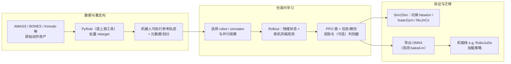
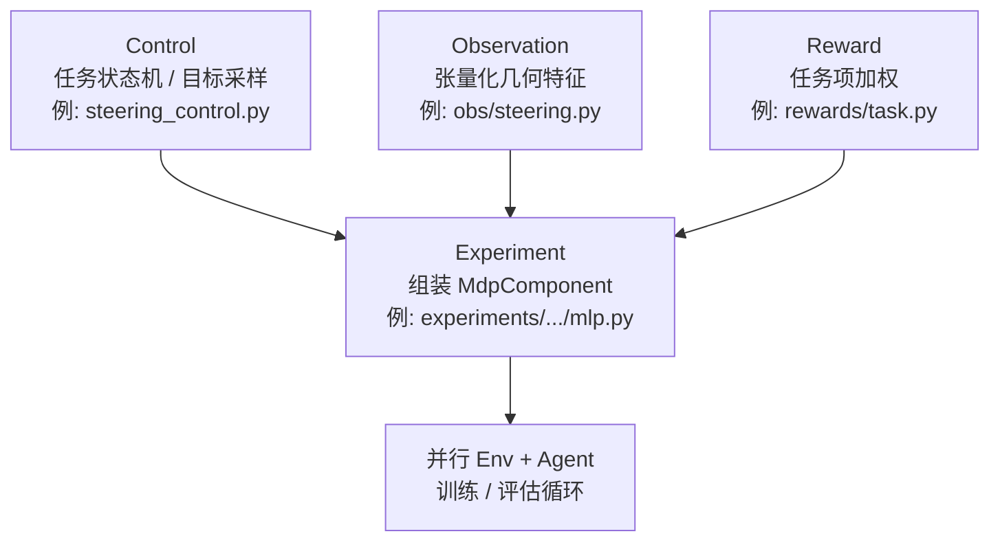

# ProtoMotions: 大规模人形机器人仿真框架

**ProtoMotions**（当前主线为 **ProtoMotions3**）是 NVIDIA Labs 维护的 **GPU 加速仿真 + 强化学习训练** 框架：面向 **动画角色** 与 **人形机器人** 的通用运动技能学习，并把「海量参考动作 → 并行物理 rollout → 可导出策略」收敛到同一套代码组织里。官方定位为跨 **动画 / 机器人 / RL** 社区的 **快速原型平台**，Apache-2.0 许可。

## 为什么重要？

- **规模与吞吐**：面向 AMASS、BONES-SEED 等 **万级～十万级 motion** 的数据形态设计，强调多 GPU 分片与大批量环境并行，适合作为「一条策略吃尽整个公开动作库」类研究的工程底座。
- **观测与部署对齐**：Sim2Sim / Sim2Real 叙事里反复强调 **只使用真机可得的观测**；部署路径导出 **单文件 ONNX（含观测计算）**，降低与机载中间件重复实现观测栈的风险。
- **多物理引擎**：在 Newton、Isaac 系、MuJoCo 等后端之间切换做对照，有助于发现 **引擎特有接触/积分差异** 带来的伪成功或伪失败。
- **与 MimicKit 互补**：算法族谱与论文级最小实现见 [MimicKit](./mimickit.md)；需要 **工业级数据管线、后端抽象与部署故事** 时再回到本框架。

## 核心能力栈（从 README 与官方文档归纳）

| 方向 | 要点 |
|------|------|
| 数据 | AMASS 全量、PHUMA、BONES / SOMA 骨架、Kimodo 生成动作等；各数据集有独立 **getting_started** 准备文档。 |
| 重定向 | v3 默认 **PyRoki** 优化式重定向（早期为 Mink）；目标是把 SMPL 系动作 **批量映射** 到指定机器人骨架。 |
| 训练 | 大规模 PPO 族训练循环 + 模块化 **Agent**（官方以 **ADD** 等为例展示「数十行级」接入新算法）。 |
| 仿真 | Newton、IsaacLab、IsaacGym、MuJoCo 等组合；Genesis 在 README 中标记为未充分测试，但提供接口层示例。 |
| 任务 | 以 **MDP 组件** 拼装控制逻辑、观测核、任务奖励与实验配置，避免单体式巨型 `Env` 类。 |
| 部署 | 以 **Unitree G1** 为主叙事，结合 **RoboJuDo** 与 ONNX 导出做端到端教程。 |

## 从原始资料到可跑策略：工程流水线

下图概括官方文档反复出现的 **数据准备 → 并行学习 → 引擎侧验证 →（可选）真机** 路径；具体脚本与 YAML 以 [官方文档](https://protomotions.github.io/) 为准。

## 模块化任务拼装（官方 steering 示例的心智模型）

仓库用 **Control / Observation / Reward / Experiment** 四层表说明「新任务不必从单类继承开始写」；下图是抽象后的依赖关系，便于对照源码目录。

## 与 MimicKit、Kimodo 的关系

- **[MimicKit](./mimickit.md)**：同一作者线的 **轻量** 研究框架，DeepMimic / AMP / ASE / ADD / SMP 等方法在统一 `run.py` 体系下对照实验更方便。
- **ProtoMotions3**：更强调 **多仿真器抽象、万级环境、数据准备与 ONNX 部署**；与 [Kimodo](./kimodo.md) 官方文档打通「文生动作 → 物理策略 → 真机」工作流。

## 关联页面

- [MimicKit](./mimickit.md)、[Kimodo](./kimodo.md)、[Xue Bin Peng](./xue-bin-peng.md)
- [模仿学习](../methods/imitation-learning.md)、[DeepMimic](../methods/deepmimic.md)、[ADD](../methods/add.md)、[AMP 奖励](../methods/amp-reward.md)、[SMP](../methods/smp.md)

## 局限与使用注意

- **引擎差异**：不同后端的接触、摩擦与求解器默认参数不一致时，**Sim2Sim 通过** 不等于 **Sim2Real 稳**；需要保留域随机化、延迟与传感器噪声等常规机器人侧校验。
- **Genesis 等后端**：README 明确部分后端为 **实验性 / 未充分测试**，接入成本与行为契约需自行评估。
- **算力与数据许可**：AMASS、BONES 等数据集各有 **下载与学术/商业许可**；大规模训练前应先核对合规与存储带宽。

## 继续阅读

- [MimicKit](./mimickit.md) — 运动模仿算法对照实验床
- [Kimodo](./kimodo.md) — 与 ProtoMotions 官方衔接的文生运动
- [模仿学习](../methods/imitation-learning.md) — 任务层概念索引
- [ADD](../methods/add.md) — README 用作「易扩展算法」示例的差分判别器路线

## 参考来源

- 本页知识编译自仓库侧原始摘录：[sources/repos/protomotions.md](../../sources/repos/protomotions.md)（含 GitHub README 与 [protomotions.github.io](https://protomotions.github.io/) 文档入口归纳）
- 上游仓库：[NVlabs/ProtoMotions](https://github.com/NVlabs/ProtoMotions)
