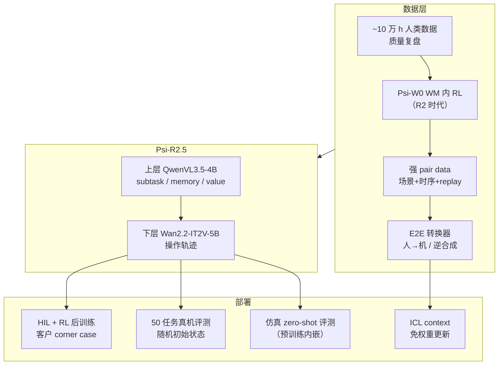

# Psi-R2.5（PsiBot · Scaling Pair Data）

**Psi-R2.5** 是 **灵巧智能（PsiBot）** 2026-09 通过技术博客 [Scaling Pair Data for Embodied Intelligence](https://www.psibot.ai/scaling-pair-data-for-embodied-intelligence-zh/) 披露的第三代具身基础模型栈：在 **~10 万小时** 自采人类数据上强调 **质量复盘与属性压缩**（而非继续堆量），用 **[强 pair data](../concepts/strong-pair-data.md)** 对齐人–机 dynamic，并展示 **In-Context Learning（ICL）** 与 **HIL+RL 后训练** 在 3C 装配等长程灵巧任务上的工程闭环。

| 字段 | 内容 |
|------|------|
| 机构 | 灵巧智能（PsiBot） |
| 类型 | 公司技术博客 + 演示（非 arXiv） |
| 入口 | <https://www.psibot.ai/scaling-pair-data-for-embodied-intelligence-zh/> |
| 前代 | Psi-R2、Psi-W0（WM 内 RL 人→机转换） |
| 开源 | **未开源**（2026-09-23） |

## 一句话定义

双层 **VLM 规划 + Wan 视频–动作轨迹** 模型，以 **强 pair data** 与 **Psi-W0 蒸馏转换器** 把人手 dynamic 对齐到机器人 domain，部署期可接 ICL 与少量 HIL 后训练。

## 英文缩写速查

| 缩写 | 英文全称 | 简要说明 |
|------|----------|----------|
| VLM | Vision-Language Model | 上层 QwenVL3.5-4B 骨干 |
| WM | World Model | Psi-W0：十万小时级人类预训练 WM |
| ICL | In-Context Learning | 人类示范经 pair 转换作 context，免微调 |
| HIL | Human-in-the-Loop | 后训练人机协同与失败回流 |
| IT2V | Image/Text-to-Video | Wan2.2 下层轨迹生成骨干 |

## 为什么重要

- **「Scaling quality, not just size」：** 在 10 万小时节点做全量复盘而非盲目扩数据 — 与 [embodied scaling laws](../concepts/embodied-scaling-laws.md) 讨论互补，突出 **策展与 pair 精度**。
- **强 pair 工业化叙事：** 从 R2/W0 的 WM+RL（重）蒸馏到 **E2E 人类→机器人转换模型**，并 **逆向从机数据合成人手** — 给出可 scale 的 [strong pair data](../concepts/strong-pair-data.md) 产线。
- **架构可换、数据定上限：** 博客称 VLA/WAM 架构 **2–3 天** 可迭代一轮，性能瓶颈在 **多模态数据清洗与对齐** — 对数据工程师选型有参考价值。
- **预训练 + 后训练双轨：** 承认客户 SKU/节拍定制需求，HIL+RL 框架 **1–2 工作日** 将手机盒装配提到 **~99% SR**（博客自报）。

## 流程总览

## 核心原理

### 双层架构

- **上层：** **QwenVL3.5-4B** + 自采预训练；将长 instruction 拆为 subtask，注入 memory、soft prompt 等 meta context，并携带 RL **value**，与观测一并输入下层。
- **下层：** **Wan2.2-IT2V-5B** + 自采预训练；输出机器人 **操作轨迹**（与 [World Action Models](../concepts/world-action-models.md) 视频–动作联合范式一致）。

### 相对 Psi-R2 的升级

- **数据质量 + 属性压缩**（非单纯加小时）。
- **强 pair scaling** 提升 human→robot 对齐。
- **仿真测评** 嵌入预训练流程；**50 复杂多任务** 真机评测 + 初始状态随机化。

### Psi-W0 → 转换器 → 逆向合成

1. **Psi-W0**（~10 万 h 人类 WM 预训练）内 RL，将人手轨迹优化为 **可 replay 机器人轨迹**（替代传统仿真器，绕开 real2sim scale 与 sim2real gap）。
2. 收集 W0 产出 **强 pair**，蒸馏 **端到端转换模型**（带 action 的 video editing，非 policy）。
3. **逆向：** 从 **机器人数据** 出发，用 **逆 Psi-W0** 生成匹配人手 → 更易 scale 强 pair。
4. **手机 ego 视频** → 转换器 → 机器人数据（博客展示 zero-shot 泛化）。

### 后训练与 ICL

- **HIL + RL**（灵巧手）：基础模型 + 极少量微调；失败案例回流。
- **ICL：** 人类示教经 pair 模型转为 **机器人 context**，**不更新权重** 完成新任务（四段 Demo 01–04）。

## 工程实践

| 检查项 | 建议 |
|--------|------|
| 数据门控 | 转换数据须过 **replay** 与 **后训练泛化** 两道测试再进预训练 |
| 任务设计 | 优先 **任务多样性** 与原子动作标注，压缩同任务冗余时长 |
| 混训风险 |  raw 人+机混训可能诱发 embodiment 分类 — 需强 pair 或显式对齐 |
| 开源边界 | R2.5 / W0 / 转换器 **未开源**；学术复现可对照 [EgoSteer](./paper-egosteer.md)（PKU–PsiBot，已开源） |
| 产品联系 | market@psirobot.ai |

## 评测读法（博客自报）

- **仿真：** 预训练流程内嵌 zero-shot 仿真测评。
- **真机：** **50** 复杂多任务集，初始状态随机化，面向组合泛化。
- **后训练：** 手机盒装配 IL from scratch 低 → HIL+RL 数轮 **~99%**，**1–2 工作日**。
- **ICL：** 四段演示；细节「后续发布」。

## 局限与风险

- **闭源 + 无 arXiv：** 数字与管线均为 **公司自述**，待独立 benchmark 或论文。
- **与 EgoSteer 勿混：** [EgoSteer](./paper-egosteer.md) 是 PKU 联合实验室 **开源全栈**；R2.5 是 PsiBot **商业 WM+VLM 栈**，强 pair 定义与产线不同。
- **转换器非 policy：** 复杂任务可能 **轨迹近似** 而非一次 replay 成功。
- **算力前置：** W0 预训练与 pair 产线成本高，中小团队难复刻。

## 关联页面

- [Strong Pair Data](../concepts/strong-pair-data.md)
- [EgoScale](../methods/egoscale.md)
- [EgoSteer](./paper-egosteer.md)
- [VLA](../methods/vla.md)
- [World Action Models](../concepts/world-action-models.md)
- [Robot In-Context Learning](../concepts/robot-in-context-learning.md)
- [DAgger](../methods/dagger.md)
- [Manipulation](../tasks/manipulation.md)

## 参考来源

- [psibot_scaling_pair_data_embodied_intelligence_zh.md](../../sources/blogs/psibot_scaling_pair_data_embodied_intelligence_zh.md)
- [psibot-scaling-pair-data-zh.md](../../sources/sites/psibot-scaling-pair-data-zh.md)

## 推荐继续阅读

- [PsiBot 技术博客（中文）](https://www.psibot.ai/scaling-pair-data-for-embodied-intelligence-zh/)
- [PsiBot 官网](https://www.psibot.ai/)
- [EgoSteer（arXiv:2607.09701）](https://arxiv.org/abs/2607.09701)
