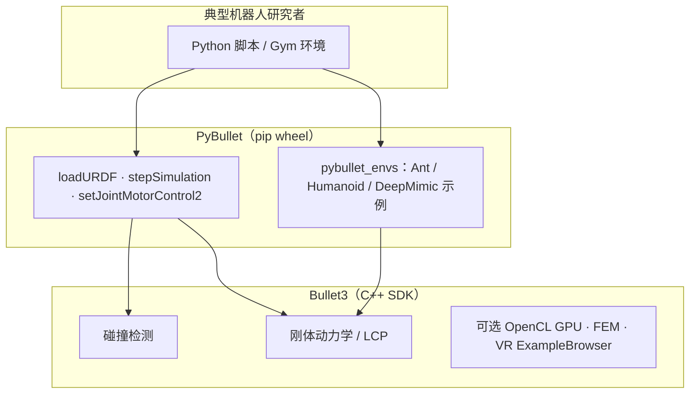

# PyBullet

**PyBullet** 把 **[Bullet3](https://github.com/bulletphysics/bullet3)** C++ 物理 SDK 封装为 **Python API**（`pip install pybullet`），是机器人 RL 领域最常见的 **轻量级入门仿真器** 之一：几分钟内即可加载 URDF、设置重力、在循环里读状态、写电机指令。官方主页与案例索引见 [pybullet.org](https://pybullet.org/wordpress/)。

## 一句话定义

用 Python 直接 `loadURDF` + `stepSimulation` 跑通 **状态–动作–奖励–物理转移** 闭环，而不必先搭 ROS 或 GPU 仿真农场。

## 英文缩写速查

| 缩写 | 英文全称 | 简要说明 |
|------|----------|----------|
| URDF | Unified Robot Description Format | PyBullet 默认机器人模型格式 |
| RL | Reinforcement Learning | 常与 PyBullet 联用做策略学习 |
| PD | Proportional–Derivative | `POSITION_CONTROL` / `VELOCITY_CONTROL` 底层跟踪 |
| GUI | Graphical User Interface | `p.connect(p.GUI)` 可视化调试 |
| LCP | Linear Complementarity Problem | Bullet 刚体接触常用 hard-contact 求解框架 |
| FEM | Finite Element Method | Bullet3 可选可变形体仿真（相对 RL 主线较少用） |

## 与 Bullet3 的分层

- **选 PyBullet**：教学、快速原型、与 NumPy / SB3 集成、笔记本无 GPU 农场。
- **选裸 Bullet3 C++**：游戏引擎插件、VR 沙盒、需深度改物理管线或 ExampleBrowser 调试；机器人 RL **仍建议 PyBullet**（官方 README 亦如此）。

## 为什么重要

- **教学与最小闭环**：在进 Isaac Lab / MuJoCo 大规模训练前，用 KUKA 臂定点、倒立摆等 **几十行脚本** 把 MDP 五元组与仿真步进对齐（见 [具身 RL 最小闭环](../concepts/embodied-rl-minimal-closed-loop.md)）。
- **历史生态**：[motion_imitation](./motion-imitation-quadruped.md)（四足模仿动物，RSS 2020）、早期 DeepMimic 复现、[gym-pybullet-drones](./gym-pybullet-drones.md)（四旋翼 RL）均建立于 PyBullet；官方站亦索引 Assistive Gym、Habitat-Sim Bullet 集成等。
- **依赖轻**：Colab 上 `pip install pybullet` 约十几秒；适合课程与算法 ablation。

## 核心能力

| 能力 | API 直觉 |
|------|----------|
| 加载场景 | `loadURDF("plane.urdf")`、机器人 `loadURDF(...)` |
| 物理步进 | `stepSimulation()` 推进一个仿真 tick |
| 读状态 | `getLinkState` / `getJointState` → 末端位姿、关节角 |
| 写动作 | `setJointMotorControl2`（位置 / 速度 / 力矩模式） |
| 可视化 | `p.connect(p.GUI)` 或 `DIRECT` 无头 |
| 共享内存 / VR | `p.connect(p.SHARED_MEMORY)` 对接 Bullet VR 沙盒 |
| 内置 Gym 环境 | `pybullet_envs`：Ant、Humanoid、DeepMimic 等（随 bullet3 仓示例） |

## 局限与选型

| 场景 | PyBullet | 更常选 |
|------|----------|--------|
| RL 入门、机械臂 reach 教学 | ✅ 足够 | — |
| 四旋翼 RL 基准 | ✅ [gym-pybullet-drones](./gym-pybullet-drones.md) | Flightmare / Isaac |
| 人形万环境并行 PPO | ⚠️ 慢 | [Isaac Lab](./isaac-gym-isaac-lab.md) |
| 精细接触 / 足端力可信 | ⚠️ 简化（hard contact / LCP，见 [接触互补](../formalizations/contact-complementarity.md)） | [MuJoCo](./mujoco.md) |
| sim2real 精细接触操作 | ❌ 不宜唯一真理源 | MuJoCo + 系统辨识 |
| 可微 / 百万步/秒 rollout | ⚠️ 非主线 | MuJoCo MJX、TDS 等可微栈 |

## 关联页面

- [具身 RL 最小闭环](../concepts/embodied-rl-minimal-closed-loop.md) — KUKA 定点任务与 MDP 要素对照
- [motion_imitation](./motion-imitation-quadruped.md) — 四足 PyBullet 模仿标杆
- [gym-pybullet-drones](./gym-pybullet-drones.md) — 四旋翼 Gymnasium 环境
- [Reinforcement Learning](../methods/reinforcement-learning.md)
- [MuJoCo vs Isaac Sim](../comparisons/mujoco-vs-isaac-sim.md)
- [接触互补形式化](../formalizations/contact-complementarity.md)

## 参考来源

- [Bullet3 Physics SDK](../../sources/repos/bullet3.md) — 官方 C++ 仓、`pybullet_envs` 与构建说明
- [PyBullet 官方网站](../../sources/sites/pybullet-org.md) — 案例索引、Colab、论坛入口
- [深蓝具身智能：跑通具身控制最小闭环](../../sources/blogs/wechat_shenlan_rl_embodied_minimal_closed_loop.md) — KUKA 教学案例
- [PyBullet Quickstart Guide](https://docs.google.com/document/d/10sXEhzFRSnvFcl3XxNGhnD4N2SedqwdAvK3dsihxVUA/edit) — 官方 API 教程（以文档为准）
- [bulletphysics/bullet3](https://github.com/bulletphysics/bullet3) · [pybullet.org](https://pybullet.org/wordpress/)

## 推荐继续阅读

- [PyBullet Quickstart Guide](https://docs.google.com/document/d/10sXEhzFRSnvFcl3XxNGhnD4N2SedqwdAvK3dsihxVUA/edit) — URDF、控制模式与传感器
- [Google Colab PyBullet + SB3 示例](https://pybullet.org/wordpress/) — 站点链出的在线训练入口
- [motion_imitation 项目页](https://github.com/google-research/motion_imitation) — 四足模仿动物官方实现
