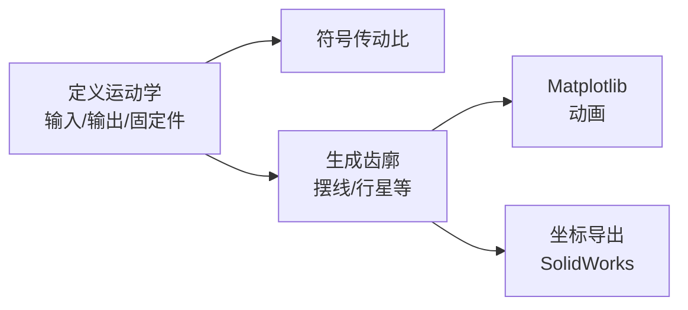

# pygeartrain（摆线/行星齿廓与传动比工具）

## 一句话定义

**pygeartrain**（[CKraft11/pygeartrain](https://github.com/CKraft11/pygeartrain)）是面向 **齿轮系运动学与齿廓导出** 的 Python 库：符号算传动比、Matplotlib 动画可视化，并把摆线/行星等轮廓坐标导出到 CAD（如 SolidWorks）；[Ironless QDD](./ironless-qdd-actuator.md) 用其生成 **可 3D 打印的摆线—行星** 齿形。

## 英文缩写速查

| 缩写 | 英文全称 | 简要说明 |
|------|----------|----------|
| CAD | Computer-Aided Design | 计算机辅助设计；本库导出轮廓坐标供导入 |
| QDD | Quasi-Direct Drive | 准直驱；常与低减速比行星/摆线组合 |
| WIP | Work In Progress | 进行中；渐开线等齿廓仍标未完成 |
| API | Application Programming Interface | 库的调用接口（如 `Planetary(...)`） |
| MIT | MIT License | 开源许可类型 |

## 为什么重要

- FDM 打印渐开线齿易出现喷嘴圆角与齿根剪切；**摆线叶瓣轮廓**更贴合挤出工艺，且可做成近零背隙接触叙事——Ironless 博文正是因此改用本库导出的齿形。
- 把「奇奇怪怪的复合行星 / 摆线」从纯数学可视化推进到 **可赋尺寸、可进 SolidWorks** 的工程文件（作者相对上游 pygeartrain 概念的主要贡献叙事）。
- 与 [Jeong 双摆线 QDD](./cycloidal-quasi-direct-drive-actuator.md)、[Internal Cycloidal](./internal-cycloidal-actuator.md) 对照时，可作为「自己生成齿廓」的工具侧入口，而不是只抄现成 STEP。

## 核心信息

| 项 | 内容 |
|----|------|
| 语言 | Python |
| 许可 | **MIT** |
| 环境 | Conda `environment.yml` → `conda activate pygeartrain` |
| 传动类型 | 标准行星、复合行星（Wolfram 等）、摆线、复合摆线、Nabtesco 风格、角接触等 |
| 导出 | 齿廓坐标 → CAD；行星有 `generate_planetary_cad.py` |
| Ironless 用法 | 约 **7:1** 摆线齿形行星；支持螺旋 / 双螺旋摆线齿 |

## 核心原理

- **输入：** 齿轮系拓扑（如太阳 `s`、行星架 `c`、齿圈 `r`）与几何尺寸。
- **输出：** 传动比公式、可视化、以及可导入 CAD 的轮廓点列。
- **与 Ironless 的衔接：** 导出摆线叶瓣 → 赋壁厚/螺旋 → 打印 → 装入执行器中心减速模块。

## 工程实践

| 步骤 | 做法 |
|------|------|
| 安装 | `git clone` → `conda env create -f environment.yml` → `conda activate pygeartrain` |
| 算比 | `from pygeartrain.planetary import Planetary`；定义输入/输出/固定件 |
| 出图 | README 示例 GIF/PNG；先确认运动学无干涉再导出 |
| 进 CAD | 跑行星导出脚本，按作者博文指南转 SolidWorks 实体 |
| 关节落地 | 对照 [Ironless QDD](./ironless-qdd-actuator.md) 打印件与锂基脂装配 |

## 局限与风险

- **不是完整执行器仓**：不含电机 FEMM、绕线、驱动配置；那些在 Ironless-QDD。
- 渐开线等能力标 **WIP**；复合/冷门拓扑需自行验强度与可打印性。
- 导出轮廓 ≠ 已做接触疲劳/磨损验证；塑料摆线在高冲击腿足上需额外评估。

## 关联页面

- [Ironless QDD Actuator](./ironless-qdd-actuator.md)
- [Cycloidal Quasi-Direct Drive Actuator](./cycloidal-quasi-direct-drive-actuator.md)
- [Internal Cycloidal Actuator](./internal-cycloidal-actuator.md)
- [开源 QDD 执行器项目对比](../comparisons/open-source-qdd-actuator-projects.md)
- [执行器驱动链选型闭环](../queries/actuator-drive-chain-selection-loop.md)

## 参考来源

- [sources/repos/pygeartrain.md](../../sources/repos/pygeartrain.md)
- [sources/blogs/cadenkraft_ironless_cycloidal_planetary_actuator.md](../../sources/blogs/cadenkraft_ironless_cycloidal_planetary_actuator.md)

## 推荐继续阅读

- 仓库：<https://github.com/CKraft11/pygeartrain>
- Ironless 项目长文（齿廓动机）：<https://cadenkraft.com/ironless-cycloidal-planetary-actuator/>
