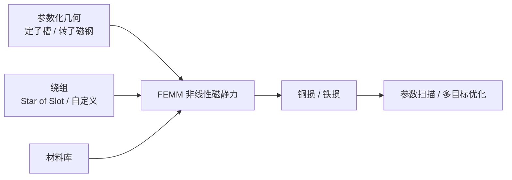

# PYLEECAN（径向磁通电机开源设计框架）

## 一句话定义

**PYLEECAN**（[Eomys/pyleecan](https://github.com/Eomys/pyleecan)，[pyleecan.org](https://www.pyleecan.org/)）是面向电机与驱动的 **开源多物理场设计/仿真/优化框架**：参数化径向磁通拓扑、材料与绕组，并可耦合 **FEMM** 等求解器做电磁与损耗分析。

## 英文缩写速查

| 缩写 | 英文全称 | 简要说明 |
|------|----------|----------|
| PMSM | Permanent Magnet Synchronous Motor | 永磁同步电机 |
| SPMSM | Surface Permanent Magnet Synchronous Motor | 表贴式永磁同步电机 |
| IPMSM | Interior Permanent Magnet Synchronous Motor | 内嵌式永磁同步电机 |
| FEMM | Finite Element Method Magnetics | 开源 2D 电磁有限元 |
| GUI | Graphical User Interface | 图形界面，用于定义拓扑 |

## 为什么重要

- 商业栈常用 Maxwell / Motor-CAD；PYLEECAN 提供 **可复现、可脚本化** 的开源替代入口，适合把 [电机设计流程](../overview/motor-design-workflow.md) 的「拓扑→FEA→扫描」落到可版本控制的代码里。
- 对人形关节：可系统扫 **外转子 SPMSM、24/28 或 36/42 槽极、集中绕组、48 V、低 KV、大气隙半径、短轴向** 等组合，而不必先开模具。
- 与 [Ironless](./ironless-qdd-actuator.md) 样机互补：Ironless 给固定设计教材；PYLEECAN 给「下一版更像人形」的重设计工作台。

## 核心原理

**主拓扑能力（官方 README）：** SPMSM、IPMSM、SCIM、DFIM、WRSM、SRM、SynRM 等；GUI 可跑单速电流驱动磁 FEMM；支持 DXF 导入槽/孔、GMSH 网格耦合第三方多物理场。

## 工程实践

| 项 | 建议 |
|----|------|
| 安装 | 按 [官网 Get PYLEECAN](https://www.pyleecan.org/get.pyleecan.html)；注意 README 对 Python 版本的兼容说明 |
| 人形关节起点 | 外转子 SPMSM；试 36 槽 / 42 极或 24/28；集中绕组；约束母线电压与连续电流密度 |
| 与开源样机对照 | 先复现 Ironless/Internal Cycloidal 量级几何，再改外径与叠长 |
| 平台 | FEMM 耦合 README 写明以 **Windows** 为主；脚本与优化可在文档流程上规划跨平台 |

你必须自己定的量：外径、槽极、磁钢尺寸、匝数、线径、目标 KV、电流密度、冷却——工具不会替你猜任务。

## 局限与风险

- **不是硬件项目**：无固定冲片/BOM/台架曲线。
- **不能替代** 工业级瞬态 3D FEA + 热 CFD + 实测 TN 的闭环（见 [仿真软件选型](../comparisons/motor-em-simulation-software.md)）。
- GUI/依赖演进中；以官方安装页与 issue 为准。

## 关联页面

- [开源力矩电机电磁设计完整度对比](../comparisons/open-source-torque-motor-em-design.md)
- [axfluxmdo](./axfluxmdo.md) · [ACMOP](./acmop.md) · [FEMM-FOC](./femm-foc-simulation.md)
- [电机设计流程](../overview/motor-design-workflow.md)
- [力矩电机设计纵深](../../roadmap/depth-torque-motor-design.md)

## 参考来源

- [sources/repos/pyleecan.md](../../sources/repos/pyleecan.md)
- [sources/sites/pyleecan_org.md](../../sources/sites/pyleecan_org.md)
- [开源力矩电机电磁设计策展](../../sources/personal/open_source_torque_motor_em_design_curator.md)

## 推荐继续阅读

- 官网：<https://www.pyleecan.org/>
- GitHub：<https://github.com/Eomys/pyleecan>
- Gallery：<https://pyleecan.org/gallery.html>
