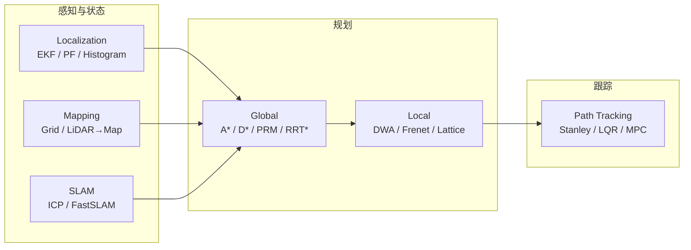

---

type: entity
tags: [repo, education, autonomous-navigation, path-planning, slam, localization, python, textbook, mit]
status: complete
updated: 2026-07-21
related:
  - ../overview/navigation-slam-autonomy-stack.md
  - ../overview/autonomous-driving-core-algorithms-series.md
  - ../entities/navigation2.md
  - ../entities/modern-robotics-book.md
  - ../formalizations/kalman-filter.md
  - ../formalizations/ekf.md
  - ../methods/trajectory-optimization.md
  - ../concepts/state-estimation.md
  - ../concepts/ros2-basics.md
sources:
  - ../../sources/repos/python_robotics.md
  - ../../sources/papers/python_robotics_arxiv_1808_10703.md
  - ../../sources/courses/python_robotics_textbook.md
  - ../../sources/blogs/wechat_shenlan_ai_ad_planning_control.md
summary: "PythonRobotics 是高星 Python 自主导航算法代码集与 Sphinx 在线教材：覆盖定位、建图、SLAM、规划与跟踪，最小依赖 + 动画演示，是理解 Nav2/Autoware 算法层的经典入门底座，非 ROS 工程栈。"
---

# PythonRobotics

**PythonRobotics**（[AtsushiSakai/PythonRobotics](https://github.com/AtsushiSakai/PythonRobotics)）是 GitHub 上最受欢迎的机器人教学型开源项目之一（约 3 万 star），提供 **Python3 可运行示例** 与配套 **[在线教材](https://atsushisakai.github.io/PythonRobotics/)**，帮助初学者在仿真中建立 **定位—建图—规划—跟踪** 的算法直觉，再迁移到 [Navigation2](./navigation2.md) 等工程框架。

## 英文缩写速查

| 缩写 | 英文全称 | 简要说明 |
|------|----------|----------|
| SLAM | Simultaneous Localization and Mapping | 同步定位与建图 |
| EKF | Extended Kalman Filter | 扩展卡尔曼滤波，非线性系统局部线性化估计 |
| DWA | Dynamic Window Approach | 动态窗口法，局部避障与速度采样 |
| MPC | Model Predictive Control | 模型预测控制，滚动优化轨迹跟踪 |
| PRM | Probabilistic Roadmap | 概率路线图，采样式运动规划 |
| RRT | Rapidly-exploring Random Tree | 快速扩展随机树，采样规划基础结构 |
| ICP | Iterative Closest Point | 迭代最近点，点云配准与 scan matching |

## 为什么重要

- **算法与代码一一对应**：每个目录一种算法，比纯教材更易验证理解；动画 GIF 降低「公式能读、行为难想象」的门槛。
- **与工程栈互补**：本仓库 [导航·SLAM 栈总览](../overview/navigation-slam-autonomy-stack.md) 侧重 **ROS 2 / Autoware 选型**；PythonRobotics 补足 **算法层预习**（例如 DWA 与 Nav2 DWB、A* 与全局规划器、Stanley/MPC 与局部控制器）。
- **最小依赖**：运行仅需 Python + NumPy/SciPy/Matplotlib/cvxpy，适合课程实验与快速改参，不必先搭完整 ROS 工作区。
- **与理论教材分工**：[Modern Robotics](./modern-robotics-book.md) 偏 **李群/动力学/控制理论**；PythonRobotics 偏 **移动机器人自主导航算法实现**，二者可并行阅读。

## 流程总览（经典自主导航学习链）

## 核心结构/机制

| 模块 | 代表内容 | 工程对照 |
|------|----------|----------|
| **Localization** | EKF、粒子滤波、直方图滤波 | AMCL、融合定位原型 |
| **Mapping** | 栅格地图、射线投射、LiDAR 转 occupancy | costmap 静态层来源直觉 |
| **SLAM** | ICP、FastSLAM 1.0 | scan matching、粒子 SLAM 概念 |
| **Path Planning** | DWA、D*/D* Lite、势场、PRM、RRT*、Frenet 最优轨迹 | Nav2 planner 插件算法背景 |
| **Path Tracking** | Pure Pursuit、Stanley、LQR、MPC、C-GMRES | Nav2 controller / 自动驾驶跟踪 |
| **Arm / Aerial / Bipedal** | 机械臂 IK、四旋翼轨迹、倒立摆步态 | 与移动导航主线弱耦合，作扩展阅读 |

**依赖与许可：** MIT；运行依赖极少；CI 覆盖 Linux/macOS/Windows。

## 常见误区或局限

- **误区：学完 PythonRobotics 即会 ROS 导航** — 项目 **无 ROS/ROS 2 节点**；上真机仍需 Nav2、TF、传感器驱动与系统集成（见 [ROS 2 基础](../concepts/ros2-basics.md)）。
- **误区：代码可直接量产** — 示例为 **2D/简化动力学教学**；未覆盖安全监控、多线程实时、大规模地图工程化。
- **局限**：不覆盖 **腿式/人形 WBC、RL locomotion、VLA** 等本仓库主线；双足章节仅为倒立摆演示。
- **局限**：概率推导浅于 *Probabilistic Robotics*；数学严谨性弱于 [Modern Robotics](./modern-robotics-book.md)。

## 参考来源

- [sources/repos/python_robotics.md](../../sources/repos/python_robotics.md)
- [sources/papers/python_robotics_arxiv_1808_10703.md](../../sources/papers/python_robotics_arxiv_1808_10703.md)
- [sources/courses/python_robotics_textbook.md](../../sources/courses/python_robotics_textbook.md)
- [AtsushiSakai/PythonRobotics](https://github.com/AtsushiSakai/PythonRobotics)
- [PythonRobotics 在线教材](https://atsushisakai.github.io/PythonRobotics/)

## 关联页面

- [导航·SLAM·自动驾驶栈总览](../overview/navigation-slam-autonomy-stack.md)
- [《自动驾驶核心算法盘点》专栏技术地图](../overview/autonomous-driving-core-algorithms-series.md) — 文内配图常引本仓 LQR/Frenet 示例
- [Navigation2（Nav2）](./navigation2.md)
- [Kalman Filter](../formalizations/kalman-filter.md)
- [Trajectory Optimization](../methods/trajectory-optimization.md)
- [Modern Robotics 教材](./modern-robotics-book.md)

## 推荐继续阅读

- [PythonRobotics 在线教材](https://atsushisakai.github.io/PythonRobotics/)
- [arXiv:1808.10703 — PythonRobotics 论文](https://arxiv.org/abs/1808.10703)
- [Nav2 官方文档](https://docs.nav2.org/)（工程落地）
- [Probabilistic Robotics](http://www.probabilistic-robotics.org/)（概率机器人理论深化）
