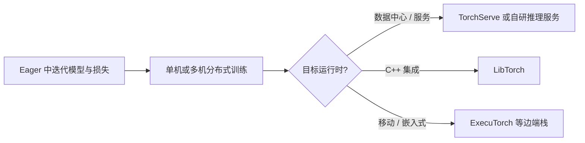

# PyTorch

**PyTorch** 是由 **PyTorch 基金会**（Linux Foundation 旗下） stewardship 的开源深度学习框架。它以 **Python 优先** 与 **命令式（eager）张量执行** 著称，在机器人领域的感知网络、模仿/强化学习策略、以及 GPU 并行仿真训练管线中占据主流生态位。

## 一句话定义

面向研究与生产的 **动态图友好** 深度学习运行时：同一套 Python API 既能快速实验，又能通过分布式、编译与多语言/边端栈延伸到部署。

## 为什么重要？

- **研究闭环快**：张量运算与自动求值与 Python 控制流自然结合，适合算法迭代频繁的机器人学习课题。
- **训练规模化**：官方将 **`torch.distributed`** 作为多机多卡与性能调优的核心后端叙述，与大并行仿真（如大规模环境 rollout）需求一致。
- **部署路径多**：从 **TorchServe**、**LibTorch（C++）** 到面向受限设备的 **ExecuTorch**，覆盖「数据中心 GPU → 集成式 C++ → 边端 NPU/CPU」等不同形态（能力与成熟度以各子项目文档为准）。
- **生态附件多**：视觉/音频有 **torchvision / torchaudio**；图与点云有 **PyTorch Geometric**；可解释性有 **Captum** 等，和机器人多模态数据流天然衔接。

## 核心结构（官网能力归纳）

1. **执行与生产化**：官网强调在 **eager** 与 **graph** 模式之间过渡，并结合 **TorchScript**、**TorchServe** 走向生产；新特性以各版本 **release notes** 为准。
2. **分布式训练**：以 **`torch.distributed`** 提供可扩展后端，服务于大模型与大规模并行实验。
3. **安装与硬件矩阵**：通过安装向导选择 OS、包管理器（pip / LibTorch / 源码）、语言（Python / C++）与计算平台（CUDA / ROCm / CPU）；**Stable** 与 **Preview（Nightly）** 二元通道，后者官方标注为未完全测试与支持。
4. **前置版本**：官方提供 **历史版本** 安装索引，便于复现旧论文代码栈。

## 与机器人研究与工程的关系

- **仿真 + RL**：许多并行物理仿真框架的策略网络、价值网络与优化器建立在 PyTorch 张量与 autograd 之上，与 [Isaac Gym / Isaac Lab](./isaac-gym-isaac-lab.md) 等栈常一起出现。
- **模仿学习与 VLA**：行为克隆、扩散策略、视觉-语言-动作模型普遍以 PyTorch 为默认实现层；与 [LeRobot](./lerobot.md) 等 Hugging Face 路线衔接紧密。
- **底层对照**：同一机器人系统里，高频刚体动力学与控制也可能用 C++/Eigen 等实现；PyTorch 更多承担 **学习模块** 而非全栈实时控制，二者通过 IPC、共享内存或策略导出格式分工。

## 常见误区或局限

- **CUDA / 驱动 / 轮子版本三元组** 任一不匹配即导致「安装成功但 GPU 不可用」；应以安装页生成的命令与 `torch.version.cuda` 交叉核对。
- **Nightly 与 Stable API 漂移**：复现社区代码时优先锁定 Stable 或小版本范围。
- **实时控制**：训练用 PyTorch 不等于板端 1 kHz 控制也要跑完整 eager 图；工程上常配合 **导出（如 ONNX）**、**C++ 运行时** 或裁剪后的推理子图。

## 流程总览（研究 → 部署）

## 关联页面

- [深度学习基础](../concepts/deep-learning-foundations.md)
- [强化学习](../methods/reinforcement-learning.md)
- [Isaac Gym / Isaac Lab](./isaac-gym-isaac-lab.md)
- [LeRobot（Hugging Face）](./lerobot.md)

## 参考来源

- [PyTorch 官方站点与文档索引](../../sources/repos/pytorch-official.md)

## 推荐继续阅读

- [PyTorch Tutorials](https://pytorch.org/tutorials/)
- [PyTorch Documentation（stable）](https://pytorch.org/docs/stable/index.html)
- [Get Started: PyTorch Local](https://pytorch.org/get-started/locally/)
