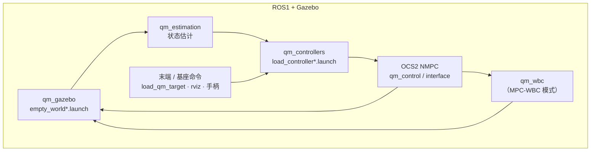
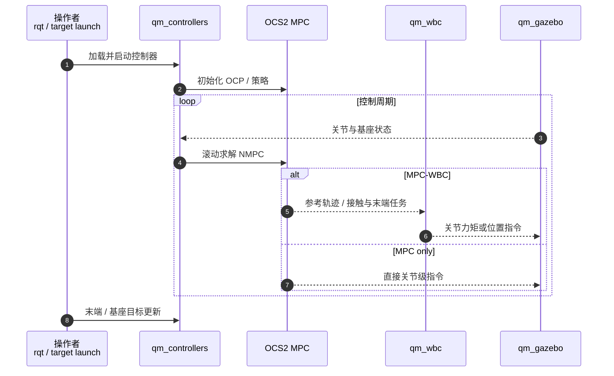

# qm_control（四足机械臂 OCS2 MPC + WBC）

**qm_control**（[skywoodsz/qm_control](https://github.com/skywoodsz/qm_control)，BSD-3-Clause）是面向 **四足机械臂（quadruped manipulator）** 的开源控制器：**模型预测控制（MPC）** 与 **全身控制（WBC）** 基于 **[OCS2](./ocs2.md)**，在 **ROS1 Noetic + Gazebo** 中实现全身规划、**末端位姿跟踪**、力扰动下的稳定与 **全身柔顺**；`feature-real` 分支面向硬件。README 标明项目 **仍在开发**，但已公开仿真、手柄遥操作与稳定性评测图。

## 一句话定义

**用 OCS2 做四足机械臂的滚动 NMPC，可选 WBC 低层执行，在 Gazebo 中实现基座行走同时约束末端位姿，并分支扩展力扰动、柔顺与真机部署。**

## 英文缩写速查

| 缩写 | 英文全称 | 简要说明 |
|------|----------|----------|
| MPC | Model Predictive Control | OCS2 滚动最优控制规划全身/末端运动 |
| WBC | Whole-Body Control | `qm_wbc` 低层全身协调（MPC-WBC 模式） |
| OCS2 | Optimal Control for Switched Systems | ETH 最优控制框架，本栈核心依赖 |
| NMPC | Nonlinear Model Predictive Control | OCS2 求解的非线性 OCP |
| ROS | Robot Operating System | Noetic + catkin 工作空间 |

## 为什么重要

- **OCS2 生态的 loco-manip 样例：** 相对 [legbot-mpc-wbc](./legbot-mpc-wbc.md) 的 Convex MPC 四足，本仓强调 **带操作臂的四足平台** 与 **OCS2 原生 NMPC**，与 [Centroidal NMPC + WBC 栈](../methods/centroidal-nmpc-wbc-stack.md) 叙事一致。
- **双模式对照：** 同一仿真资产可切 **MPC-WBC** 与 **MPC only**，便于理解 WBC 层在跟踪与约束分配上的作用。
- **分支化能力：** `feature-force` / `feature-compliance` / `feature-real` 把 **扰动稳定、柔顺、真机** 从主线的「无末端外力」假设中拆出，降低误用风险。
- **可量化仿真指标：** README 报告基座平移 30 cm 时末端相对初始位姿偏差 **≤3.5 mm、2.6°**，可作为 MPC–WBC 跟踪性讨论的数据点。
- **学术关联：** README 引用 IROS 2024 录用论文（关节力矩与地面摩擦饱和下的 **whole-body compliance**）及哈尔滨工业大学相关学位工作。

## 核心信息

| 项 | 内容 |
|----|------|
| **维护** | [skywoodsz](https://github.com/skywoodsz) 社区仓库 |
| **关联机构（论文）** | 哈尔滨工业大学（HIT）等（见 README「Related Paper」） |
| **许可** | BSD-3-Clause |
| **依赖** | OCS2 · ROS Noetic |
| **开源** | **已开源**；真机与部分能力在 feature 分支 |

## 流程总览

## 源码运行时序图

- **入口对齐 README：** `mon launch qm_gazebo …` → `load_controller*.launch` → `rqt_controller_manager` 启控 → `load_qm_target.launch` / rviz；真机见 **`feature-real`** 分支。

## 工程实践

| 项 | 内容 |
|----|------|
| 构建 | catkin workspace；`RelWithDebInfo`；**OCS2 须在环境变量 PATH 中** |
| 仿真启动 | MPC-WBC：`empty_world.launch` + `load_controller.launch`；仅 MPC：`*_mpc.launch` |
| 人机接口 | 手柄分控 **四足基座** 与 **机械臂末端**（README 示意图） |
| 分支选型 | 默认 `main` 假设末端无外力；力扰动 / 柔顺 / 真机勿混用未合并分支假设 |

## 与相邻栈对比

| 项目 | 平台 | MPC 后端 | 操作臂 | 仿真 |
|------|------|----------|--------|------|
| **qm_control** | 四足机械臂 | **OCS2** | 有 | Gazebo |
| [legbot-mpc-wbc](./legbot-mpc-wbc.md) | Go2 / LegBot | Convex MPC (Cheetah3) | 无 | MuJoCo |
| [OCS2](./ocs2.md) | 多示例 | 框架本体 | 视示例 | 多种 |

## 结论

**qm_control 是 OCS2 在四足机械臂 loco-manipulation 上的可跑参考栈：MPC 负责全身与末端任务，WBC 可选承担低层执行；选型时先对分支（力/柔顺/真机）与「MPC only」假设，再谈 sim2real。**

- **优先读分支 README：** `main` 不含末端外力与柔顺；扰动与 compliance 能力在 **feature-*** 分支，避免按 main 能力做真机预期。
- **依赖链长：** OCS2 + Noetic 版本固定；迁移 ROS2 需自行移植，非仓库现成能力。
- **与人形栈的关系：** 任务结构类似 **浮基 + 操作**，但接触模式与冗余度与双足人形不同；可对照 [mpc-wbc-integration](../concepts/mpc-wbc-integration.md)，勿直接套用人形 WBC 公式。
- **复现指标：** 仿真末端稳定性图可作为 MPC–WBC 跟踪性 sanity check，真机以 `feature-real` 为准。
- **维护状态：** 作者声明 **非最终版**；Issue / skywoodszcn@gmail.com 为反馈入口。

## 局限与风险

- **ROS1 Noetic：** 新部署需考虑发行版生命周期与 OCS2 安装复杂度。
- **开发中：** API 与 launch 名可能变动；无官方 ROS2 端口说明。
- **真机边界：** 硬件实现集中在 **`feature-real`**；主分支以仿真为主。
- **机构/论文：** 学位论文与 IROS 文与代码分支对应关系需读各分支说明，勿仅凭 `main` 复现论文全部实验。

## 关联页面

- [OCS2](./ocs2.md)
- [Centroidal NMPC + WBC 栈](../methods/centroidal-nmpc-wbc-stack.md)
- [MPC–WBC 集成](../concepts/mpc-wbc-integration.md)
- [Loco-Manipulation](../tasks/loco-manipulation.md)
- [legbot-mpc-wbc](./legbot-mpc-wbc.md)

## 参考来源

- [qm_control 来源归档](../../sources/repos/qm_control.md)
- GitHub：<https://github.com/skywoodsz/qm_control>

## 推荐继续阅读

- OCS2 安装：<https://leggedrobotics.github.io/ocs2/installation.html>
- [nonlinear-model-predictive-control](../methods/nonlinear-model-predictive-control.md)
