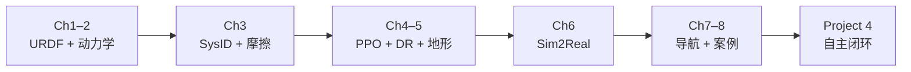

---

type: entity
tags: [course, quadruped, reinforcement-learning, sim2real, locomotion, curriculum, motrix]
status: complete
updated: 2026-06-23
related:
  - ./matrix-simulation-platform.md
  - ./roamerx-navigation.md
  - ./quadruped-robot.md
  - ../concepts/differentiable-simulation.md
  - ../concepts/urdf-robot-description.md
  - ../methods/ppo.md
  - ../concepts/sim2real.md
  - ../../roadmap/motion-control.md
sources:
  - ../../sources/courses/quadruped_control_simulation_rl_curriculum.md
summary: "四足控制 L0 策展：具身智能研究室《从动力学建模到强化学习》八章大纲，映射 URDF/SysID/PPO/DR/Sim2Real/分层导航与四个 Project。"
---

# 四足控制学习策展（仿真 → RL → 实机）

**一句话：** 四足 loco 的完整工程闭环是 **建模 → 辨识 → 并行 RL → 域随机化 → 摩擦补偿与蒸馏 → 导航集成**；本页把 [《四足机器人：从动力学建模到强化学习》](../../sources/courses/quadruped_control_simulation_rl_curriculum.md) 八章大纲整理成可执行路线，并接到 [运动控制成长路线](../../roadmap/motion-control.md) 与 [四足机器人](./quadruped-robot.md)。

## 英文缩写速查

| 缩写 | 英文全称 | 简要说明 |
|------|----------|----------|
| URDF | Unified Robot Description Format | 机器人连杆/关节/惯量描述格式 |
| ABA | Articulated Body Algorithm | 正向动力学 $\tau \to \ddot{q}$ |
| RNEA | Recursive Newton–Euler Algorithm | 逆动力学 $\ddot{q} \to \tau$ |
| PPO | Proximal Policy Optimization | 四足 loco 主流 on-policy 算法 |
| DR | Domain Randomization | 训练时随机化物理参数以提升迁移 |
| RMA | Rapid Motor Adaptation | 特权教师 → 可部署学生的蒸馏范式 |
| VLN | Vision-Language Navigation | 自然语言/视觉引导的导航任务 |
| Sim2Real | Simulation to Real | 仿真策略落地真机的工程主线 |
| SLAM | Simultaneous Localization and Mapping | 同步定位与建图 |
| PD | Proportional–Derivative | 策略输出经 PD 转关节力矩 |

## 为什么重要

1. **把控制范式演进讲清楚**：PID → MPC → RL 不是替代关系，而是 **建模精度、实时预算与地形复杂度** 下的分层选型（见 [MPC vs RL](../comparisons/mpc-vs-rl.md)）。
2. **可微仿真 + 并行 RL 是近年四足训练新主线**：课程以 [MATRiX](./matrix-simulation-platform.md) 为统一实验台，覆盖 SysID 梯度拟合与 4096 环境 PPO，不必强绑 Isaac Gym。
3. **四个 Project 对应真实研发里程碑**：动力学验证 → 多地形步态 → 摩擦补偿部署 → 导航闭环，与工业队 IROS 挑战赛流程一致。

## 推荐学习路径

| 阶段 | 课程章节 | 机器人相关产出 | 本库页面 |
|------|---------|---------------|---------|
| 建模基础 | Ch2 URDF / 浮动基 / ABA·RNEA | 能算 $M(q)$、$g(q)$，理解 $n_q \neq n_v$ | [URDF](../concepts/urdf-robot-description.md)、[Floating Base](../concepts/floating-base-dynamics.md)、[ABA/RNEA](../formalizations/articulated-body-algorithms.md) |
| 模型精度 | Ch3 SysID | 摩擦/Stribeck、转子惯量、可微拟合 | [System Identification](../concepts/system-identification.md)、[Joint Friction](../concepts/joint-friction-models.md) |
| RL 训练 | Ch4–5 PPO + DR + 课程 | 48 维 obs、Trot 奖励、程序化地形 | [PPO](../methods/ppo.md)、[DR](../concepts/domain-randomization.md)、[Procedural Terrain](../concepts/procedural-terrain-generation.md) |
| 实机迁移 | Ch6 Sim2Real | 摩擦前馈、RMA 蒸馏、PD 整定 | [Sim2Real](../concepts/sim2real.md)、[Friction Compensation](../concepts/friction-compensation.md)、[Privileged Training](../concepts/privileged-training.md) |
| 系统集成 | Ch7–8 导航栈 | VLN → Nav → RL → PD 六层栈 | [Hierarchical Stack](../concepts/hierarchical-quadruped-navigation-stack.md)、[RoamerX](./roamerx-navigation.md)、[VLN](../tasks/vision-language-navigation.md) |

## 章节 ↔ 本库节点完整映射

### 第 1 章 引言

- 1.1 PID → MPC → RL → [PID Control](../methods/pid-control.md)、[MPC](../methods/model-predictive-control.md)、[Reinforcement Learning](../methods/reinforcement-learning.md)
- 1.3 可微仿真 → [Differentiable Simulation](../concepts/differentiable-simulation.md)
- 1.4 MATRiX → [MATRiX Platform](./matrix-simulation-platform.md)

### 第 2 章 机器人建模

- 2.1 URDF → [URDF Robot Description](../concepts/urdf-robot-description.md)
- 2.2 四元数 / 流形 → [Lie Group Rigid Body Motions](../formalizations/lie-group-rigid-body-motions.md)
- 2.3 浮动基 → [Floating Base Dynamics](../concepts/floating-base-dynamics.md)
- 2.4 ABA / RNEA → [Articulated Body Algorithms](../formalizations/articulated-body-algorithms.md)
- Project 1 → [Pinocchio Quick Start](../queries/pinocchio-quick-start.md)、[MATRiX](./matrix-simulation-platform.md)

### 第 3 章 系统辨识

- 3.2 摩擦模型 → [Joint Friction Models](../concepts/joint-friction-models.md)
- 3.3 转子惯量 → [Robot Link and Rotor Inertia](../concepts/robot-link-and-rotor-inertia.md)
- 3.4 可微 SysID → [Differentiable Simulation](../concepts/differentiable-simulation.md)、[System Identification](../concepts/system-identification.md)

### 第 4–5 章 RL 运动控制

- 4.1 PPO → [PPO](../methods/ppo.md)
- 4.4 Trot / 奖励 → [Gait Generation](../concepts/gait-generation.md)、[Reward Design](../concepts/reward-design.md)
- 5.1 DR → [Domain Randomization](../concepts/domain-randomization.md)
- 5.2 课程学习 → [Curriculum Learning](../concepts/curriculum-learning.md)
- 5.3 程序化地形 → [Procedural Terrain Generation](../concepts/procedural-terrain-generation.md)
- Project 2 → [Locomotion](../tasks/locomotion.md)、[Domain Randomization Guide](../queries/domain-randomization-guide.md)

### 第 6 章 Sim2Real

- 6.1 Gap 分解 → [Sim2Real](../concepts/sim2real.md)、[Sim2Real Approaches](../comparisons/sim2real-approaches.md)
- 6.2 摩擦补偿 → [Friction Compensation](../concepts/friction-compensation.md)
- 6.3 RMA 蒸馏 → [Privileged Training](../concepts/privileged-training.md)、[RMA Paper](./paper-rma-rapid-motor-adaptation.md)
- Project 3 → [Sim2Real Checklist](../queries/sim2real-checklist.md)

### 第 7–8 章 导航与案例

- 7.1 分层栈 → [Hierarchical Quadruped Navigation Stack](../concepts/hierarchical-quadruped-navigation-stack.md)
- 7.2 RoamerX → [RoamerX Navigation](./roamerx-navigation.md)
- 7.3 VLN → [Vision-Language Navigation](../tasks/vision-language-navigation.md)
- 8.1 IROS 案例 → [Quadruped Robot](./quadruped-robot.md)、[MATRiX](./matrix-simulation-platform.md)
- Project 4 → [Navigation SLAM Autonomy Stack](../overview/navigation-slam-autonomy-stack.md)

## 常见误区

- **跳过 Ch2 直接 PPO**：不懂 $M$、$g$ 与欠驱动结构，奖励和 obs 设计只能靠试错。
- **只做 DR 不做 SysID**：随机化范围与真机参数脱节，反而训练更慢。
- **导航与运动策略硬耦合**：应通过分层栈把 VLN/规划与 RL loco 解耦（见第 7 章）。

## 与其他页面的关系

- 平台：[四足机器人](./quadruped-robot.md)、[Unitree](./unitree.md)、[Legged Gym](./legged-gym.md)
- 对比：[MPC vs RL](../comparisons/mpc-vs-rl.md)、[PPO vs SAC](../comparisons/ppo-vs-sac.md)
- 姊妹课程：[Numerical Optimization Curriculum](./numerical-optimization-curriculum.md)、[Linear Algebra Curriculum](./linear-algebra-curriculum.md)

## 推荐继续阅读

- 深蓝学院课程页：[四足机器人：从动力学建模到强化学习](https://www.shenlanxueyuan.com/course/858)
- [MATRiX GitHub](https://github.com/zsibot/matrix)
- [RoamerX Open](https://github.com/zsibot/genisom_roamerx_open)
- [Motion Control Roadmap](../../roadmap/motion-control.md)

## 参考来源

- [sources/courses/quadruped_control_simulation_rl_curriculum.md](../../sources/courses/quadruped_control_simulation_rl_curriculum.md) — 具身智能研究室课程大纲整理
