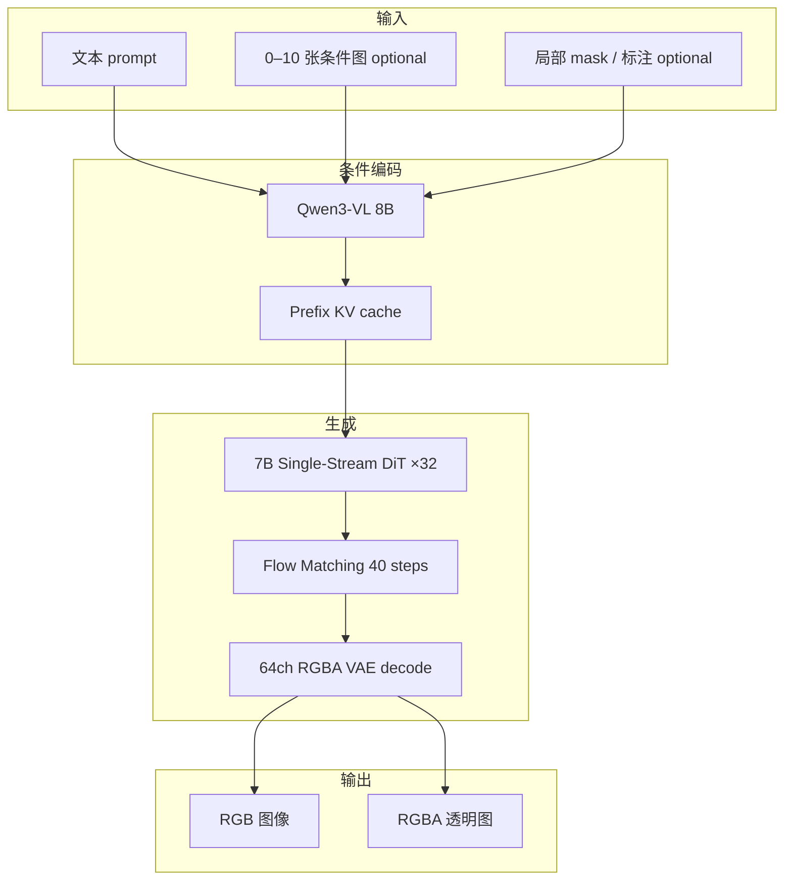
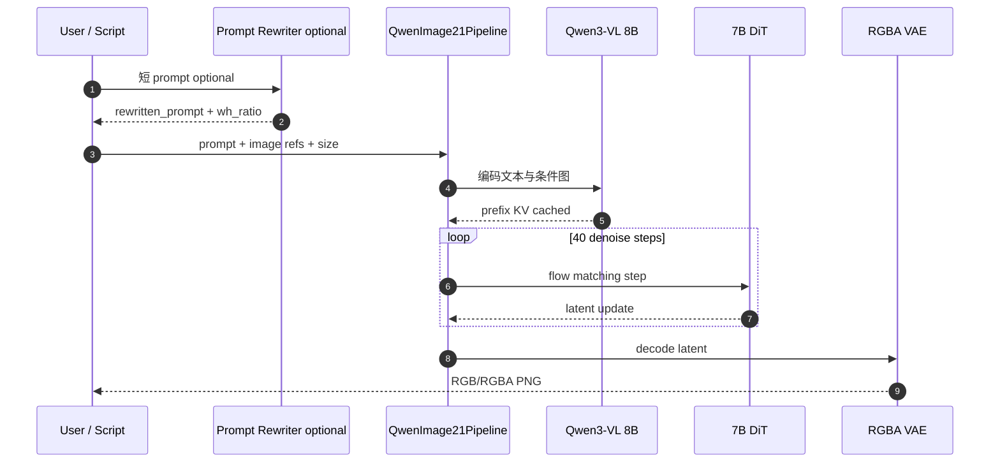

# Qwen-Image-2.1

**Qwen-Image-2.1**（[GitHub](https://github.com/QwenLM/Qwen-Image-2.1) · [Hugging Face](https://huggingface.co/Qwen/Qwen-Image-2.1) · [ModelScope](https://www.modelscope.cn/models/Qwen/Qwen-Image-2.1) · [Blog](https://qwen.ai/blog?id=qwen-image-2.1) · [Demo](https://huggingface.co/spaces/Qwen/Qwen-Image-2.1)）是通义 Qwen 家族 **2026-09-20** 开源的统一 **文生图（T2I）+ 图像编辑（I2I）** 模型：视觉生成核心 **7B Single-Stream DiT（32 层）**，在质量、效率与编辑 versatility 之间做平衡。

## 一句话定义

**一个 7B DiT pipeline 同时做 2K 文生图、多参考图编辑与原生 RGBA 透明生成，靠 prefix KV cache 把条件编码成本摊薄到全去噪步。**

## 英文缩写速查

| 缩写 | 英文全称 | 简要说明 |
|------|----------|----------|
| T2I | Text-to-Image | 文本条件图像生成 |
| I2I | Image-to-Image | 以输入图像为条件的编辑/重绘 |
| DiT | Diffusion Transformer | 以 Transformer 为骨干的扩散生成架构 |
| RGBA | Red Green Blue Alpha | 含 alpha 通道的透明图像格式 |
| VAE | Variational Autoencoder | 图像 latent 编解码器；本模型为 64 通道 RGBA VAE |
| KV Cache | Key-Value Cache | 前缀条件一次编码、去噪步复用的推理加速机制 |

## 为什么重要

- **机器人数据管线里的「场景编辑器」：** 站内 [WH0](./paper-sa-2606-22136-wh0-generative-world-models-as-scalable-sources.md) 用 Qwen-Image-Edit 系做 **工作区插物体 / 人手→灵巧手**；[RoboEdit](./paper-roboedit.md) 用 keyframe 编辑支撑视频数据合成 — 2.1 把 **T2I + Edit + RGBA** 收进 **同一权重**，降低 sim2real / 合成数据栈的模型切换成本。
- **原生透明层：** 可直接生成 **贴纸/主体抠图** 类资产，服务 [generative-data-augmentation](../methods/generative-data-augmentation.md) 中的 **物体叠加、背景替换、长尾场景合成**。
- **多参考 + 局部编辑：** 最多 **10** 张参考图、圆选/涂鸦/mask 指定区域，适合 **商品/人物 identity 保持** 的批量数据变体，而不必为每种编辑类型单独训 specialist。
- **Day-0 工程栈：** `diffusers.QwenImage21Pipeline`、[ComfyUI](./comfyui.md) 模板、vLLM-Omni / SGLang / LightX2V — 与 [Qwen-VLA](./qwen-vla.md) / [Qwen-Robot Suite](./qwen-robot-suite.md) 同属通义开源生态，便于在同一 HF org 下组 **感知–生成–控制** 流水线。

## 核心信息

| 项 | 内容 |
|----|------|
| **机构** | Qwen Team（阿里巴巴通义） |
| **视觉生成核心** | **7B** Single-Stream DiT，**32** 层 |
| **条件编码** | **Qwen3-VL 8B**（文本 + 条件图像统一表征） |
| **VAE** | **64 通道 RGBA**，**16×** 空间压缩 |
| **原生分辨率** | **2K**；推荐 1:1 / 4:3 / 16:9 等七种宽高比 |
| **开源** | **已开源** — GitHub + HF + ModelScope + Demo Space |
| **许可证** | Qwen Research License Agreement |

## 核心结构

| 模块 | 作用 |
|------|------|
| **Single-Stream DiT** | block-causal attention：文本 token 级 causal，图像 chunk 级双向；mixed-granularity attention |
| **Prefix KV cache** | 条件图像 + 文本指令 **首步编码一次**，全部去噪步复用（`causal_condition: true` 默认开启） |
| **Flow Matching** | Euler discrete scheduler + dynamic shifting |
| **统一 Pipeline** | `QwenImage21Pipeline`：无 `image` → T2I；单张/多张 `image` → 编辑（≤10 参考） |
| **Prompt 重写** | Qwen3.5-VL 9B 微调 PE：[PE-T2I](https://huggingface.co/Qwen/Qwen-Image-2.1-PE-T2I) / [PE-I2I](https://huggingface.co/Qwen/Qwen-Image-2.1-PE-I2I)；`prompt_rewrite/` 统一代码库 |

### 流程总览

## 工程实践

| 场景 | 入口 | 备注 |
|------|------|------|
| 快速 T2I / Edit | `QwenImage21Pipeline.from_pretrained("Qwen/Qwen-Image-2.1")` | 默认 2048²、40 steps |
| 透明图 | prompt 前缀 `This is an RGBA image with transparency. ...` | 输出带 alpha |
| 短 prompt 扩写 | `prompt_rewrite/run_vllm.py --task t2i\|edit` | 输出 `rewritten_prompt` + `wh_ratio` |
| 低显存 | `pipe.enable_model_cpu_offload()` | README 官方推荐 |
| 批量 serving | vLLM-Omni `vllm serve Qwen/Qwen-Image-2.1 --omni` | FP8 / TP / CUDA Graph |
| 节点工作流 | ComfyUI [T2I](https://github.com/Comfy-Org/workflow_templates/blob/main/templates/image_qwen_image_2_1_t2i.json) / [Edit](https://github.com/Comfy-Org/workflow_templates/blob/main/templates/image_qwen_image_2_1_image_edit.json) | Day-0 模板 |

### 推理运行时序（Diffusers 最小路径）

## 与机器人知识库的关系

| 用法 | 站内参照 |
|------|----------|
| 仿真/真机工作区 **插物体、换背景** | [WH0](./paper-sa-2606-22136-wh0-generative-world-models-as-scalable-sources.md)（前代 Qwen-Image-Edit） |
| 视频数据 **keyframe 编辑** | [RoboEdit](./paper-roboedit.md) |
| **生成式数据增强** 总览 | [generative-data-augmentation](../methods/generative-data-augmentation.md) |
| 统一 **生成+理解** 对照 | [Vision Banana](./vision-banana.md) |

## 局限与风险

- **许可证：** Qwen Research License — 商用与再分发需读 [LICENSE](https://github.com/QwenLM/Qwen-Image-2.1/blob/main/LICENSE)。
- **算力：** 2K 默认 40 steps；批量数据合成需 vLLM-Omni / LightX2V 或降分辨率。
- **物理一致性：** 编辑结果 **不保证** 接触/光照/尺度与机器人仿真一致；下游仍要 sim 校验或 filter（参见 WH0 / RoboEdit 的过滤叙事）。
- **与 VLA 边界：** 本模型是 **2D 生成/编辑工具**，不是策略；与 [Qwen-VLA](./qwen-vla.md) 互补而非替代。

## 结论

**Qwen-Image-2.1 把通义图像栈推到「一个开源权重覆盖 T2I、编辑、透明层与多参考合成」，是具身数据合成与 sim2real 场景编辑的默认候选工具之一。**

1. **开源完整：** GitHub + HF + ModelScope + Diffusers Day-0 — 可直接接入 [ComfyUI](./comfyui.md) 或 Python pipeline。
2. **选型读点：** 需要 **RGBA 主体资产** 或 **≤10 参考图 identity 合成** 时优先 2.1；仅简单背景替换可对照前代 Edit 模型成本。
3. **Prompt 工程：** 短 prompt 建议走 **PE-T2I / PE-I2I** 重写；透明图必须用推荐 RGBA 前缀模板。
4. **推理默认：** 2048²、40 steps；多参考编辑收益来自 prefix KV cache — 条件图越多越应走官方 cache 路径。
5. **机器人管线：** 替换 WH0/RoboEdit 中的 Edit 分支前，先在小批量上验证 **接触边界与尺度** 是否满足下游 world model / 策略 filter。

## 关联页面

- [generative-data-augmentation](../methods/generative-data-augmentation.md)
- [generative-world-models](../methods/generative-world-models.md)
- [ComfyUI](./comfyui.md)
- [Qwen-VLA](./qwen-vla.md)
- [WH0 论文页](./paper-sa-2606-22136-wh0-generative-world-models-as-scalable-sources.md)

## 参考来源

- [qwen-image-2-1.md](../../sources/repos/qwen-image-2-1.md)
- [qwen_image_2_1_blog.md](../../sources/blogs/qwen_image_2_1_blog.md)
- [QwenLM/Qwen-Image-2.1（GitHub）](https://github.com/QwenLM/Qwen-Image-2.1)

## 推荐继续阅读

- [Hugging Face 模型卡](https://huggingface.co/Qwen/Qwen-Image-2.1)
- [Diffusers QwenImage21Pipeline PR #14804](https://github.com/huggingface/diffusers/pull/14804)
- [Qwen 官方博客](https://qwen.ai/blog?id=qwen-image-2.1)
