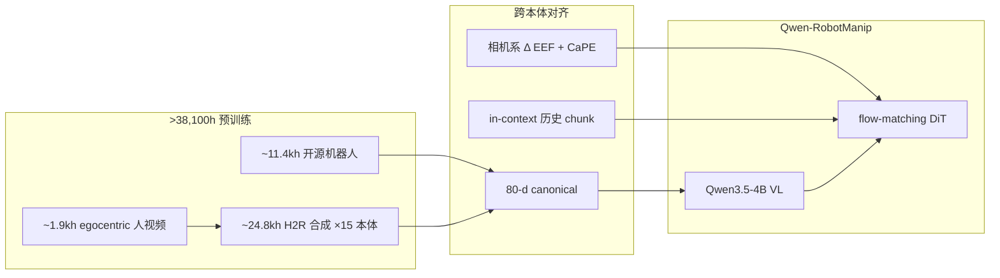

# Qwen-RobotManip

**Qwen-RobotManip**（[GitHub](https://github.com/QwenLM/Qwen-RobotManip) | [深度博客](https://qwen.ai/blog?id=qwen-robotmanip)）论证：**机器人 manipulation foundation 需要 alignment 与 scale 同时成立**——无 **跨本体统一表示** 则加数据 **冲突**；无 **数据多样性（含 H2R 合成）** 则对齐 **无法泛化**。

## 一句话定义

**Qwen3.5-4B 视觉–语言骨干 + flow-matching DiT 动作头**，在 **80 维共享 state-action 空间** 与 **相机系 delta EEF** 上 **>38,100h** 预训练，以 **OOD 榜**（LIBERO-Plus、RoboTwin-C2R、RoboCasa365 等）衡量 **真 foundation** 能力。

## 英文缩写速查

| 缩写 | 英文全称 | 简要说明 |
|------|----------|----------|
| VLA | Vision-Language-Action | 视觉-语言-动作端到端策略 |
| DiT | Diffusion Transformer | 扩散式 Transformer 动作生成头 |
| EEF | End-Effector | 末端执行器位姿/动作空间 |
| CaPE | Camera Positional Encoding | 相机外参注入 cross-attention 的编码 |
| H2R | Human-to-Robot | 人视频合成机器人演示的数据管线 |
| OOD | Out-of-Distribution | 分布外场景/指令/本体泛化评测 |
| SFT | Supervised Fine-Tuning | 监督微调阶段 |

## 为什么重要

- **OOD north star：** 文内指出 **LIBERO / RoboTwin Clean 等 IID 榜** 无法区分是否 **真预训练**；**LIBERO-Plus、RoboTwin-IF、RoboTwin-XE** 等才体现 **语言条件与跨本体**。
- **Human-to-Robot 规模化：** **1,933h 人视频 → 24,808h / 15 本体** 合成，是 **>38k h** 语料的主要 scaling 引擎（仅开源数据、无 proprietary 采集叙事）。
- **Agent 组合：** 与 **Qwen-3.5 planner** 或 **Qwen-Omni**（语音提议+评判）组合，支持 **OOD 长指令分解** 与 **开放任务提议**；**Chat2Robot** 提供浏览器真机实验入口（当前策略域有限）。

## 核心结构/机制

| 机制 | 要点 |
|------|------|
| **Unified 80-d** | 单/双/灵巧手/移动底座共用向量；**per-dim mask** 只回传有效维 |
| **Camera-frame Δ EEF** | 视觉相似动作跨本体 **数值邻近**；**CaPE** + 内参 token + **EEF type embedding** |
| **In-context adaptation** | embodiment prompt + 历史 obs-action chunk；**随机 context** 防 copy shortcut |
| **训练** | 预训练 VLA:VLM = **9:1**；后训练 **generalist SFT** 且 **VLA/VLM 共训** 提 OOD 指令 |

## 流程总览（数据 → 策略）

## 评测摘录（博客）

| 基准 | 结果 |
|------|------|
| LIBERO-Plus（Context） | **91.4%** |
| RoboTwin-C2R Hard | **69.4%** |
| RoboCasa365 Composite-Unseen | **14.9%**（~3× 次优） |
| RoboTwin-IF | **72.2%** |
| RoboTwin-XE zero-shot | **23.9%**（3.2× π₀.₅ eef） |
| RoboChallenge Table30 Generalist | **#1，45% SR** |
| 真机 in-domain / OOD | **88.6% / 87.5%** |

## 与 Qwen-VLA 的关系

- **[Qwen-VLA](./qwen-vla.md)：** **单权重** 同时服务 **操作 + VLN + 轨迹** 的 **通才**；README 有 R2R/RxR 与 LIBERO 同表。
- **RobotManip：** Suite 内 **操作专精 foundation**，共享 **Qwen3.5 + DiT flow** 族，但强调 **对齐框架 + H2R + OOD 评测**；与 [StarVLA](../methods/star-vla.md)、[Xiaomi-Robotics-0](./xiaomi-robotics-0.md) 在 **真机/OOD/异步部署** 维度可对照。

## 常见误区或局限

- **误区：高 LIBERO 分 = foundation 强。** 文内示 **scratch 训练** 亦可接近 SOTA；应看 **Plus / C2R / IF / XE**。
- **误区：Chat2Robot = 全能力部署。** 当前仅 **RoboTwin-Clean 50 任务** 策略，演示 **有限 zero-shot 指令**。
- **局限：** **log-linear scaling** 结论依赖 **统一表示 ablation**；真机仍受 **平台标定与安全层** 约束。

## 参考来源

- [Qwen-RobotManip 博客归档](../../sources/blogs/qwen_robot_manip.md)
- [Qwen-Robot Suite 总览](../../sources/blogs/qwen_robot_suite.md)
- [Qwen-RobotManip 技术报告 PDF](https://qianwen-res.oss-accelerate.aliyuncs.com/qwenrobot/papers/Qwen_RobotManip.pdf)
- [QwenLM/Qwen-RobotManip](https://github.com/QwenLM/Qwen-RobotManip)

## 关联页面

- [Qwen-Robot Suite](./qwen-robot-suite.md)
- [Qwen-VLA](./qwen-vla.md)
- [VLA](../methods/vla.md)
- [StarVLA](../methods/star-vla.md)
- [Manipulation](../tasks/manipulation.md)
- [Xiaomi-Robotics-0](./xiaomi-robotics-0.md)

## 推荐继续阅读

- [Qwen-RobotManip 深度博客](https://qwen.ai/blog?id=qwen-robotmanip)
- [Qwen-RobotManip GitHub](https://github.com/QwenLM/Qwen-RobotManip)
