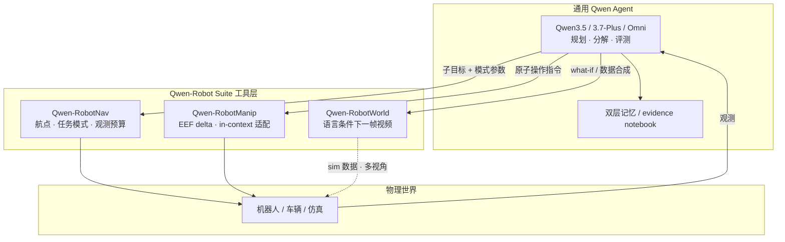

# Qwen-Robot Suite

**Qwen-Robot Suite**（[官方总览博客](https://qwen.ai/blog?id=qwen-robotsuite)）把 **视觉–语言理解** 与 **三类物理动作域** 对齐：**移动（Nav）**、**操作（Manip）**、**世界预测（World）**。相对「单模型通才」叙事（如 [Qwen-VLA](./qwen-vla.md)），Suite 选择 **分域 foundation + 语言工具接口**，便于上层 **Qwen3.5 / Qwen3.7-Plus / Qwen-Omni** 以 agent 方式编排长时程任务。

## 一句话定义

以 **Qwen-RobotNav + Qwen-RobotManip + Qwen-RobotWorld** 三模型分别桥接 VLM 表示到 **导航航点、操作轨迹、下一帧世界视频**，并通过 **统一自然语言调用面** 接入通用 Qwen agent（含文内 **Qwen-RobotClaw** harness 与 **Chat2Robot** 实验演示）。

## 英文缩写速查

| 缩写 | 英文全称 | 简要说明 |
|------|----------|----------|
| VLM | Vision-Language Model | 视觉-语言多模态理解模型，Suite 的上游认知层 |
| VLA | Vision-Language-Action | 视觉-语言-动作策略，RobotManip 所属范式 |
| VLN | Vision-Language Navigation | 视觉-语言导航，RobotNav 核心任务族之一 |
| EQA | Embodied Question Answering | 具身问答：探索环境后基于证据回答 |
| MMDiT | Multimodal Diffusion Transformer | 多模态扩散 Transformer，RobotWorld 骨干 |
| OOD | Out-of-Distribution | 分布外场景/指令/本体，Manip 评测 north star |
| PDMS | Predictive Driver Model Score | NAVSIM 等闭环驾驶综合指标 |

## 为什么重要

- **分域对齐降低异构数据冲突：** 导航轨迹、遥操作、行车片段 **动作空间与观测格式** 差异大；Suite 用 **三个专用 foundation** 分别建模，避免 naive pooling。
- **Agent 可组合：** 三模型 **language-first**，与通用 planner 组成 **两层系统**（高层分解 + 低层执行/导航/想象），已在 **桌面清理、开放世界寻物、语音提议操作** 等 demo 验证。
- **开源入口清晰：** Nav / Manip 已有 GitHub 与 PDF 技术报告；World 以技术报告为主，便于与 [生成式世界模型](../methods/generative-world-models.md) 路线对照。

## 套件组成

| 子模型 | Wiki | 对齐域 | 骨干摘要 |
|--------|------|--------|----------|
| **Qwen-RobotNav** | [qwen-robot-nav.md](./qwen-robot-nav.md) | 移动 / 导航 / 驾驶 | Qwen3-VL + MLP 航点；**可控观测协议** |
| **Qwen-RobotManip** | [qwen-robot-manip.md](./qwen-robot-manip.md) | 操作 | Qwen3.5-4B VL + DiT flow；**80-d 跨本体对齐** |
| **Qwen-RobotWorld** | [qwen-robot-world.md](./qwen-robot-world.md) | 世界模型 | 双流 MMDiT + Qwen2.5-VL；**NL 统一动作** |

## 流程总览（Agent 闭环）

## 与 Qwen-VLA 的分工

- **[Qwen-VLA](./qwen-vla.md)：** **单 checkpoint** 覆盖操作 + VLN + 轨迹的 **通才 actor**（embodiment prompt 切换平台）。
- **Suite：** **三个专精 foundation**，强调 **分域 scaling 叙事**（Nav 的 context MCP、Manip 的 OOD 对齐与 H2R 合成、World 的跨场景视频物理）；Manip 与 VLA **架构相近** 但 **数据与评测哲学** 更偏 manipulation foundation。

## 常见误区或局限

- **误区：Suite = 一个可下载的统一权重。** 实际是 **三个模型 + agent harness**；Chat2Robot 当前仅 **Manip 子集策略**（RoboTwin-Clean 50 任务），非全能力展示。
- **误区：VLM 规划足够。** 文内强调 **alignment gap**——语言计划 ≠ 电机命令；需 **分域动作头 / 世界模型** 或通才 VLA。
- **局限：** RobotWorld **公开 GitHub 未在博客链出**；agent 系统（RobotClaw、EQA 细节）部分 **待后续发布**。

## 参考来源

- [Qwen-Robot Suite 总览归档](../../sources/blogs/qwen_robot_suite.md)
- [Qwen-RobotNav 博客归档](../../sources/blogs/qwen_robot_nav.md)
- [Qwen-RobotManip 博客归档](../../sources/blogs/qwen_robot_manip.md)
- [Qwen-RobotWorld 博客归档](../../sources/blogs/qwen_robot_world.md)
- [Qwen-Robot Suite 官方博客](https://qwen.ai/blog?id=qwen-robotsuite)

## 关联页面

- [Qwen-RobotNav](./qwen-robot-nav.md) — 可配置上下文导航与 agentic 原语
- [Qwen-RobotManip](./qwen-robot-manip.md) — 跨本体操作 VLA 与 H2R 合成
- [Qwen-RobotWorld](./qwen-robot-world.md) — 语言条件具身世界模型
- [Qwen-VLA](./qwen-vla.md) — 通才 VLA 对照
- [Vision-Language Navigation](../tasks/vision-language-navigation.md) — VLN / EQA 任务语境
- [Manipulation](../tasks/manipulation.md) — 操作任务与 VLA 选型
- [Generative World Models](../methods/generative-world-models.md) — 世界模型方法纵览

## 推荐继续阅读

- [QwenLM/Qwen-RobotNav（GitHub）](https://github.com/QwenLM/Qwen-RobotNav)
- [QwenLM/Qwen-RobotManip（GitHub）](https://github.com/QwenLM/Qwen-RobotManip)
- [Qwen-RobotNav 技术报告 PDF](https://qianwen-res.oss-accelerate.aliyuncs.com/qwenrobot/papers/Qwen_RobotNav.pdf)
- [Qwen-RobotWorld 技术报告 PDF](https://qianwen-res.oss-accelerate.aliyuncs.com/qwenrobot/papers/Qwen_RobotWorld.pdf)
