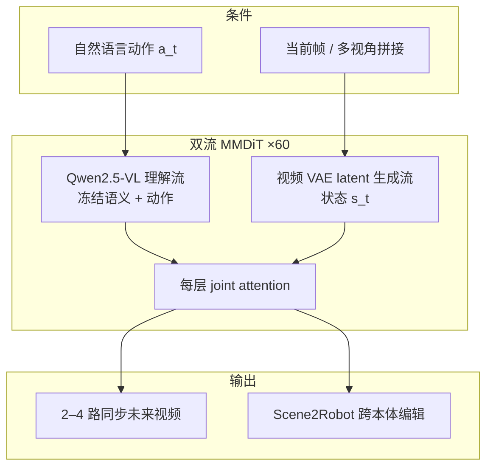

# Qwen-RobotWorld

**Qwen-RobotWorld**（[深度博客](https://qwen.ai/blog?id=qwen-robotworld) | [技术报告 PDF](https://qianwen-res.oss-accelerate.aliyuncs.com/qwenrobot/papers/Qwen_RobotWorld.pdf)）学习 **状态转移函数**：给定 **当前观测 + 自然语言动作** → 预测 **下一时刻世界长什么样**。核心设计是把 **关节角、方向盘、航向** 等 **全部投影到自然语言**，使 **Franka / 自动驾驶 / 室内导航** 成为 **同一语言条件视频生成任务**。

## 一句话定义

**60 层双流 MMDiT**：**Qwen2.5-VL** 理解流编码语言动作，**视频 VAE latent** 生成流预测下一帧；在 **EWK 8.6M** 对上 **联合训练 20+ 本体、500+ 动作类**，并生成 **2–4 视角几何一致** 的未来视频。

## 英文缩写速查

| 缩写 | 英文全称 | 简要说明 |
|------|----------|----------|
| WM | World Model | 预测环境下一状态的模型 |
| MMDiT | Multimodal Diffusion Transformer | 多模态双流扩散 Transformer |
| MLLM | Multimodal Large Language Model | 多模态大语言模型，作动作编码器 |
| EWK | Embodied World Knowledge | 通义具身世界知识数据集（8.6M 对） |
| VAE | Variational Autoencoder | 视频 latent 编解码 |
| RoPE | Rotary Position Embedding | 旋转位置编码；文内 asymmetric 3D RoPE |
| T2I | Text-to-Image | 文本到图像；预训练阶段锚定几何 |

## 为什么重要

- **语言统一异构动作：** 解决 **「每种 embodiment 一个 WM」** 的碎片化；与 [RynnVLA-002 / WorldVLA](./paper-shenlan-wm-07-worldvla.md) 等 **联合 VLA+WM** 路线不同，RobotWorld 专注 **可跨场景生成的世界模型**。
- **MLLM 作动作编码器 load-bearing：** 相对 T5/CLIP，**Qwen2.5-VL** 带入 **刚性/流体/落体** 等 **内化物理常识**，约束 **不可物理的未来**。
- **Scene2Robot + Multi-view：** 既作 **训练数据引擎**（人演示→14 机形态），也服务 **sim 数据 / 多相机策略训练** 的 **几何正则**。

## 核心结构/机制

### EWK 四轴（摘要）

| 轴 | 规模感 |
|----|--------|
| Multi-Embodiment | **20+** 机器人/人手/车辆 |
| Multi-Task | **500+** 动作类 |
| Multi-Scenario | 真机优先 + 仿真增强 |
| Multi-View | **~1.6M/6M** 样本含 2–4 视角 |

**训练：** general 数据（Ego4D、EPIC-Kitchen + T2I）→ **四阶段 embodied SFT**，每 batch **保留通用数据** 防灾难性遗忘。

## 性能与 demo（博客）

- 对比 **Sora2 / Veo3 / Cosmos / LVP** 等：**HSD 0.566**、场景一致 **0.914**、**GR1-Object IF 0.878**。
- **改一词即改未来**（对象/动词/目的地）；**多步长指令**；**驾驶（Waymo 等）与 VLNVerse 室内导航** 生成展示 **跨 morphology**。

## 常见误区或局限

- **误区：RobotWorld = 可直接闭环控制机器人。** 主输出是 **预测视频**；下游 VLA 训练/评测是 **应用场景**，非端到端替代 [Qwen-RobotManip](./qwen-robot-manip.md)。
- **误区：与 Qwen-VLA 重复。** VLA 输出 **动作轨迹**；World 输出 **视觉后果**，互补于 [Qwen-Robot Suite](./qwen-robot-suite.md) **三件套**。
- **局限：** 博客 **未链公开推理仓库**；benchmark 数字需以 **PDF 技术报告** 为准。

## 参考来源

- [Qwen-RobotWorld 博客归档](../../sources/blogs/qwen_robot_world.md)
- [Qwen-Robot Suite 总览](../../sources/blogs/qwen_robot_suite.md)
- [Qwen-RobotWorld 技术报告 PDF](https://qianwen-res.oss-accelerate.aliyuncs.com/qwenrobot/papers/Qwen_RobotWorld.pdf)
- [Qwen-RobotWorld 深度博客](https://qwen.ai/blog?id=qwen-robotworld)

## 关联页面

- [Qwen-Robot Suite](./qwen-robot-suite.md)
- [Qwen-RobotManip](./qwen-robot-manip.md)
- [Generative World Models](../methods/generative-world-models.md)
- [世界模型 15 项目 · 02 联合架构](../overview/world-models-route-02-joint.md)
- [WorldVLA / RynnVLA-002](./paper-shenlan-wm-07-worldvla.md)

## 推荐继续阅读

- [Qwen-RobotWorld 深度博客](https://qwen.ai/blog?id=qwen-robotworld)
- [Generative World Models 方法页](../methods/generative-world-models.md)
