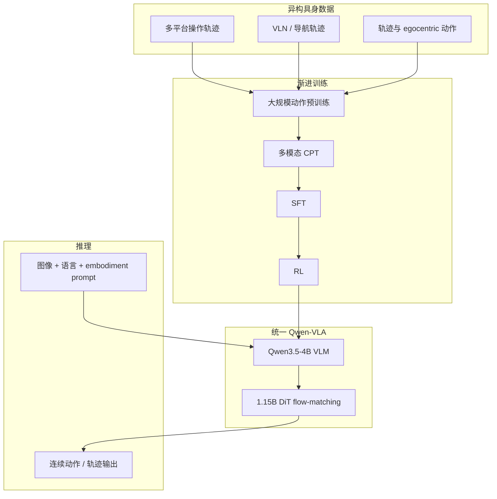

# Qwen-VLA

**Qwen-VLA**（[QwenLM/Qwen-VLA](https://github.com/QwenLM/Qwen-VLA)）把 **操作（manipulation）**、**视觉–语言导航（VLN）** 与 **轨迹 / 以自我为中心的动作建模** 收进 **同一动作–轨迹预测框架**，用 **一套权重** 在异构仿真与真机平台上评测，主张从「按 benchmark 专精微调」走向 **统一通才（generalist actor）**。

## 一句话定义

以 **Qwen3.5-4B** 为视觉–语言骨干、**1.15B DiT flow-matching** 为动作解码器，通过 **文本 prompt 描述 embodiment** 切换机器人平台，而 **不为每个平台单独维护输出头**。

## 英文缩写速查

| 缩写 | 英文全称 | 简要说明 |
|------|----------|----------|
| VLA | Vision-Language-Action | 视觉-语言-动作多模态基础策略方向 |
| DiT | Diffusion Transformer | 以 Transformer 为骨干的扩散生成架构 |
| SFT | Supervised Fine-Tuning | 用监督数据将通用模型适配到特定任务分布 |
| RL | Reinforcement Learning | 通过与环境交互最大化长期回报来学习策略的范式 |
| Manipulation | Robot Manipulation | 抓取、移动、操作物体的任务总称 |
| MLP | Multi-Layer Perceptron | 多层感知机，处理本体向量等低维输入 |
| OOD | Out-of-Distribution | 分布外样本/未见场景，泛化评测关注点 |
| VLM | Vision-Language Model | 视觉-语言多模态理解模型，VLA 的上游 |

## 为什么重要

- **跨任务统一：** 同一模型同时出现在 **LIBERO / RoboTwin** 类操作基准与 **R2R / RxR** 类导航基准的 README 表格中，便于对照 [VLN](../tasks/vision-language-navigation.md) 与 [Manipulation](../tasks/manipulation.md) 是否应共享策略抽象。
- **Qwen3 生态的「重炮」对照：** 相对 [StarVLA](../methods/star-vla.md) 的极简 MLP 头基准，Qwen-VLA 代表 **大规模渐进预训练 + RL** 的通才路线；相对 [Xiaomi-Robotics-0](./xiaomi-robotics-0.md) 的 **异步 chunk 部署** 叙事，Qwen-VLA 更突出 **单 checkpoint 跨本体 / 跨任务** 与 **OOD 真机** 表。
- **与 [Qwen-Robot Suite](./qwen-robot-suite.md) 的分工：** 通才 **单权重**（操作+导航+轨迹）vs Suite **三模型分域**（[Nav](./qwen-robot-nav.md) / [Manip](./qwen-robot-manip.md) / [World](./qwen-robot-world.md)）+ agent 工具接口；[Qwen-RobotManip](./qwen-robot-manip.md) 与本文 **架构同族**（Qwen3.5 + DiT flow），但更强调 **跨本体对齐、H2R 合成与 OOD 评测 north star**。
- **开源入口完整：** 官方仓库提供技术报告、博客与 Demo 链接，便于与 [VLA 方法页](../methods/vla.md) 及 [2025 开源复现景观](../overview/vla-open-source-repro-landscape-2025.md) 串联阅读。

## 核心结构/机制

| 模块 | 作用 |
|------|------|
| **VLM 骨干** | **Qwen3.5-4B**：统一理解图像、语言指令与场景上下文。 |
| **动作解码** | **1.15B DiT** + **flow matching**：生成连续动作 / 轨迹，与 π₀、Xiaomi-Robotics-0 等同属 **flow 族** 动作头。 |
| **任务统一** | 操作、导航、egocentric action、trajectory prediction 共享 **动作–轨迹预测空间**（非「VLA + 独立导航栈」的简单拼接）。 |
| **跨本体** | **Embodiment-aware prompt conditioning**：切换平台时改 **文本 prompt** 中的 embodiment 描述，而非换模型输出头。 |
| **训练配方** | **动作预训练** → **多模态持续预训练（CPT）** → **SFT** → **RL**，用于衔接离散 VLM token 与连续控制轨迹。 |

## 流程总览（渐进训练与统一推理）

## 公开结果（README 摘录，以官方更新为准）

**仿真（联合训练、跨平台无 per-benchmark 适配）：** Qwen-VLA-Instruct 在 README 中报告例如 LIBERO **97.9**、RoboTwin-Hard **87.2**、R2R SR **57.5**、RxR SR **59.6** 等（Base 版本数值更低，见 [sources/repos/qwen-vla.md](../../sources/repos/qwen-vla.md) 表）。

**真机 ALOHA：** 与 **按任务独立微调** 的 GR00T N1.6、π₀.5 对比时，README 给出 **Qwen-VLA-aloha（w/ pretrain）** 域内平均 **83.6%**、OOD 平均 **76.9%** 成功率叙事；并强调 **大规模预训练** 对 OOD 的必要性（w/o pretrain 明显更低）。

## 常见误区或局限

- **误区：通才权重可直接零样本上任意真机。** README 的真机表针对 **ALOHA** 与特定任务分布；新硬件仍需标定、安全层与可能的 **平台 prompt / 少量适配**。
- **误区：导航与操作只需拼两个 specialist。** 本文主张 **共享动作–轨迹空间** 与 **联合训练**；若仅推理时切换两个 checkpoint，则不在同一设计点。
- **局限：** 仓库以官方 README、技术报告与 Demo 为主；训练数据规模、RL 细节与权重发布节奏需跟踪 [GitHub Issues](https://github.com/QwenLM/Qwen-VLA/issues)。

## 参考来源

- [Qwen-VLA 仓库与论文归档](../../sources/repos/qwen-vla.md)
- [qwenvla_arxiv_2605_30280.md](../../sources/papers/qwenvla_arxiv_2605_30280.md)
- Wang et al., *Qwen-VLA: Unifying Vision-Language-Action Modeling across Tasks, Environments, and Robot Embodiments*, [arXiv:2605.30280](https://arxiv.org/abs/2605.30280)
- [QwenLM/Qwen-VLA（GitHub）](https://github.com/QwenLM/Qwen-VLA)

## 关联页面

- [VLA（Vision-Language-Action）](../methods/vla.md) — 方法总览与 Qwen3 系路线对照
- [StarVLA](../methods/star-vla.md) — 同生态极简基准
- [Xiaomi-Robotics-0](./xiaomi-robotics-0.md) — Qwen3-VL + DiT flow 的另一开源实例（偏实时 chunk）
- [视觉–语言导航（VLN）](../tasks/vision-language-navigation.md) — R2R / RxR 任务语境
- [Loco-manipulation](../tasks/loco-manipulation.md) — 操作与移动联合任务语境
- [Qwen-Robot Suite](./qwen-robot-suite.md) — 通义分域具身三件套与 agent 闭环
- [Qwen-RobotManip](./qwen-robot-manip.md) — Suite 内操作专精 foundation

## 推荐继续阅读

- Black et al., *π₀: A Vision-Language-Action Flow Model for General Robot Control* — flow-matching VLA 相近动作建模脉络
- [Physical Intelligence openpi](https://github.com/Physical-Intelligence/openpi) — π 系通才与真机微调常用参照
- [VLA 开源复现景观（2025）](../overview/vla-open-source-repro-landscape-2025.md) — 按复现目标选仓库的策展地图
