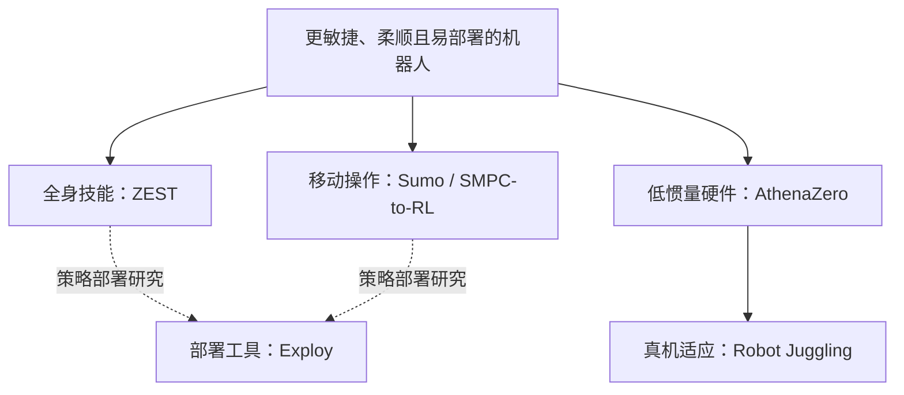

# RAI Institute：全身控制、动态操作与部署研究路线

## 一句话定义

**RAI Institute** 是由 Marc Raibert 领导、2022 年成立的机器人与人工智能研究机构，以学习控制、动态操作、硬件设计和物理交互研究提升机器人能力。

## 英文缩写速查

| 缩写 | 英文全称 | 简要说明 |
| --- | --- | --- |
| RAI | Robotics and AI Institute | 机器人与人工智能研究所 |
| RL | Reinforcement Learning | 从交互回报学习控制策略 |
| MPC | Model Predictive Control | 利用模型滚动规划控制动作 |
| WBC | Whole-Body Control | 全身稳定与动作协调 |
| ONNX | Open Neural Network Exchange | Exploy 使用的计算图交换格式 |

## 为什么重要

这条路线把“机器人如何稳定运动”“如何利用动态接触”“如何把训练代码部署到真机”放在同一工程视野中。它适合用来对照 VLA 路线中的低层执行问题，也适合研究 G1 的运动模仿、推物和策略部署。

## 核心信息

| 字段 | 内容 |
| --- | --- |
| 机构 | 机器人与人工智能研究所（RAI Institute） |
| 成立 | 2022 年；成立公告正文为 2022-08-12，最初称 Boston Dynamics AI Institute |
| 领导与地点 | Marc Raibert；美国 Cambridge 与瑞士 Zurich |
| 初始支持 | Hyundai Motor Group 与 Boston Dynamics；公告称初始投资超过 4 亿美元 |
| 当前五个方向 | 灵巧操作、学习控制、物理交互的数据驱动模型、复杂环境导航、机器人社会伦理 |
| 路线视角 | 本轮代表项目以强全身控制、动态操作与 Sim2Real 为主；研究范围并不限于此 |

RAI 与 [Boston Dynamics](./boston-dynamics.md)分别维护机构与机器人公司背景；合作的 ZEST、Atlas / Spot 演示按项目署名理解。另一个 [RobotecAI/rai](./painode-129-rai.md)是 ROS 2 Agent 框架，与此机构不同。

## 核心原理：并行研究如何连接

实线表达研究分支与平台关系，虚线表达工程阅读联系。**不表示 Exploy 是所有历史实验的已确认部署栈**；具体平台案例以 Exploy 官方博客为准。

| 研究问题 | 已有节点 | 阅读重点 |
| --- | --- | --- |
| 参考动作如何变成多接触全身技能 | [ZEST](./paper-zest.md) | MoCap / 视频 / 动画 → RL → 跨本体零样本迁移 |
| 部署时如何操纵陌生重物 | [Sumo](../methods/sumo.md) | 高层采样 MPC 在低层 RL 命令空间搜索；Spot 真机、G1 仿真 |
| 如何绕开稠密奖励反复调参 | [SMPC-to-RL](./paper-smpc2rl-loco-manipulation.md) | 仿真规划采示范 → 稀疏 offline-to-online RL → 冻结低层稳定控制 |
| 为什么动态操作要硬件共设计 | [AthenaZero](./paper-athenazero.md) | 有效质量、低减速比、柔顺接触；硬件论文与抛接学习分别阅读 |
| 不完美模型如何在真机适应 | [Robot Juggling](./paper-robot-juggling-athenazero.md) | 经验记忆、任务规划与连续抛接安全约束 |
| 如何减少训练与部署的实现差异 | [Exploy](./exploy.md) | 观测、actor、动作处理一起导出；C++ 接设备状态与命令 |

## 工程实践

- 做 G1 运动模仿：先读 ZEST 的观测、奖励与课程，不把公开论文视作现成训练仓。
- 做 G1 推物：用 Sumo 的公开仿真入口理解“高层规划—低层策略”边界，再与 SMPC-to-RL 的“规划只负责采数”对照。
- 做策略上线：读 Exploy 的 adapter、ONNX evaluator 与 C++ controller；设备驱动、周期调度和安全壳仍需自行集成。
- 看时间轴：ZEST 按 arXiv v1 的 2026-01-30；AthenaZero 按 04-07 博客；抛接按 05-27 演示。期刊日期、后续论文日期与入库日单独说明。

## 局限与风险

**开放程度逐项目判断**：Exploy 与 Sumo 有代码入口；AthenaZero 部分分析/实验资产公开；ZEST、Robot Juggling 和 SMPC-to-RL 的完整控制学习栈不能由其他仓库的开源状态推定。本次没有运行 Sumo 仿真或真机实验，历史结论的核查日期保留在各详情页。

官网列出物理交互基础模型方向，但本轮已收录的研究不能据此推定已发布统一通用 VLA / WAM。各节点是并行研究成果，不是一个模型的连续版本，也不是统一任务排行榜。

## 关联页面

- [公司路线对照](../comparisons/robot-foundation-model-company-paths-2026.md)
- [全身控制](../concepts/whole-body-control.md)
- [移动操作](../tasks/loco-manipulation.md)
- [Exploy](./exploy.md)

## 公司路线日期口径

成立公告正文事件日 2022-08-12，页面栏为 08-11；均为同月。当前五方向总览不是同日发布的模型。 [日期证据](https://rai-inst.com/resources/press-release/hyundai-launches-boston-dynamics-ai-institute/)。详见[本轮日期核查](../../sources/sites/company-roadmap-date-audit-2026-10-08.md)；版本事件与原始产品首发分别记录。

## 参考来源

- [公司路线日期核查](../../sources/sites/company-roadmap-date-audit-2026-10-08.md)

- [机构背景、研究方向与日期证据](../../sources/sites/rai-institute.md)
- [Sumo 官方代码核查](../../sources/repos/rai-opensource-sumo.md)
- [AthenaZero 官方博客归档](../../sources/sites/rai-athenazero-blog.md)
- [Exploy 官方介绍](../../sources/blogs/introducing_exploy_rai_2026-10-07.md)

## 推荐继续阅读

- [RAI Institute Research](https://rai-inst.com/research/)
- [RAI Institute Resources](https://rai-inst.com/resources/)
- [成立公告](https://rai-inst.com/resources/press-release/hyundai-launches-boston-dynamics-ai-institute/)
