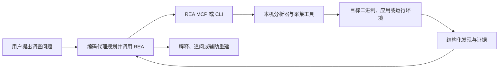

# REA（Reverse Engineer Anything）

## 一句话定义

REA 是面向编码代理的软件逆向调查层：通过 **MCP Server 与 CLI** 调用本机分析器或受控观测流程，返回带证据的程序结构/行为发现，供代理解释、追问并辅助重建功能。

## 英文缩写速查

| 缩写 | 英文全称 | 简要说明 |
|------|----------|----------|
| RE | Reverse Engineering | 通过检查程序、二进制或运行行为推断其实现与功能 |
| MCP | Model Context Protocol | REA 将分析工具暴露给 Agent 的统一接口协议 |
| CLI | Command-Line Interface | 与 MCP 共用调查能力的终端命令入口 |
| IPC | Inter-Process Communication | Electron renderer、preload 与 main 进程间的通信边界 |
| APK | Android Package Kit | REA 可读取其清单、类与反编译方法的 Android 安装包 |

## 为什么重要

理解一个软件功能，常要在反汇编器、源码浏览器、浏览器开发工具和笔记之间来回搬运结果。REA 把常见调查动作收束到一套 Agent 可调用的工具合同与 CLI 流程中：人用自然语言提问，Agent 负责选择工具、串接调用、归纳结果；结果保留证据与限制，便于人工复核，而不是只相信一段模型生成的解释。

对机器人软件工程而言，它更适合用于检查不熟悉的桌面调试工具、仿真器插件、设备管理应用或 SDK 的结构和行为，帮助定位“功能入口在哪里、数据经过哪些模块、调用如何流转”。但它不直接分析机器人运动学或控制策略，也不替代人工安全审查、供应商授权或领域验证。

## 核心原理

### 能力面：一个接口，多类目标

| 目标 | 典型结果 | 关键依赖/边界 |
|------|----------|---------------|
| 原生二进制 | 伪代码、汇编、字符串、符号、调用与引用关系 | Hopper、Ghidra 或 IDA；格式和宿主支持随 provider 变化 |
| JavaScript / Electron | 模块、导入、source map、路由、IPC 与原生插件关系 | Node.js；可分析应用目录或 ASAR |
| 网站 / 浏览器 / 进程 | 页面结构、脚本、网络观察、截图或进程交互记录 | Chrome 系浏览器；运行时行为会执行/交互目标 |
| .NET / APK | Assembly 元数据、CIL、类与反编译方法、构建比较 | APK 需要 headless JADX 与完整 JDK |
| 固件 / 软件包 | 固件区域、提取结果、文件清单、摘要和资源结构 | Binwalk / Unblob 等；能力取决于目标格式 |
| ELF / crash / EVM / HAR | ELF 布局与 mitigation 候选、Linux 崩溃寄存器、字节码结构、已保存请求响应与源码位置 | 如 pwntools、GDB、HAR、原始字节输入等依赖按具体指南配置 |

### 调查闭环

REA 本身是“工具协调层”，不是分析引擎。Agent 可通过 MCP 做连续追问，也可从 CLI 启动同类工作流；分析器提供结构化证据，最终解释和代码重建仍由 Agent/人完成。静态检查与运行时观测是不同风险等级：前者读取给定文件；后者可能启动程序、读取窗口/网络或与进程交互，应按目标指南确认影响。

## 工程实践

- **接入方式：** 项目 README 提供 npx rea-agents setup；设置过程会显示将修改的 Agent 配置和工作流指引，用户审阅批准后写入并重启 Agent。也可以通过 npm 全局安装后用 rea --help 使用命令行。当前 README 要求 Node.js 22.19+、24.11+ 或 26+，以当前文档为准。
- **先做小调查：** 从一个具体问题开始，例如“这个 Electron 功能的按钮如何经 IPC 写出 CSV？”；要求 Agent 展示模块、调用链和证据，再独立核对关键发现。
- **选择分析路径：** JS/Electron 静态结构分析不需要 Hopper/Ghidra；深度原生分析需配置 Hopper、Ghidra 或 IDA；目标类型对应的额外工具和宿主限制应先从官方指南确认。
- **安全边界：** REA 声明目标分析在本机进行，但工具结果会交给所连接的 Agent/model provider；若启用进程或浏览器交互，目标程序会以当前用户权限执行。仅分析有权检查的软件，运行未知样本前使用隔离环境。
- **复现记录：** 固定 REA 与 provider 版本，保存输入目标摘要、调查命令/问题、原始工具结果与证据，再记录 Agent 的解释；这样可区分分析器事实与模型推断。
- **开源状态：** REA 主仓库与 npm 分发均公开（MIT）。分析引擎的授权与条款由各上游 provider 单独决定；“REA 开源”不等于 Hopper、IDA 等依赖免费或开源。

## 局限与风险

- **不是源码恢复器：** 伪代码、符号和调用关系是证据与线索，不等同于原始源码，也不能保证自动复刻应用。
- **能力不均衡：** 分析结果依赖目标格式、宿主系统与外部 provider；官网表格指出不同格式需单独工具。不要把“支持某类文件”理解为无需配置或覆盖所有变体。
- **运行时观测有副作用：** 静态读取和启动目标是两种不同操作；后者可能改变目标状态或触达文件、网络和系统资源。
- **模型数据边界：** 本地分析只说明 REA 不把目标送往托管分析服务；Agent 的模型 provider 仍会接收工具结果，需按组织的数据策略选择。
- **快速演进：** 官方建议按版本更新并刷新 Agent 注册；生产或敏感分析应固定确切版本、先审阅 setup 计划，并检查升级变更。
- **授权与合规：** 官方声明仅支持合法授权的逆向研究、分析和重建；用户须自行确认目标软件、数据和环境的使用许可。

## 关联页面

- [Agent Reach](./agent-reach.md) — 代理外部信息采集与工具链安装脚手架；REA 则把本机软件分析能力交给代理
- [Model Context Protocol](../concepts/model-context-protocol.md) — 代理与外部工具之间的调用协议
- [Graphify](./graphify.md) — 从代码/资料建立知识图的工具；与 REA 的“追踪程序证据”侧重点不同

## 参考来源

- [morluto/rea 仓库归档](../../sources/repos/morluto-rea.md)
- [REA 官方站点归档](../../sources/sites/rea-tools.md)

## 推荐继续阅读

- [REA 官方 README](https://github.com/morluto/rea#readme) — 能力矩阵、依赖、安装与限制
- [REA 官方指南](https://rea.tools/guides/) — 按原生二进制、Electron 与浏览器观察展开的实际步骤
- [Model Context Protocol](../concepts/model-context-protocol.md) — 了解 MCP Host/Client/Server 的交互边界
