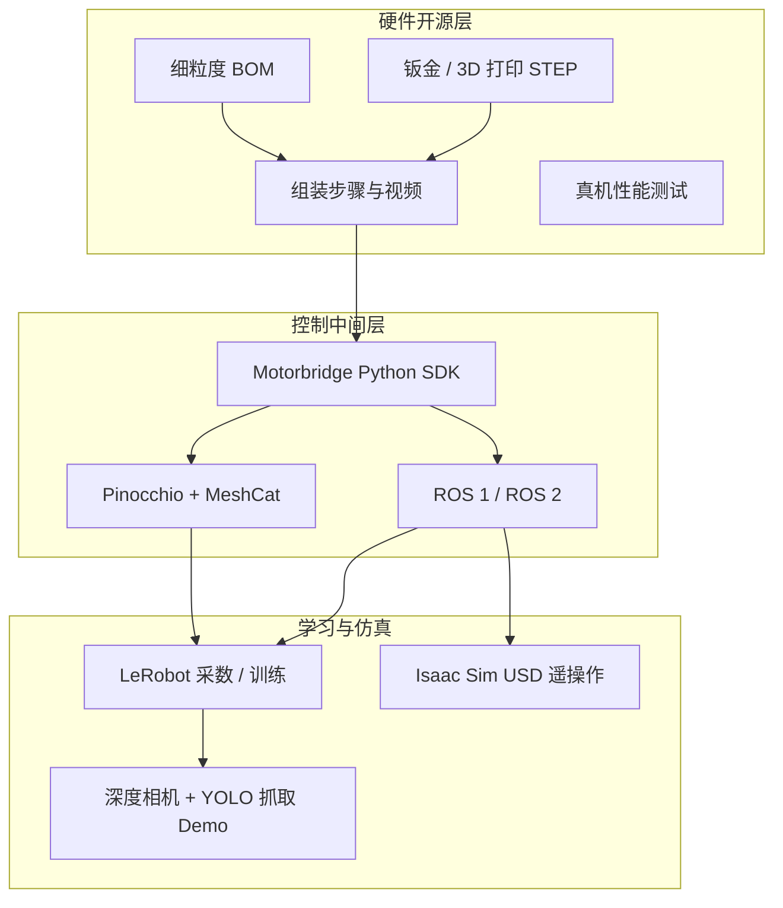

# reBot-DevArm（Seeed reBot Arm B601）

## 一句话定义

**reBot-DevArm**（商品名 **reBot Arm B601**）是 [Seeed Studio](https://www.seeedstudio.com/) 推出的 **桌面级开源六轴机械臂**：同外观提供 **达妙（DM）** 与 **灵足（RS）** 两套电机版本；GitHub 仓公开 **钣金 / 3D 打印 STEP、细粒度 BOM、组装与性能测试**，并对接 **Motorbridge SDK、ROS 1/2、Pinocchio、LeRobot、Isaac Sim**，目标是降低具身智能与操作学习的真机门槛。

## 英文缩写速查

| 缩写 | 英文全称 | 简要说明 |
|------|----------|----------|
| DoF | Degrees of Freedom | 本机 6 轴臂 + 1 夹爪 |
| BOM | Bill of Materials | 物料清单；本仓细到螺丝规格与采购链 |
| ROS 2 | Robot Operating System 2 | 官方已集成运动学、轨迹规划与重力补偿 |
| OSHWA | Open Source Hardware Association | 本项目认证号 CN000024 |
| CERN-OHL-W | CERN Open Hardware Licence — Weakly Reciprocal | 硬件许可证（弱互惠，允许商业） |
| SDK | Software Development Kit | Motorbridge 统一多品牌电机读写与控制 |
| IL | Imitation Learning | 经 LeRobot 采集 / 训练的模仿学习主路径 |
| USD | Universal Scene Description | Isaac Sim 资产格式；RS 版演示仓已提供 |

## 为什么重要

- **「真开源」中间档：** 相对舵机级 SO-ARM100/101，reBot 用准工业执行器与钣金结构，负载进入 **1.5–2.5 kg** 桌面操作区；相对闭源桌面臂，又公开 **完整 STEP + BOM**，可 DIY 复现或二次开模。
- **学习栈已接好：** README 路线图显示 **LeRobot、ROS 2、Pinocchio** 双版本均已完成；适合作为本库 [LeRobot](./lerobot.md) / [SO-101 Sim2Real 课](./nvidia-so101-sim2real-lab-workflow.md) 之外的 **更高负载开发臂** 对照。
- **许可可商用：** 2026-05-11 起硬件由 CC BY-SA NC 切换为 **CERN-OHL-W-2.0**，软件 **Apache-2.0**，明确允许商业场景（硬件再分发需提供完整源）。
- **Seeed 供应链闭环：** 官方套件（电机件 / 结构件 / 夹爪 / 整机 / 预装）+ Wiki 教程 + Jetson / 深度相机 / reSpeaker 外围，降低「图纸有了但买不到件」的摩擦。

## 核心原理

### 双版本硬件矩阵

| 参数 | B601-DM | B601-RS |
|------|---------|---------|
| 电机品牌 | 达妙（Damiao）43 系 | 灵足（Robstride） |
| 供电 | DC **24 V** | DC **48 V** |
| 负载 | **1.5 kg** | **2.5 kg** |
| 最大臂展（README EN） | 767 mm | 754 mm |
| 自重 | ≈ 4.5 kg | ≈ 6.7 kg |
| 重复定位精度 | < 0.2 mm（宣称） | < 0.2 mm（宣称） |
| 自由度 | 6 DoF + 1 夹爪 | 6 DoF + 1 夹爪 |

> 规格以官方 README / 产品页为准；中英文 README 臂展数字曾有不一致，工程引用前请核对当前仓内表格。

### 开源与软件栈（主干）

- **仓内路径：** `hardware/reBot_B601_DM/`、`hardware/reBot_B601_RS/`（打印件、金属件、外购件、组装、性能测试）。
- **Leader 臂：** 可选 [Star Arm 102](https://github.com/servodevelop/Star-Arm-102)；亦可用 SO-ARM101 的 12 V 电源给 Leader 供电（README 说明）。
- **可选外设：** 腕部相机支架（D435i / D405 / Gemini 等 STEP）、柔性手指、reSpeaker 语音阵、Jetson 边缘机。

## 工程实践

| 维度 | 实践要点 |
|------|----------|
| **选型** | 预算 / 供电便利 → **DM（24 V）**；要更高负载 → **RS（48 V，推荐明纬 48 V 12.5 A 起）** |
| **复现路径** | GitHub BOM → 采购或买 Seeed 套件 → Wiki 组装视频 → Motorbridge 点通电机 → ROS2 / LeRobot 教程 |
| **学习入口** | [DM LeRobot](https://wiki.seeedstudio.com/rebot_arm_b601_dm_lerobot/) / [RS LeRobot](https://wiki.seeedstudio.com/rebot_arm_b601_rs_lerobot/) |
| **运动学** | Pinocchio 官方 Wiki + 社区仓 [reBotArm_control_py](https://github.com/vectorBH6/reBotArm_control_py) |
| **仿真** | RS：[`reBot-Isaacsim`](https://github.com/Seeed-Projects/reBot-Isaacsim)；DM：README 标为进行中（曾延迟至 2026-06-20） |
| **开源状态** | **已开源（全栈）**：硬件 CERN-OHL-W-2.0 + 软件 Apache-2.0；OSHWA **CN000024**（核查日 2026-07-21） |

**推荐上手顺序：** 选版本与套件 → 按 Wiki 组装并固定供电 → Motorbridge / Web UI 验证关节 → 跟 ROS2 重力补偿与轨迹 → 再进 LeRobot 遥操作采数。

## 局限与风险

- **不是工业产线臂：** 桌面 / 实验室负载与工作空间设计；极限工况见仓内 `performance_testing/`，勿直接外推到产线循环寿命。
- **BOM ≠ 量产件：** 开源 BOM 声明为 **开发者最低成本复现优化**，Seeed 量产件可能金属化、公差与线束不同，机械拓扑相同但零件未必 1:1。
- **双版本生态进度不完全对称：** Isaac Sim 在 RS 已完成、DM 仍标进行中；引用教程时按版本核对 Wiki 链接。
- **许可证细节：** 硬件 CERN-OHL-W 为 **弱互惠**——再分发硬件须提供完整源；软件 Apache-2.0 可闭源链接。商用前通读 LICENSE 全文。
- **与 SO-ARM / ALOHA 定位不同：** SO 系更轻更便宜、主攻低成本 IL；ALOHA 主攻双臂精细遥操作。reBot 偏 **单臂桌面开发 + Seeed 生态**，双臂/移动底座需自行扩展。

## 关联页面

- [Manipulation](../tasks/manipulation.md) — 桌面抓取 / 操作任务语境
- [Teleoperation](../tasks/teleoperation.md) — Leader–Follower 与 IL 采数
- [LeRobot](./lerobot.md) — 官方已适配的模仿学习全栈
- [NVIDIA SO-101 Sim2Real 实验 workflow](./nvidia-so101-sim2real-lab-workflow.md) — 更低成本 SO-101 + Isaac 课对照
- [ALOHA](./aloha.md) — 双臂低成本遥操作事实标准对照
- [PAROL6](./parol6-source-robotics.md) — 另一条开源桌面六轴教育臂
- [StackForce](./stackforce.md) — Seeed 生态相关的模块化小整机与 CAD→Isaac 工具链
- [ROBOTIS OpenMANIPULATOR](./robotis-open-manipulator-line.md) — ROS 教学臂产品线对照
- [Pinocchio 快速上手](../queries/pinocchio-quick-start.md) — 正逆运动学与重力补偿工具链
- [ROS 2 基础](../concepts/ros2-basics.md) — 中间件与 bringup 基础

## 参考来源

- [rebot-devarm.md](../../sources/repos/rebot-devarm.md) — GitHub 主仓归档与开源状态
- [rebot-devarm-seeed-wiki.md](../../sources/sites/rebot-devarm-seeed-wiki.md) — Seeed Wiki / 产品页 / Motorbridge 核查

## 推荐继续阅读

- 官方仓库：<https://github.com/Seeed-Projects/reBot-DevArm>
- Seeed 机器人文档枢纽：<https://wiki.seeedstudio.com/robotics_page/>
- Motorbridge：<https://motorbridge.seeedstudio.com>
- OSHWA 认证页：<https://certification.oshwa.org/cn000024.html>
- Isaac Sim 演示仓：<https://github.com/Seeed-Projects/reBot-Isaacsim>
