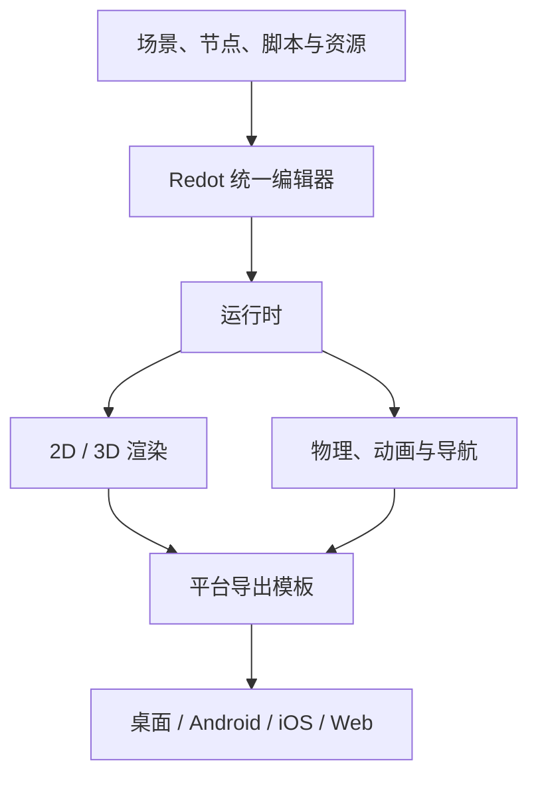

# Redot Engine（Godot 开源分支）

Redot Engine 是 2024 年从 Godot 分叉出来的社区维护 2D/3D 游戏引擎，采用 MIT 许可，以统一编辑器、渲染、物理、脚本和跨平台导出构建游戏与交互内容。

## 英文缩写速查

| 缩写 | 英文全称 | 简要说明 |
|------|----------|----------|
| 2D / 3D | Two-Dimensional / Three-Dimensional | Redot 编辑器和运行时支持的二维与三维内容 |
| MIT | MIT License | Redot 引擎源码采用的宽松开源许可证 |
| C# | C Sharp | 官方支持的脚本语言之一；当前文档说明 C# 项目无法导出到 Web |
| HTML5 | HyperText Markup Language 5 | 官方文档用于描述浏览器端项目导出的目标 |
| MCP | Model Context Protocol | 仓库提供的 AI 集成接口，不是机器人控制协议 |

## 为什么重要

Redot 将 2D/3D 场景编辑、脚本、渲染和打包放在同一套工具里，便于制作交互演示。引擎代码采用 MIT 许可，官方说明不向游戏收入抽成；项目可从桌面开发延伸到 Android、iOS 与 Web 发布。

对机器人研发来说，它可以用来制作机器人模型展示、操作交互界面、训练过程回放或浏览器演示。这些是基于通用引擎能力的工程用途；Redot 官方资料将其定位为游戏引擎，没有将其列为机器人动力学、ROS 或策略训练平台。

## 核心结构与工作流

Redot 项目由场景、节点、资源与脚本组成。编辑器管理场景树、资源和调试；运行时把项目送入渲染与物理模块，最后由对应的导出模板生成平台构建物。

| 部分 | 作用 | 读者关注点 |
|------|------|------|
| 场景与节点 | 组织对象、层级、组件与交互 | 机器人模型、传感器画面和 UI 可映射成场景节点 |
| 脚本 | GDScript、C#、C++ 扩展逻辑 | 快速原型优先看 GDScript；使用 C# 时检查目标平台限制 |
| 渲染 | Forward+、Mobile、Compatibility 三种渲染器 | Web 默认使用 Compatibility；渲染器能力与硬件要求不同 |
| 物理与动画 | 提供 2D/3D 游戏运行时物理、动画和导航等通用功能 | 若用于机器人交互仿真，应验证单位、坐标、碰撞与数值稳定性 |
| 导出 | 编辑器配合平台导出模板打包应用 | 导出目标包括 Windows、macOS、Linux、Android、iOS、Web；控制台另受许可限制 |

## 工程实践与版本

- **下载与构建：** 官网提供编辑器和平台导出模板；源码仓库提供编译文档及 Nix 示例 `nix run .`。首次使用某平台时，安装匹配的导出模板。
- **平台边界：** 官方 FAQ 列出 Windows、macOS、Linux / BSD 编辑器，以及桌面、Android、iOS、Web 游戏导出。官方团队不发布开源控制台导出模板；当前文档注明 C# 项目无法导出到 Web。
- **许可证：** 引擎为 MIT；官方文档一般采用 CC BY 3.0，类参考保留上游 MIT 许可，网站代码另为 MIT。第三方库可能采用不同条款，图标和商标也需按单独说明处理。
- **版本状态（2026-10-06 核查）：** GitHub 最新正式版为 Redot LTS 26.2（2026-06-30）；最新预发布为 26.3-rc.2（2026-09-30）。正式项目应固定版本，并区分 LTS 与候选版。

## 在机器人项目中的位置

- **合适用途：** 实时 2D/3D 展示、可交互机器人教学、浏览器仿真前端、遥操作界面原型和训练过程可视化。
- **集成方式：** 机器人状态、关节角与传感器数据需通过自建 ROS 2 bridge、WebSocket、UDP 或文件回放接口送入 Redot；具体接口和时间同步由应用负责。这是基于通用引擎能力的集成建议，不是 Redot 官方内置机器人栈。
- **验证重点：** 检查 URDF / 网格导入链、坐标系和单位转换、关节层级、碰撞简化、渲染帧率与控制数据延迟。若做接触动力学或策略训练，应单独评估物理模型精度与批量运行效率，不能只凭画面相似度判断仿真有效性。
- **选型对照：** 将 Redot 与 [Unity](./unity-engine.md) 和 [Unreal Engine 5](./unreal-engine-5.md) 放在引擎层比较；机器人控制级仿真仍按任务需求另选物理后端。

## 局限与风险

Redot 是独立维护的 Godot 分支，项目文件、插件、脚本扩展与 Godot 的兼容程度应按目标版本实测，不能仅凭相似界面推断完全兼容。官方资料没有列出机器人专用 ROS 驱动、URDF 导入标准或控制级物理标定。Web 端还受到浏览器图形 API、跨域隔离和 C# 导出的限制；控制台构建需遵循厂商许可条件。MIT 许可仅适用于 Redot 代码本身，不能自动覆盖项目依赖、游戏素材和第三方插件。

## 关联页面

- [Unity Engine](./unity-engine.md) — 商业许可模式不同、机器人研究中常用于渲染和仿真客户端的实时 3D 引擎
- [Unreal Engine 5](./unreal-engine-5.md) — 面向高保真实时 3D 场景的另一类引擎
- [Sim2Real](../concepts/sim2real.md) — 视觉展示与物理/控制保真度是不同验证目标

## 参考来源

- [Redot 官方文档与项目入口归档](../../sources/sites/redotengine-docs.md)
- [Redot 官方 GitHub 仓库归档](../../sources/repos/redot-engine.md)

## 推荐继续阅读

- [Redot 官方文档：FAQ](https://docs.redotengine.org/en/About/faq) — 支持平台、语言和许可说明
- [Redot 官方文档：功能列表](https://docs.redotengine.org/en/About/list_of_features) — 编辑器、渲染器、物理、动画与导出能力
- [Redot 官方文档：Web 导出](https://docs.redotengine.org/en/26.2/Tutorials/export/exporting_for_web) — 浏览器端运行条件与限制
- [Redot 26.3-rc.2 发布页](https://github.com/Redot-Engine/redot-engine/releases/tag/redot-26.3-rc.2) — 最新候选版记录
