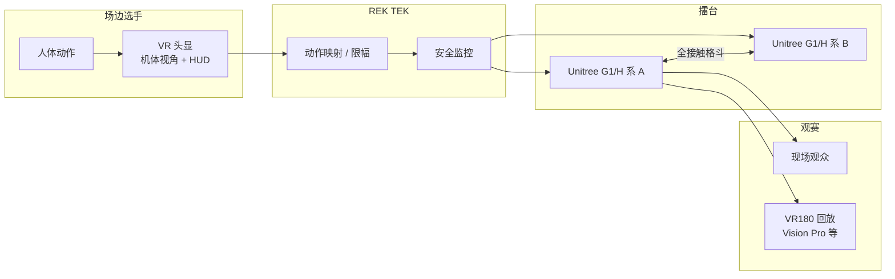

# REK（Robot Embodied Kombat · 人形格斗联赛）

**REK** 是旧金山公司 **Robot Embodied Kombat** 运营的 **人形机器人格斗体育联赛**：选手在场边戴 **VR 头显**，通过自研 **REK TEK** 将人体动作实时映射到 **Unitree G1**（及更大 H 系机型）上，在擂台进行 **全接触** 对打，面向现场与沉浸式回放观众。

## 一句话定义

**把 VR 全身遥操作与量产人形硬件组合成可售票的格斗体育赛事，并向外租赁可编程 G1 用于活动与教育。**

## 英文缩写速查

| 缩写 | 英文全称 | 简要说明 |
|------|----------|----------|
| REK | Robot Embodied Kombat | 品牌与联赛简称 |
| VR | Virtual Reality | 选手端第一视角与动作采集界面 |
| DoF | Degrees of Freedom | G1 租赁页标注 29 关节自由度 |
| SDK | Software Development Kit | 租赁 G1 提供完整开发接口 |
| WBC | Whole-Body Control | 格斗遥操作依赖全身协调与力矩安全 |
| Teleop | Teleoperation | 人类实时驱动机器人本体 |

## 为什么重要

- **消费级人形的「非科研」出口：** 在 [Unitree G1](./unitree-g1.md) 大量用于 RL / loco-manip 研究的语境下，REK 证明同一硬件可支撑 **高冲击、高曝光** 的娱乐产品化路径。
- **VR 遥操作的极限场景：** 与桌面操作或家务示教不同，格斗要求 **低延迟全身映射、抗摔打与紧急停机**——是 [Teleoperation](../tasks/teleoperation.md) 谱系中 **竞技向** 的极端数据点。
- **自主 vs 人类 pilot 对照轴：** 学术侧 [RoboStriker](./paper-notebook-robostriker.md) 走 **双智能体 RL 自主拳击**；REK 走 **人类策略 + 机器人执行**——同一「人形拳击」任务的两条技术路线，选型与评测指标完全不同。
- **中美产业叙事并列：** 2026 年前后中国 **[URKL](./urkl.md)**（EngineAI · 自主算法 + 统一 T800）与 REK 形成对照；REK 以 **embodied VR 选手** 与 **Unitree 硬件生态** 形成西方现场赛事样本。

## 流程总览

## 核心结构

### 赛事产品线

| 里程碑 | 要点 |
|--------|------|
| **REK0** | 旧金山 proof-of-concept：双机、VR pilot、现场观众验证叙事 |
| **REK America** | 2025-11 美国五城巡演，公开报道 **场场售罄** |
| **REK1** | 2026-02-07 Kezar Pavilion（旧金山）；更高制作规格，购票者可申请 pilot 资格 |

### 技术要素（公开信息归纳）

| 维度 | 内容 |
|------|------|
| **硬件** | 主力 **Unitree G1**；更大体型 **H1-2** 亦出现在报道中；拳套、护具，部分演示含冷兵器道具 |
| **软件** | **REK TEK**：人体 → 机器人关节/末端映射；VR 内嵌机体视角、环境感知与 **血量/性能** 类 HUD |
| **商业模式** | ① **售票现场赛** ② **G1 U2 租赁**（活动/课堂/制片；29 DoF、约 2 h 续航、Full SDK）③ 电商早鸟名单 |

### 与科研遥操作的差异

| 维度 | 实验室 VR 全身 teleop（如 TWIST2 / PILOT） | REK 格斗 |
|------|---------------------------------------------|----------|
| **目标** | 采集示范 / 部署 loco-manip 策略 | 竞技观赏与选手体验 |
| **接触** | 受控物体与力矩上限 | **故意全接触、高冲击** |
| **策略来源** | 常接 RL tracking 或 VLA 下层 | **人类实时决策** |
| **数据用途** | 训练模仿学习 | 非公开强调 IL 数据集 |

## 常见误区

- **不是自主拳击 AI 联赛：** 公开报道一致强调 **VR 真人 pilot**；与 RoboStriker 类 **策略互博** 不同。
- **不等于 Unitree 官方产品：** 硬件来自 [Unitree](./unitree.md)，联赛与 REK TEK 为第三方运营。
- **「机器人格斗」≠ 液压巨型机：** 使用 **轻量电驱人形**（数十 kg 级），安全与耐久设计决定可承受的打击强度。

## 与其他页面的关系

- [Unitree G1](./unitree-g1.md) — 主力格斗与租赁机型
- [Unitree](./unitree.md) — 硬件供应链与 SDK 生态
- [Teleoperation](../tasks/teleoperation.md) — VR 全身映射的任务谱系
- [RoboStriker](./paper-notebook-robostriker.md) — 自主人形拳击 RL 研究对照
- [URKL](./urkl.md) — 中国 EngineAI 标准化 T800 **自主算法** 格斗联赛对照
- [Open Duck Mini](./open-duck-mini.md) — 另一条 **娱乐向双足** 开源硬件路线（DIY vs 量产 G1 租赁）

## 参考来源

- [rek-com.md](../../sources/sites/rek-com.md) — 官网与第三方交叉归档
- 官网：<https://rek.com/>
- Founders Inc. 投资组合：<https://f.inc/portfolio/rek/>

## 推荐继续阅读

- [RoboStriker 论文](https://arxiv.org/abs/2601.22517) — 自主人形拳击分层决策与 LS-NFSP
- [Unitree G1 实体页](./unitree-g1.md) — 格斗平台硬件规格与科研生态
- Rest of World 报道：[Chinese robot boxing draws crowds in San Francisco](https://restofworld.org/2026/chinese-robot-boxing-unitree-rek/)
