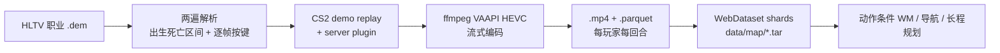
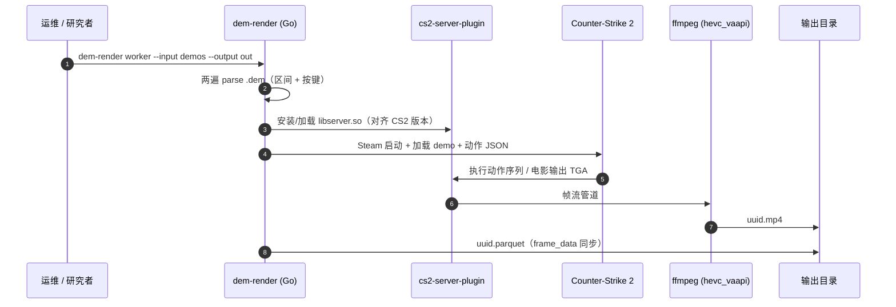

# RekaCS2-10k（CS2 第一人称游戏数据集）

**RekaCS2-10k**（HF 名 **CS2-10k**，<https://huggingface.co/datasets/RekaAI/CS2-10k>）是 [Reka AI](https://reka.ai/) 发布的大规模 **职业 CS2 第一人称游戏视频 + 逐帧控制/状态** 语料：从公开 [HLTV](https://www.hltv.org/) demo 经游戏内回放渲染，专为 **动作条件交互世界模型** 提供紧密对齐的观测–动作环。

## 一句话定义

**把职业 CS2 确定性 demo 重渲染为每玩家每回合的干净第一人称视频，并同步逐帧键盘、鼠标增量与 3D 位姿，形成可扩展的「视频 ↔ 控制」世界模型预训练语料；数据 CC BY-NC，渲染管线 MIT 开源。**

## 英文缩写速查

| 缩写 | 英文全称 | 简要说明 |
|------|----------|----------|
| CS2 | Counter-Strike 2 | Valve 第一人称射击竞技游戏 |
| DEM | Demo file（`.dem`） | 比赛确定性回放文件，可再渲染 |
| WAM | World Action Model | 联合建模未来观测与动作的策略族 |
| WDS | WebDataset | tar shard 流式训练格式 |
| HEVC | High Efficiency Video Coding | 渲染管线 ffmpeg VAAPI 编码 |
| FOV | Field of View | 相机视场；本集默认 90° |

## 为什么重要

- **稀缺的「视觉 + 稠密动作」对齐：** 真实具身采录贵；纯合成常缺行为多样性。CS2 demo 可 **任意时刻重渲染** 并还原驱动画面的精确控制输入。
- **规模可达训练级：** **600k+** 回合片段、**10k+** 小时、**720p@48fps**，覆盖多张职业图。
- **可复现扩展：** 官方 [cs2-dem-renderer](https://github.com/reka-ai/cs2-dem-renderer)（MIT）允许按需加比赛、改标注，而不只消费静态镜像。
- **直接对接动作条件生成 / 导航先验 / 长程战术 / 多智能体因果** 等世界模型工作流（见发布页用例）。

## 核心信息

| 字段 | 内容 |
|------|------|
| 机构 | 瑞卡人工智能（Reka AI） |
| 来源 | HLTV 公开职业比赛 `.dem` |
| 规模 | **600,000+** player-round · **10,000+** 小时 |
| 画面 | 720p · 48 fps；无 HUD；隐藏武器减视觉突变 |
| 标注 | 逐帧 `actions` / 鼠标 delta / `position_*` / yaw·pitch |
| 格式 | WebDataset `data/<map>/*.tar` + `index.parquet` |
| HF | <https://huggingface.co/datasets/RekaAI/CS2-10k> |
| 许可 | **CC BY-NC 4.0**（非商用）；渲染器 **MIT** |

### 数据集速查

| 维度 | 内容 |
|------|------|
| **规模** | 10k+ 小时 · 600k+ clips；地图含 ancient/nuke/dust2/mirage/overpass/train/inferno 等 |
| **模态** | Ego RGB 视频 + 逐帧控制与 3D 状态 parquet |
| **许可证** | 数据 CC BY-NC 4.0；管线 MIT；底层 demo 版权归原权利人 |
| **重定向就绪度** | **不适用（游戏控制空间）**：键鼠动作非机器人 DOF；适合世界模型 / 动作条件视频，不直接作人形关节示范 |

## 流程总览

## 源码运行时序图

官方渲染器可运行入口对齐 [`sources/repos/cs2-dem-renderer.md`](../../sources/repos/cs2-dem-renderer.md)：

关键复现路径：对齐 CS2 版本构建插件 → `go build` `dem-render` → Steam 已运行下单文件或 worker 批处理 → 本地 Viewer 或 HF Space 核验。

## 工程实践

| 项 | 要点 |
|----|------|
| **获取数据** | HF `RekaAI/CS2-10k`；先读 `index.parquet` 再按地图拉 shard |
| **加载** | 任意 WebDataset 读 tar：`data/<map>/<map>-NNNNNN.tar` |
| **扩展数据** | 自备 `.dem` 跑 [cs2-dem-renderer](https://github.com/reka-ai/cs2-dem-renderer) |
| **开源状态** | **数据 + 渲染器均已开源**；Viewer Space 可用 |
| **许可陷阱** | **非商用**（CC BY-NC）；商用或产品训练需另获授权 |
| **team 字段** | 以 HF README 为准：`0=T / 1=CT`（新闻页曾写反，勿混用） |
| **下游读法** | 世界模型 / 动作条件视频主战场；**不是** 家庭操作或机器人遥操作集 |

## 与相邻语料对比

| 对照 | RekaCS2-10k 的定位 |
|------|-------------------|
| **[RekaDaily-10k](./rekadaily-10k-dataset.md) / Ego4D** | 真实家庭物理杂乱与家务语义；本集是 **游戏内可控、动作稠密对齐** 的中间地带 |
| **EgoCS-400k** | 同属 CS ego 社区；本集强调 **10k+ 小时职业 demo + 开源渲染器** |
| **机器人真机 teleop** | 可执行关节/末端；本集动作在 **键鼠游戏接口** |
| **[Video as Simulation](../concepts/video-as-simulation.md)** | 本集提供大规模 **可交互合成观测** 的训练底物 |
| **[WAM](../concepts/world-action-models.md)** | 天然适合「观测条件动作 / 动作条件下一帧」联合训练配方 |

## 局限与风险

- **域差距：** 射击游戏纹理、动力学与真实机器人物理无关；迁移需额外桥接或仅作算法沙盒。
- **非商用许可：** 工业产品训练默认不可直接吃；与 Apache 2.0 家务集选型不同。
- **版本耦合：** 渲染插件随 CS2 更新易碎，扩展语料需钉版本分支。
- **职业分布偏置：** 地图/战术来自职业赛，不等于全体玩家行为分布。
- **隐藏武器权衡：** 减少突变有利于生成稳定性，但丢失枪模/后坐视觉线索。

## 关联页面

- [World Action Models（WAM）](../concepts/world-action-models.md) — 动作–世界联合建模消费侧
- [Video as Simulation](../concepts/video-as-simulation.md) — 视频作交互仿真器叙事
- [Generative World Models](../methods/generative-world-models.md) — 生成式世界模型方法族
- [mimic-video（VAM）](../methods/mimic-video.md) — 视频–动作模型对照
- [EgoWM](./paper-egowm-egocentric-world-model.md) — egocentric 世界模型
- [RekaDaily-10k](./rekadaily-10k-dataset.md) — 同机构家务 ego（Apache 2.0；非游戏控制）
- [Ego 分类 01：数据采集](../overview/ego-category-01-data-collection.md) — 第一人称数据生态旁路

## 参考来源

- [RekaCS2-10k 新闻页归档](../../sources/sites/rekacs2-10k.md)
- [CS2-10k HF 数据卡归档](../../sources/datasets/rekacs2-10k.md)
- [cs2-dem-renderer 仓库归档](../../sources/repos/cs2-dem-renderer.md)

## 推荐继续阅读

- 新闻页：<https://reka.ai/news/cs2-10k-a-large-scale-egocentric-counter-strike-2-dataset>
- Hugging Face：<https://huggingface.co/datasets/RekaAI/CS2-10k>
- 渲染器：<https://github.com/reka-ai/cs2-dem-renderer>
- 交互 Viewer：<https://huggingface.co/spaces/RekaAI/CS2-10k-viewer>
- EgoCS-400k：<https://egocs-400k.github.io/#dataset>
